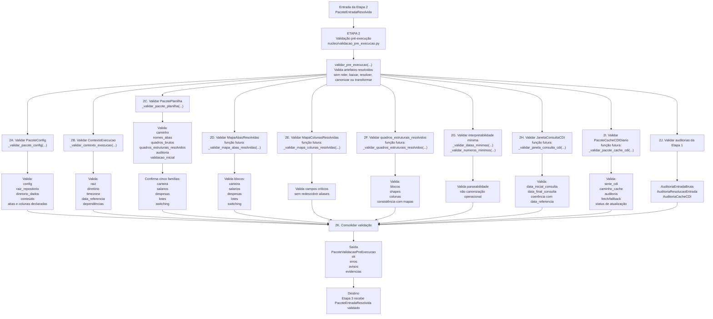

# ME-V17-F0-V32B — Formaliza Etapa 2 como validação do PacoteEntradaResolvida

## 1. Identificação

- MICROETAPA: V17-F0-V.3.2B
- TIPO: DOCUMENTAL / ARQUITETURAL
- CLASSE: FORMALIZA_ETAPA2_COMO_VALIDACAO_DO_PACOTE_ENTRADA_RESOLVIDA
- ALTERA CÓDIGO: NÃO
- ALTERA MOTOR: NÃO
- ALTERA SAÍDA CANÔNICA: NÃO
- ALTERA DADOS: NÃO
- ALTERA CACHE: NÃO
- ALTERA RENDERIZAÇÃO: NÃO

---

## 2. Problema motivador

Com a formalização da Etapa 1 como produtora do `PacoteEntradaResolvida`, a Etapa 2 deve deixar de ser descrita como validação de pacotes físicos soltos e passar a ser formalizada como validação estrutural do pacote único produzido pela Etapa 1.

A Etapa 2 já havia sido definida como gate puro de pré-execução. Esta microetapa atualiza a semântica do objeto validado, preservando o papel de gate puro.

---

## 3. Decisão arquitetural

A Etapa 2 passa a ser formalizada como:

```text
Etapa 2 = validação pré-execução do PacoteEntradaResolvida
```

A Etapa 2 valida se a entrada resolvida produzida pela Etapa 1 está completa, coerente, auditável e minimamente interpretável para permitir a canonização operacional da Etapa 3.

---

## 4. Entrada normativa da Etapa 2

A entrada conceitual da Etapa 2 é:

`PacoteEntradaResolvida`

Composto por:

- `PacoteConfig`;
- `ContextoExecucao`;
- `PacotePlanilha`;
- `MapaAbasResolvidas`;
- `MapaColunasResolvidas`;
- `quadros_brutos`;
- `quadros_estruturais_resolvidos`;
- `JanelaConsultaCDI`;
- `PacoteCacheCDIDiario`;
- `AuditoriaEntradaBruta`;
- `AuditoriaResolucaoEntrada`;
- `AuditoriaCacheCDI`.

No código atual, essa entrada pode ainda estar fisicamente distribuída como `PacoteConfig`, `ContextoExecucao` e `PacotePlanilha`. Arquiteturalmente, esses elementos passam a ser tratados como componentes de um único `PacoteEntradaResolvida`.

---

## 5. Saída normativa da Etapa 2

A saída da Etapa 2 é:

`PacoteValidacaoPreExecucao`

Composto por:

- `ok`;
- `erros`;
- `avisos`;
- `evidencias`.

O `PacoteValidacaoPreExecucao` registra se o `PacoteEntradaResolvida` está apto para ser consumido pela Etapa 3.

A Etapa 2 não corrige dados, não cria dados canônicos, não altera planilha, não altera cache e não altera artefatos da Etapa 1.

---

## 6. Validações da Etapa 2

A Etapa 2 valida:

1. `PacoteConfig`;
2. `ContextoExecucao`;
3. `PacotePlanilha`;
4. `MapaAbasResolvidas`;
5. `MapaColunasResolvidas`;
6. `quadros_estruturais_resolvidos`;
7. interpretabilidade mínima de datas e números;
8. `JanelaConsultaCDI`;
9. `PacoteCacheCDIDiario`;
10. auditorias da Etapa 1.

---

## 7. PacotePlanilha validado pela Etapa 2

A Etapa 2 deve validar que o `PacotePlanilha` contém as cinco famílias operacionais:

1. `carteira`;
2. `salarios`;
3. `despesas`;
4. `lotes`;
5. `switching`.

Correspondência física esperada:

- `carteira` → `Carteira`;
- `salarios` → `Salários` / recebidos brutos;
- `despesas` → `Todos os Gastos` / despesas;
- `lotes` → `Inventário de Lotes`;
- `switching` → `Switching` / switchings já realizados brutos.

---

## 8. Mapas resolvidos

A Etapa 2 valida mapas resolvidos.

A Etapa 2 não reconstrói mapas.

### 8.1. MapaAbasResolvidas

A Etapa 2 valida que cada bloco obrigatório possui aba física resolvida:

- `carteira`;
- `salarios`;
- `despesas`;
- `lotes`;
- `switching`.

### 8.2. MapaColunasResolvidas

A Etapa 2 valida que os campos críticos estão resolvidos e consistentes com os quadros estruturais.

Campos críticos mínimos:

#### carteira

- `nome`;
- `taxa_base`.

#### salarios

- `data_recebimento`;
- `valor_bruto`.

#### despesas

- `data`;
- `descricao`;
- `valor`;
- `pago`.

#### lotes

- `lote_id`;
- `data_aplicacao`;
- `valor_original`;
- `produto_id`.

#### switching

- `lote_id_antes`;
- `lote_id_depois`;
- `data_aplicacao`;
- `valor_liquido_migrado`;
- `investimento`.

---

## 9. Interpretabilidade mínima

A Etapa 2 valida interpretabilidade, não canonização.

### Datas críticas

- `salarios/data_recebimento`;
- `despesas/data`;
- `lotes/data_aplicacao`;
- `switching/data_aplicacao`.

### Números críticos

- `carteira/taxa_base`;
- `salarios/valor_bruto`;
- `despesas/valor`;
- `lotes/valor_original`;
- `switching/valor_liquido_migrado`.

A Etapa 2 pode verificar parseabilidade mínima de datas e números, mas não transforma esses valores em entidades operacionais canônicas.

---

## 10. Janela CDI e pacote cache CDI

A Etapa 2 valida a `JanelaConsultaCDI` e o `PacoteCacheCDIDiario`.

A Etapa 2 deve validar:

- `data_inicial_consulta`;
- `data_final_consulta`;
- consistência da janela com `data_referencia`;
- presença da série CDI;
- caminho do cache;
- auditoria do cache;
- status de fetch/fallback;
- quantidade de datas na série;
- última data disponível;
- status de atualização para a data de referência.

A Etapa 2 não busca BCB, não salva cache, não substitui série e não calcula rendimento.

---

## 11. Fronteira da Etapa 2

A Etapa 2 pode:

- validar presença de artefatos;
- validar existência de caminhos;
- validar consistência de config;
- validar contexto de execução;
- validar presença das cinco famílias operacionais;
- validar mapas de abas resolvidas;
- validar mapas de colunas resolvidas;
- validar quadros estruturais resolvidos;
- validar interpretabilidade mínima de datas;
- validar interpretabilidade mínima de números;
- validar janela CDI;
- validar pacote cache CDI;
- validar auditorias da Etapa 1;
- emitir erros;
- emitir avisos;
- registrar evidências.

A Etapa 2 não pode:

- baixar planilha;
- abrir workbook;
- reler abas;
- resolver aliases;
- resolver colunas para uso operacional;
- canonizar colunas;
- criar quadros estruturais;
- carregar cache BCB;
- buscar BCB online;
- salvar cache;
- corrigir dados;
- limpar dados;
- normalizar dados operacionalmente;
- criar carteira canônica;
- criar gastos canônicos;
- criar salários canônicos;
- criar switching canônico;
- criar inventário canônico;
- integrar inventário com switching;
- calcular rendimento;
- executar replay;
- montar estado temporal;
- decidir pagamento;
- decidir switching;
- gerar ledger;
- gerar saída canônica;
- renderizar console;
- gerar XLSX.

---

## 12. Relação com Etapa 3

A Etapa 3 deve receber o `PacoteEntradaResolvida` validado e transformá-lo em artefatos operacionais canônicos.

A Etapa 2 não cria esses artefatos; apenas registra se a entrada está apta para a Etapa 3.

---

## 13. Arquivos alterados

- `relatorios/principais/CONTRATO_OPERACIONAL_PROJETO.md`
- `logs/iteracoes/ME-V17-F0-V32B_FORMALIZA_ETAPA2_VALIDACAO_PACOTE_ENTRADA_RESOLVIDA.md`

---

## 14. Arquivos preservados

Nenhum arquivo de código foi alterado.

Foram preservados:

- `nucleo/ambiente.py`;
- `nucleo/carregador_config.py`;
- `nucleo/leitor_planilha.py`;
- `nucleo/cache_cdi_bcb.py`;
- `nucleo/validacao_pre_execucao.py`;
- `nucleo/dados_operacionais_canonicos.py`;
- `nucleo/inventario_lotes_expandido_pos_switching.py`;
- `nucleo/nucleo_financeiro_minimo.py`;
- `nucleo/saida_canonica.py`;
- `nucleo/saida_observavel.py`;
- `aplicacao/principal.py`;
- `README.md`;
- `dados/`;
- `saidas/`;
- `cache/`;
- modelo matemático oficial;
- scripts de execução;
- motor temporal;
- regras econômicas;
- renderização;
- arquivos XLSX.

---

## 15. Consequências para etapas futuras

Futuras microetapas poderão:

- adaptar `validar_pre_execucao(...)` para receber formalmente `PacoteEntradaResolvida`;
- substituir `_mapear_colunas_por_alias(...)` por validação do `MapaColunasResolvidas`;
- criar validações explícitas para `MapaAbasResolvidas`;
- criar validações explícitas para `quadros_estruturais_resolvidos`;
- criar validações explícitas para `JanelaConsultaCDI`;
- criar validações explícitas para `PacoteCacheCDIDiario`.

Esta microetapa não implementa nenhuma dessas refatorações.

---

## 16. Fluxograma da Etapa 2 — Validação do PacoteEntradaResolvida



