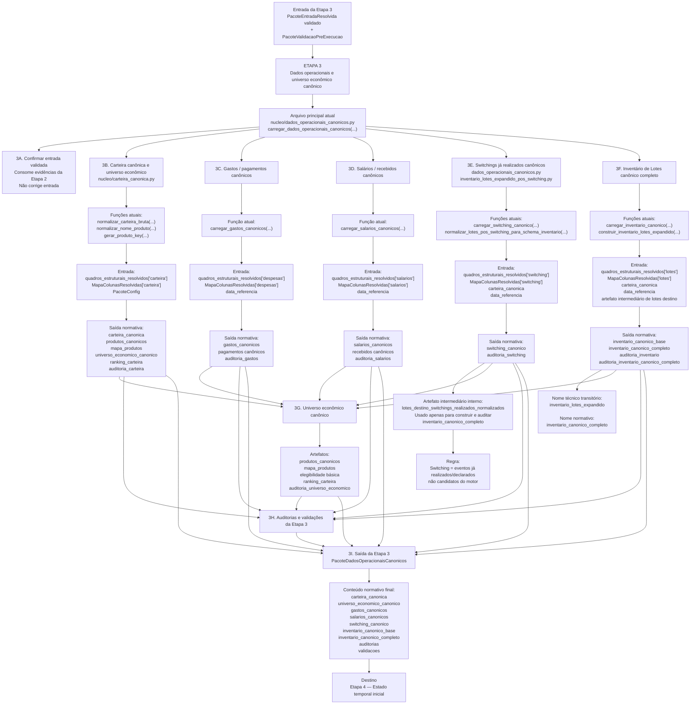

# ME-V17-F0-V32C — Formaliza Etapa 3 como canonização operacional do PacoteEntradaResolvida validado

## 1. Identificação

- MICROETAPA: V17-F0-V.3.2C
- TIPO: DOCUMENTAL / ARQUITETURAL
- CLASSE: FORMALIZA_ETAPA3_COMO_CANONIZACAO_OPERACIONAL
- ALTERA CÓDIGO: NÃO
- ALTERA MOTOR: NÃO
- ALTERA SAÍDA CANÔNICA: NÃO
- ALTERA DADOS: NÃO
- ALTERA CACHE: NÃO
- ALTERA RENDERIZAÇÃO: NÃO

---

## 2. Problema motivador

Após a formalização da Etapa 1 como produtora do `PacoteEntradaResolvida` e da Etapa 2 como gate de validação desse pacote, a Etapa 3 deve ser formalizada como camada de transformação da entrada resolvida validada em artefatos operacionais canônicos.

Também era necessário eliminar ambiguidades conceituais sobre:

- resolução local de aliases e colunas na Etapa 3;
- distinção entre switchings já realizados e switchings candidatos do motor;
- duplicidade entre switching canônico e lotes destino de switching;
- uso normativo do termo `inventario_lotes_expandido`;
- risco de expor lotes destino de switching como fonte operacional paralela.

---

## 3. Decisão arquitetural

A Etapa 3 passa a ser formalizada como:

```text
Etapa 3 = canonização operacional do PacoteEntradaResolvida validado
```

A Etapa 3 recebe:

- `PacoteEntradaResolvida` validado;
- `PacoteValidacaoPreExecucao`.

A Etapa 3 produz:

- `PacoteDadosOperacionaisCanonicos`;
- `UniversoEconomicoCanonico`.

---

## 4. Entrada normativa da Etapa 3

A entrada da Etapa 3 é:

`PacoteEntradaResolvida validado`

Composto por:

- `PacoteConfig`;
- `ContextoExecucao`;
- `PacotePlanilha`;
- `MapaAbasResolvidas`;
- `MapaColunasResolvidas`;
- `quadros_brutos`;
- `quadros_estruturais_resolvidos`;
- `JanelaConsultaCDI`;
- `PacoteCacheCDIDiario`;
- `AuditoriaEntradaBruta`;
- `AuditoriaResolucaoEntrada`;
- `AuditoriaCacheCDI`.

A Etapa 3 também consome o `PacoteValidacaoPreExecucao` como evidência de validação pela Etapa 2.

---

## 5. Saída normativa da Etapa 3

A saída principal da Etapa 3 é:

`PacoteDadosOperacionaisCanonicos`

Composição normativa:

- `carteira_canonica`;
- `universo_economico_canonico`;
- `gastos_canonicos`;
- `salarios_canonicos`;
- `switching_canonico`;
- `inventario_canonico_base`;
- `inventario_canonico_completo`;
- auditorias;
- validações.

O pacote final não deve expor como saída normativa independente:

`lotes_destino_switchings_realizados_normalizados`

Esse artefato pode existir internamente, mas apenas como artefato intermediário de construção e auditoria do `inventario_canonico_completo`.

---

## 6. Blocos normativos da Etapa 3

### 6.1. Confirmar entrada validada

A Etapa 3 consome as evidências do `PacoteValidacaoPreExecucao`.

A Etapa 3 não corrige a entrada. Ela apenas consome entrada validada.

---

### 6.2. Carteira canônica e universo econômico

A Etapa 3 transforma o quadro estrutural resolvido de `carteira` em:

- carteira canônica;
- produtos canônicos;
- mapa de produtos;
- universo econômico canônico;
- ranking da Carteira;
- auditoria da Carteira;
- validação da Carteira.

Funções atuais relacionadas:

- `normalizar_carteira_bruta(...)`;
- `normalizar_nome_produto(...)`;
- `gerar_produto_key(...)`.

Arquivo atual relacionado:

- `nucleo/carteira_canonica.py`.

A Etapa 3 não deve redescobrir colunas da Carteira quando `MapaColunasResolvidas["carteira"]` já existir.

---

### 6.3. Gastos / pagamentos canônicos

A Etapa 3 transforma o quadro estrutural resolvido de `despesas` em:

- gastos canônicos;
- pagamentos canônicos;
- auditoria de gastos.

Função atual relacionada:

- `carregar_gastos_canonicos(...)`.

Arquivo atual relacionado:

- `nucleo/dados_operacionais_canonicos.py`.

A Etapa 3 não decide fonte de pagamento, não executa pagamento e não calcula saldo temporal.

---

### 6.4. Salários / recebidos canônicos

A Etapa 3 transforma o quadro estrutural resolvido de `salarios` em:

- salários canônicos;
- recebidos canônicos;
- auditoria de salários.

Função atual relacionada:

- `carregar_salarios_canonicos(...)`.

Arquivo atual relacionado:

- `nucleo/dados_operacionais_canonicos.py`.

A Etapa 3 não decide uso do recebido, aporte, pagamento, saldo livre ou estado temporal.

---

### 6.5. Switchings já realizados canônicos

A Etapa 3 transforma o quadro estrutural resolvido de `switching` em:

- `switching_canonico`;
- auditoria de switching.

Funções atuais relacionadas:

- `carregar_switching_canonico(...)`;
- `normalizar_lotes_pos_switching_para_schema_inventario(...)`.

Arquivos atuais relacionados:

- `nucleo/dados_operacionais_canonicos.py`;
- `nucleo/inventario_lotes_expandido_pos_switching.py`.

A aba `Switching` representa switchings já realizados/declarados na entrada operacional.

Ela não representa switchings candidatos, recomendados, promovidos ou simulados pelo motor.

A Etapa 3 pode gerar internamente lotes destino derivados desses switchings já realizados, mas esses lotes são apenas artefato intermediário de construção do `inventario_canonico_completo`.

---

### 6.6. Inventário de Lotes canônico completo

A Etapa 3 transforma o quadro estrutural resolvido de `lotes`, em conjunto com os switchings já realizados canônicos, em:

- `inventario_canonico_base`;
- `inventario_canonico_completo`;
- auditoria de inventário;
- auditoria do inventário canônico completo.

Funções atuais relacionadas:

- `carregar_inventario_canonico(...)`;
- `construir_inventario_lotes_expandido(...)`.

Arquivos atuais relacionados:

- `nucleo/dados_operacionais_canonicos.py`;
- `nucleo/inventario_lotes_expandido_pos_switching.py`.

O nome técnico transitório atual `inventario_lotes_expandido` deve ser interpretado conceitualmente como:

`inventario_canonico_completo`

O inventário operacional entregue às etapas posteriores é único.

Nenhuma etapa posterior deve consumir uma lista paralela de lotes destino de switching como fonte operacional independente.

---

### 6.7. Universo econômico canônico

A Etapa 3 consolida:

- produtos canônicos;
- mapa de produtos;
- elegibilidade básica;
- ranking da Carteira;
- auditoria do universo econômico.

O ranking estrutura produtos e destinos, mas não decide pacote do dia, não materializa switching candidato e não liquida pagamento.

---

### 6.8. Auditorias e validações da Etapa 3

A Etapa 3 deve registrar auditorias de:

- carteira;
- gastos;
- salários;
- switching;
- inventário;
- inventário canônico completo;
- universo econômico.

A auditoria do inventário canônico completo deve registrar, quando aplicável:

- quantidade de lotes no inventário base;
- quantidade de lotes destino de switchings já realizados integrados;
- quantidade de lotes no inventário canônico completo;
- lotes destino com schema válido;
- lotes destino sem produto;
- lotes destino sem valor;
- duplicidades detectadas;
- risco de dupla contagem de origem de switching;
- neutralização temporal de origem de switching.

---

## 7. Fronteira da Etapa 3

A Etapa 3 pode:

- criar carteira canônica;
- criar produtos canônicos;
- criar universo econômico canônico;
- criar ranking da Carteira;
- criar gastos/pagamentos canônicos;
- criar salários/recebidos canônicos;
- criar switching canônico de switchings já realizados;
- criar inventário canônico base;
- gerar internamente lotes destino de switchings já realizados;
- integrar esses lotes ao inventário canônico base;
- criar inventário canônico completo;
- resolver `produto_key` usando a Carteira canônica;
- classificar minimamente lotes;
- registrar auditorias e validações de canonização.

A Etapa 3 não pode:

- baixar planilha;
- abrir workbook;
- resolver abas físicas;
- resolver aliases de colunas;
- canonizar colunas estruturais;
- buscar BCB online;
- salvar cache BCB;
- calcular rendimento;
- executar replay passado;
- montar estado temporal inicial;
- normalizar vencimentos temporalmente;
- decidir pagamento;
- decidir switching candidato;
- promover switching do motor;
- materializar switching candidato;
- executar pacote do dia;
- gerar ledger;
- aplicar gates de núcleo;
- gerar saída canônica;
- renderizar console;
- gerar XLSX;
- expor lotes destino de switching como fonte operacional paralela ao `inventario_canonico_completo`.

---

## 8. Relação com Etapa 4

A Etapa 4 deve receber:

- `PacoteDadosOperacionaisCanonicos`;
- `inventario_canonico_completo`;
- `gastos_canonicos`;
- `salarios_canonicos`;
- `switching_canonico`;
- `carteira_canonica`;
- `universo_economico_canonico`;
- `PacoteCacheCDIDiario`;
- `data_referencia`.

A Etapa 4 deve construir o estado temporal inicial.

A Etapa 3 não deve montar o estado temporal inicial.

---

## 9. Arquivos alterados

- `relatorios/principais/CONTRATO_OPERACIONAL_PROJETO.md`
- `logs/iteracoes/ME-V17-F0-V32C_FORMALIZA_ETAPA3_CANONIZACAO_OPERACIONAL.md`

---

## 10. Arquivos preservados

Nenhum arquivo de código foi alterado.

Foram preservados:

- `nucleo/ambiente.py`;
- `nucleo/carregador_config.py`;
- `nucleo/leitor_planilha.py`;
- `nucleo/cache_cdi_bcb.py`;
- `nucleo/validacao_pre_execucao.py`;
- `nucleo/dados_operacionais_canonicos.py`;
- `nucleo/inventario_lotes_expandido_pos_switching.py`;
- `nucleo/nucleo_financeiro_minimo.py`;
- `nucleo/saida_canonica.py`;
- `nucleo/saida_observavel.py`;
- `aplicacao/principal.py`;
- `README.md`;
- `dados/`;
- `saidas/`;
- `cache/`;
- modelo matemático oficial;
- scripts de execução;
- motor temporal;
- regras econômicas;
- renderização;
- arquivos XLSX.

---

## 11. Consequências para etapas futuras

Futuras microetapas poderão:

- adaptar `carregar_dados_operacionais_canonicos(...)` para consumir `PacoteEntradaResolvida` validado;
- remover resolvedores locais duplicados da Etapa 3;
- substituir `inventario_lotes_expandido` por `inventario_canonico_completo` como nomenclatura normativa;
- deixar `lotes_destino_switchings_realizados_normalizados` como artefato interno ou auditoria, não como saída operacional paralela;
- consolidar resolvedores de produto duplicados;
- preparar a Etapa 4 para consumir o inventário canônico completo único.

Esta microetapa não implementa nenhuma dessas refatorações.

---

## 12. Fluxograma da Etapa 3 — Canonização operacional



