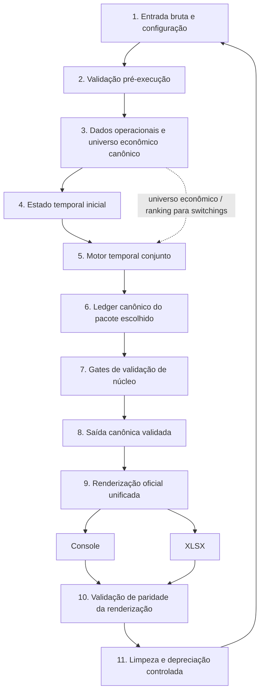

# CONTRATO OPERACIONAL MESTRE DO PROJETO `payment-investment-allocation`

## 1. Status e função normativa

### 1.1. Documento mestre vigente
Este documento é o **Contrato Operacional Mestre vigente** do projeto `payment-investment-allocation`.

### 1.2. Referência normativa principal
O contrato mestre e o modelo matemático-estatístico-financeiro oficial constituem a referência normativa principal do projeto.

Este contrato deve ser tratado simultaneamente como:

- norma operacional superior;
- referência metodológica de interpretação;
- referência de governança para implementação, auditoria e validação.

### 1.3. Estrutura normativa
Na estrutura normativa do projeto:

- este contrato é o **documento normativo superior**;
- o modelo matemático-estatístico-financeiro oficial é o **anexo metodológico vinculante**;
- implementações, relatórios, runners, auditorias, saídas operacionais e documentos históricos não têm prevalência sobre este contrato nem sobre o modelo oficial.

### 1.4. Regra de prevalência
Em caso de divergência entre:

- implementação;
- relatório;
- saída de runner;
- heurística local;
- documento histórico;
- interpretação de conversa anterior;
- output de console;
- arquivo intermediário;

**prevalece este contrato mestre**.

Para formulação matemática, econômica e estatística detalhada, a leitura correta é conjunta:

- este contrato mestre como norma superior;
- o modelo oficial como formulação detalhada vinculante.

### 1.5. Cláusula de estabilização
O núcleo lógico, econômico e matemático definido por este contrato e pelo modelo oficial é tratado como **estabilizado**.

É vedado reabrir sua estrutura em conversas futuras ou em implementações novas sem justificativa explícita de revisão contratual.

---

## 2. Nome canônico e localização dos documentos

### 2.1. Contrato canônico
O arquivo canônico do contrato mestre no repositório é:

`relatorios/principais/CONTRATO_OPERACIONAL_PROJETO.md`

### 2.2. Modelo matemático-estatístico-financeiro oficial
O arquivo canônico do modelo é o documento oficial de modelo matemático-estatístico-financeiro localizado em `relatorios/principais/`.

### 2.3. Artefatos de revisão e distribuição
Arquivos de exportação, cópias de revisão, relatórios de auditoria, pacotes de entrega ou arquivos de congelamento devem ser tratados apenas como artefatos de:

- exportação;
- revisão;
- auditoria;
- distribuição;
- rastreabilidade histórica.

Eles não substituem os arquivos canônicos internos do repositório.

---

## 3. Hierarquia documental vigente

A hierarquia documental vigente do projeto é:

1. contrato mestre normativo superior;
2. modelo matemático-estatístico-financeiro oficial;
3. auditorias, reexecuções e validações compatíveis com os documentos normativos;
4. documentos auxiliares de planejamento, sem força normativa principal;
5. documentos históricos preservados, sem autonomia normativa.

Quando houver conflito:

- prevalece o contrato mestre;
- depois, o modelo oficial;
- depois, a evidência de auditoria mais recente compatível com ambos;
- por fim, os documentos históricos.

---

## 4. Status dos documentos históricos

### 4.1. Documentos históricos preservados
Documentos históricos são preservados para:

- rastreabilidade;
- auditoria de regressão;
- comparação metodológica;
- compreensão da evolução do projeto.

### 4.2. Sem autonomia normativa
É vedado tratar documentos históricos, intermediários ou superados como normas autônomas diante deste contrato e do modelo oficial.

### 4.3. Uso permitido
Documentos históricos podem ser consultados apenas como evidência auxiliar ou memória de decisão, desde que não contrariem os documentos normativos vigentes.

---

## 5. Objetivo final do projeto

O objetivo final do projeto é construir um **motor conjunto, diário, auditável e economicamente coerente** que decida, em cada dia \(t\), sobre:

- pagamento das contas do dia;
- uso de saldo disponível;
- uso de lotes aportados;
- uso de lotes vencidos já normalizados;
- switching entre produtos;
- manutenção ou não ação;

com o objetivo de **maximizar o patrimônio líquido terminal líquido** no horizonte principal vigente.

O projeto deve respeitar simultaneamente:

- pagamento obrigatório das contas do dia;
- disponibilidade temporal real;
- liquidez;
- carência;
- tributação;
- regras dos produtos;
- cronologia intradiária do pacote escolhido;
- auditabilidade por lote, fonte, conta, grupo, produto e pacote.

É vedado interpretar o projeto como:

- otimizador isolado de conta;
- planejador de switching separado do estado do dia;
- heurística local sem núcleo econômico;
- runner de auditoria sem função decisória conjunta.

---

## 6. Definições normativas

Para este contrato, os termos abaixo têm significado fixo.

### 6.1. Fonte
É qualquer recurso economicamente utilizável no dia, incluindo:

- saldo disponível geral;
- recebido disponível;
- lote aportado elegível;
- lote vencido já normalizado.

### 6.2. Lote
É a unidade financeira rastreável com identidade própria, histórico, custo fiscal, regras de rendimento e regras de disponibilidade.

### 6.3. Residual
É o valor remanescente de uma fonte ao fim de uma fase ou de um pacote do dia.

### 6.4. Pacote do dia
É a estrutura decisória completa do dia \(t\), dentre os pacotes permitidos por este contrato.

### 6.5. Grupo factível de switching
É o subconjunto de fontes elegíveis que pode ser migrado conjuntamente para um produto destino, respeitando todas as restrições do dia.

### 6.6. Horizonte principal
É o horizonte \(H\) oficialmente adotado para a decisão-base do motor.

### 6.7. Sensibilidade
É análise complementar em horizonte alternativo, sem substituir a decisão-base, salvo regra explícita em contrário.

### 6.8. Saldo disponível geral
Para fins contratuais, o saldo disponível geral é tratado como **uma única fonte lógica**, salvo se o projeto vier a formalizar explicitamente múltiplos saldos operacionais independentes.

### 6.9. Carteira ranqueada oficial
É a carteira resultante da aplicação do módulo oficial de ranking da aba `Carteira`, usada como base obrigatória de priorização de destinos elegíveis.

---

## 7. Unidade oficial de decisão

### 7.1. Unidade temporal
A unidade oficial de decisão do projeto é o **dia \(t\)**.

### 7.2. Condição inicial do dia
Em cada dia \(t\), é obrigatório verificar primeiro se existem contas com vencimento em \(t\).

Defina:

\[
\mathbb I_t^{pay}=
\begin{cases}
1, & \text{se existe pelo menos uma conta com vencimento em } t \\
0, & \text{caso contrário}
\end{cases}
\]

com

\[
\mathcal J_t=\{j:\text{data da conta }j=t\}
\]

### 7.3. Pacotes factíveis
Se \(\mathbb I_t^{pay}=0\), os pacotes factíveis são:

- `no_action`;
- `switch_only`.

Se \(\mathbb I_t^{pay}=1\), os pacotes factíveis são:

- `pay_only`;
- `switch_then_pay`;
- `pay_then_switch`.

### 7.4. Comparação no mesmo estado
É obrigatório comparar os pacotes factíveis sobre o **mesmo estado econômico inicial do dia**, respeitando:

- a mesma valoração;
- a mesma cronologia intradiária;
- a mesma regra de desempate;
- o mesmo horizonte principal.

---

## 7-A. Fonte única de verdade temporal

### 7-A.1. Regra principal
A decisão operacional do projeto deve ser derivada de uma **única fonte de verdade temporal**.

Essa fonte deve representar, para cada data e para cada etapa intradiária relevante, o estado conjunto de:

- recebidos disponíveis;
- saldo disponível;
- lotes aportados;
- lotes não aportados;
- lotes vencidos;
- lotes bloqueados;
- switchings candidatos;
- switchings promovidos;
- switchings materializados;
- lotes sintéticos pós-switching;
- pagamentos liquidados;
- saldos remanescentes;
- bloqueios operacionais;
- estado final do dia.

### 7-A.2. Vedação a trilhas independentes
É vedado calcular pagamentos e switchings em trilhas independentes e reconciliá-los posteriormente em camadas de saída.

Pagamentos, switchings, fontes, lotes, saldos, cobertura e status devem ser derivados do mesmo estado temporal canônico.

### 7-A.3. Ledger canônico de eventos
O motor diário deve produzir um **ledger canônico de eventos** contendo, no mínimo:

- data do evento;
- ordem intradiária;
- tipo de evento;
- pacote do dia;
- conta, quando aplicável;
- lote ou fonte de origem;
- lote ou fonte de destino;
- produto de origem;
- produto de destino;
- valor bruto;
- imposto;
- valor líquido;
- saldo antes;
- consumo;
- saldo depois;
- status do evento;
- motivo de bloqueio;
- impacto terminal estimado;
- fonte decisória.

Console, planilha, markdown, JSON e demais saídas devem ser renderizações desse ledger, não fontes alternativas de decisão.

---

## 7-B. Estados normativos de switching e fontes

### 7-B.1. Estados normativos de switching
Todo switching deve possuir estado operacional explícito. Os estados mínimos são:

- candidato;
- rejeitado;
- promovido;
- materializado;
- consumido em pagamento;
- bloqueado.

Um switching candidato representa apenas uma oportunidade avaliada.

Um switching promovido representa uma decisão selecionada pelo motor, mas só se torna fonte de pagamento quando materializado no estado temporal.

Um switching materializado representa a efetiva transição de estado que cria ou atualiza uma fonte/lote disponível.

Switching candidato ou promovido sem materialização não pode ser usado como fonte operacional de pagamento.

### 7-B.2. Estados normativos de lote ou fonte
Cada lote ou fonte deve possuir estado único e auditável em cada etapa temporal. Os estados mínimos são:

- futuro;
- disponível;
- ativo aportado;
- vencido normalizado;
- bloqueado;
- migrado por switching;
- sintético pós-switching;
- consumido;
- residual;
- exaurido.

Fontes futuras, migradas, exauridas ou não materializadas não podem ser apresentadas como fonte operacional de pagamento.

### 7-B.3. Campos operacionais e diagnósticos
Campos operacionais devem conter apenas eventos, fontes, lotes e saldos materializados.

Informações candidatas, estimadas ou diagnósticas devem ser identificadas como tais e não podem preencher campos operacionais.

Produto destino, oportunidade de switching ou ganho estimado não equivalem a lote pós-switching materializado.

---

## 7-C. Regra de trajetória conjunta dos pacotes

No pacote `pay_only`, os pagamentos devem consumir o estado disponível sem switching materializado no mesmo pacote.

No pacote `switch_then_pay`, o pagamento deve consumir o estado pós-switching materializado.

No pacote `pay_then_switch`, o switching deve consumir o estado residual após pagamento.

A escolha do pacote deve considerar a trajetória completa de estado, e não apenas uma comparação local por conta ou por switching isolado.

---

## 7-D. Falha temporal, reescolha dinâmica e generalidade decisória

### 7-D.1. Status terminal de falha

Status como `sem_saldo_temporal_auditavel`, `saldo_temporal_insuficiente_cumulativo` ou equivalentes representam falha terminal de factibilidade temporal somente depois de esgotada a tentativa de refactibilização no mesmo estado temporal canônico.

Eles não podem ser usados como substitutos da decisão econômica nem como correção em camada de saída.

### 7-D.2. Reescolha dinâmica obrigatória antes da falha definitiva

Quando uma fonte inicialmente escolhida deixar de cobrir temporalmente um pagamento por saldo cumulativo, carência, liquidez, vencimento, materialização ou qualquer restrição dura do estado, o motor deve tentar refactibilizar a decisão dentro do mesmo pacote, na mesma data e no mesmo estado temporal canônico.

A refactibilização só pode usar fontes que, naquela etapa intradiária, estejam:

- materializadas;
- temporalmente disponíveis;
- líquidas ou resgatáveis;
- fora de carência impeditiva;
- suficientes para a cobertura exigida;
- compatíveis com as restrições de residual e com a cronologia do pacote.

A falha definitiva só pode ser registrada quando não existir alternativa elegível e suficiente no estado temporal canônico.

### 7-D.3. Vedação a remendos locais

É vedado criar regra específica por despesa, lote, produto nominal, data isolada, caso histórico ou rótulo de auditoria.

Toda correção decisória deve ser formulada como regra geral do motor temporal, aplicável a qualquer fonte, conta, lote, produto ou pacote que satisfaça as mesmas condições estruturais.

### 7-D.4. Separação entre diagnóstico e norma

Rótulos de auditoria, contagens transitórias, nomes de versões, scripts diagnósticos e casos reais usados para validação não constituem regra normativa autônoma.

Eles podem servir como evidência para testar o contrato e o modelo, mas não podem substituir a formulação geral aqui definida.

## 7-E. Arquitetura macro obrigatória do pipeline operacional

### 7-E.1. Ordem lógica macro obrigatória

O projeto deve seguir uma arquitetura macro em camadas, com a seguinte ordem lógica obrigatória:

1. entrada bruta e configuração;
2. validação pré-execução;
3. dados operacionais e universo econômico canônico;
4. estado temporal inicial;
5. motor temporal conjunto;
6. ledger canônico do pacote escolhido;
7. gates de validação de núcleo;
8. saída canônica validada;
9. renderização oficial unificada;
10. validação de paridade da renderização;
11. limpeza e depreciação controlada, com retorno à etapa 1.

O fluxograma macro oficial é:

A implementação física pode ser refatorada em módulos, pacotes, funções ou scripts distintos, mas a ordem lógica, as responsabilidades e as proibições por camada são normativas.

É vedado inverter essa ordem de modo que saída, console, planilha, ponte de renderização, relatório ou diagnóstico posterior passem a decidir, corrigir, inferir ou substituir o estado temporal canônico.

O fluxograma macro não detalha subetapas internas. O detalhamento de cada etapa deve ser feito em auditorias, mapas técnicos ou documentos próprios de cada camada, para evitar assimetria e excesso de granularidade no contrato macro.

### 7-E.2. Ambiente, configuração, entrada bruta e insumos externos resolvidos

A Etapa 1 deve ser tratada como a camada responsável por produzir um artefato único, auditável e consumível pelas etapas seguintes:

`PacoteEntradaResolvida`

Essa camada não deve entregar conjuntos soltos de DataFrames, aliases, caminhos, cache ou metadados independentes. A função normativa da Etapa 1 é consolidar a entrada física e os insumos externos em um pacote resolvido, a ser validado pela Etapa 2 e consumido pela Etapa 3.

A Etapa 1 deve abranger, conceitualmente:

1. ambiente mínimo;
2. configuração operacional única;
3. ambiente final com data de referência;
4. planilha operacional obtida por download ou fallback local;
5. resolução estrutural de abas;
6. leitura dos quadros brutos das cinco famílias operacionais;
7. resolução estrutural de colunas;
8. aplicação mecânica do mapa de colunas;
9. produção de quadros estruturais resolvidos;
10. derivação da janela bruta para CDI/BCB;
11. carregamento e auditoria do cache CDI/BCB;
12. consolidação do `PacoteEntradaResolvida`.

O `PacoteEntradaResolvida` contém, conceitualmente:

- `PacoteConfig`;
- `ContextoExecucao`;
- `PacotePlanilha`;
- `MapaAbasResolvidas`;
- `MapaColunasResolvidas`;
- `quadros_brutos`;
- `quadros_estruturais_resolvidos`;
- `JanelaConsultaCDI`;
- `PacoteCacheCDIDiario`;
- `AuditoriaEntradaBruta`;
- `AuditoriaResolucaoEntrada`;
- `AuditoriaCacheCDI`.

O `PacotePlanilha`, dentro do `PacoteEntradaResolvida`, contém as cinco famílias de entrada operacional em forma bruta e estruturalmente resolvida:

1. `Carteira`;
2. `Salários` / recebidos brutos;
3. `Todos os Gastos` / despesas;
4. `Inventário de Lotes`;
5. `Switching` / switchings já realizados brutos.

Esses quadros não são artefatos operacionais canônicos. Eles são entradas estruturais validáveis pela Etapa 2 e transformáveis pela Etapa 3.

Na Etapa 1, `quadros_canonicos`, quando esse nome aparecer no código existente, deve ser interpretado conceitualmente como `quadros_estruturais_resolvidos`. Dados operacionais canônicos pertencem à Etapa 3. Assim, carteira canônica, gastos canônicos, salários canônicos, switching canônico e inventário canônico não pertencem à Etapa 1.

A resolução de abas e colunas deve ocorrer uma única vez na Etapa 1, a partir do config operacional canônico. A Etapa 2 deve validar os mapas resolvidos, e a Etapa 3 deve consumir os quadros estruturais resolvidos sem recriar resolvedores locais de aliases e colunas quando o mapa resolvido já existir.

O cache CDI/BCB entra na Etapa 1 como insumo externo bruto, cacheável e auditável. A Etapa 1 deve obter a série CDI, auditar sua origem, registrar fetch ou fallback, registrar a janela de consulta e registrar o status de atualização do cache. A Etapa 1 não deve usar essa série para cálculo de rendimento, replay, valoração ou decisão econômica. O uso econômico da série CDI pertence às etapas posteriores.

A Etapa 1 pode:

- resolver ambiente mínimo;
- carregar config;
- resolver data de referência definitiva;
- obter planilha;
- resolver abas;
- resolver colunas;
- produzir quadros estruturais resolvidos;
- derivar janela bruta CDI;
- carregar cache CDI;
- registrar auditorias.

A Etapa 1 não pode:

- criar carteira canônica;
- criar gastos canônicos;
- criar salários canônicos;
- criar switching canônico;
- criar inventário canônico;
- integrar inventário com switching;
- calcular rendimento;
- executar replay;
- montar estado temporal;
- decidir pagamento;
- decidir switching;
- gerar ledger;
- gerar saída canônica;
- gerar console;
- gerar XLSX.

### 7-E.3. Validação pré-execução do PacoteEntradaResolvida

A Etapa 2 deve ser tratada como gate puro de validação pré-execução do `PacoteEntradaResolvida`.

A Etapa 2 valida se a entrada resolvida produzida pela Etapa 1 está completa, coerente, auditável e minimamente interpretável para permitir a canonização operacional da Etapa 3.

A entrada normativa da Etapa 2 é:

`PacoteEntradaResolvida`

A saída normativa da Etapa 2 é:

`PacoteValidacaoPreExecucao`

Composto por:

- `ok`;
- `erros`;
- `avisos`;
- `evidencias`.

A Etapa 2 valida:

1. `PacoteConfig`;
2. `ContextoExecucao`;
3. `PacotePlanilha`;
4. `MapaAbasResolvidas`;
5. `MapaColunasResolvidas`;
6. `quadros_estruturais_resolvidos`;
7. interpretabilidade mínima de datas e números;
8. `JanelaConsultaCDI`;
9. `PacoteCacheCDIDiario`;
10. auditorias da Etapa 1.

A Etapa 2 valida que o `PacotePlanilha` contém as cinco famílias operacionais:

1. `carteira`;
2. `salarios`;
3. `despesas`;
4. `lotes`;
5. `switching`.

A Etapa 2 valida mapas resolvidos. A Etapa 2 não reconstrói mapas.

A Etapa 2 pode verificar parseabilidade mínima de datas e números, mas não transforma esses valores em entidades operacionais canônicas.

A Etapa 2 valida a `JanelaConsultaCDI` e o `PacoteCacheCDIDiario`, mas não busca BCB, não salva cache, não substitui série e não calcula rendimento.

A Etapa 2 pode:

- validar presença de artefatos;
- validar existência de caminhos;
- validar consistência de config;
- validar contexto de execução;
- validar presença das cinco famílias operacionais;
- validar mapas de abas resolvidas;
- validar mapas de colunas resolvidas;
- validar quadros estruturais resolvidos;
- validar interpretabilidade mínima de datas;
- validar interpretabilidade mínima de números;
- validar janela CDI;
- validar pacote cache CDI;
- validar auditorias da Etapa 1;
- emitir erros;
- emitir avisos;
- registrar evidências.

A Etapa 2 não pode:

- baixar planilha;
- abrir workbook;
- reler abas;
- resolver aliases;
- resolver colunas para uso operacional;
- canonizar colunas;
- criar quadros estruturais;
- carregar cache BCB;
- buscar BCB online;
- salvar cache;
- corrigir dados;
- limpar dados;
- normalizar dados operacionalmente;
- criar carteira canônica;
- criar gastos canônicos;
- criar salários canônicos;
- criar switching canônico;
- criar inventário canônico;
- integrar inventário com switching;
- calcular rendimento;
- executar replay;
- montar estado temporal;
- decidir pagamento;
- decidir switching;
- gerar ledger;
- gerar saída canônica;
- renderizar console;
- gerar XLSX.

### 7-E.4. Dados operacionais e universo econômico canônico

A Etapa 3 deve ser tratada como camada de canonização operacional do `PacoteEntradaResolvida` validado.

A Etapa 3 recebe:

- `PacoteEntradaResolvida` validado;
- `PacoteValidacaoPreExecucao`.

A Etapa 3 produz:

- `PacoteDadosOperacionaisCanonicos`;
- `UniversoEconomicoCanonico`.

A saída normativa da Etapa 3 contém:

- `carteira_canonica`;
- `universo_economico_canonico`;
- `gastos_canonicos`;
- `salarios_canonicos`;
- `switching_canonico`;
- `inventario_canonico_base`;
- `inventario_canonico_completo`;
- auditorias;
- validações.

O pacote final não deve expor como saída normativa independente:

`lotes_destino_switchings_realizados_normalizados`

Esse artefato pode existir internamente, mas apenas como artefato intermediário de construção e auditoria do `inventario_canonico_completo`.

A Etapa 3 transforma o quadro estrutural resolvido de `carteira` em carteira canônica, produtos canônicos, mapa de produtos, universo econômico canônico, ranking da Carteira, auditoria da Carteira e validação da Carteira.

A Etapa 3 transforma o quadro estrutural resolvido de `despesas` em gastos canônicos, pagamentos canônicos e auditoria de gastos.

A Etapa 3 transforma o quadro estrutural resolvido de `salarios` em salários canônicos, recebidos canônicos e auditoria de salários.

A Etapa 3 transforma o quadro estrutural resolvido de `switching` em `switching_canonico` e auditoria de switching. A aba `Switching` representa switchings já realizados/declarados na entrada operacional. Ela não representa switchings candidatos, recomendados, promovidos ou simulados pelo motor.

A Etapa 3 pode gerar internamente lotes destino derivados desses switchings já realizados, mas esses lotes são apenas artefato intermediário de construção do `inventario_canonico_completo`.

A Etapa 3 transforma o quadro estrutural resolvido de `lotes`, em conjunto com os switchings já realizados canônicos, em `inventario_canonico_base`, `inventario_canonico_completo`, auditoria de inventário e auditoria do inventário canônico completo.

O nome técnico transitório atual `inventario_lotes_expandido` deve ser interpretado conceitualmente como:

`inventario_canonico_completo`

O inventário operacional entregue às etapas posteriores é único.

Nenhuma etapa posterior deve consumir uma lista paralela de lotes destino de switching como fonte operacional independente.

A Etapa 3 pode:

- criar carteira canônica;
- criar produtos canônicos;
- criar universo econômico canônico;
- criar ranking da Carteira;
- criar gastos/pagamentos canônicos;
- criar salários/recebidos canônicos;
- criar switching canônico de switchings já realizados;
- criar inventário canônico base;
- gerar internamente lotes destino de switchings já realizados;
- integrar esses lotes ao inventário canônico base;
- criar inventário canônico completo;
- resolver `produto_key` usando a Carteira canônica;
- classificar minimamente lotes;
- registrar auditorias e validações de canonização.

A Etapa 3 não pode:

- baixar planilha;
- abrir workbook;
- resolver abas físicas;
- resolver aliases de colunas;
- canonizar colunas estruturais;
- buscar BCB online;
- salvar cache BCB;
- calcular rendimento;
- executar replay passado;
- montar estado temporal inicial;
- normalizar vencimentos temporalmente;
- decidir pagamento;
- decidir switching candidato;
- promover switching do motor;
- materializar switching candidato;
- executar pacote do dia;
- gerar ledger;
- aplicar gates de núcleo;
- gerar saída canônica;
- renderizar console;
- gerar XLSX;
- expor lotes destino de switching como fonte operacional paralela ao `inventario_canonico_completo`.

A Etapa 4 deve receber os dados operacionais canônicos e construir o estado temporal inicial. A Etapa 3 não deve montar o estado temporal inicial.

### 7-E.5. Estado temporal inicial

Antes da execução do motor temporal conjunto, o projeto deve construir explicitamente o estado temporal inicial.

O estado temporal inicial deve consumir os dados financeiros canônicos e o inventário completo de lotes produzido na etapa anterior.

O estado temporal inicial deve conter, no mínimo:

- lotes ativos;
- lotes exauridos;
- lotes vencidos normalizados;
- lotes futuros;
- saldos disponíveis;
- recebidos materializados;
- recebidos futuros;
- pagamentos vencidos ou futuros;
- switchings candidatos, promovidos ou previamente declarados;
- restrições de liquidez, carência, vencimento e disponibilidade.

O estado temporal inicial não depende diretamente do ranking para existir. A dependência direta do ranking ocorre principalmente no motor temporal conjunto, em especial na avaliação de switchings e destinos econômicos.

### 7-E.6. Motor temporal conjunto

O motor temporal conjunto é a única camada autorizada a decidir ou aplicar efeitos econômicos sobre:

- pagamentos;
- recebidos;
- aportes;
- resgates;
- switchings;
- materialização de lote destino;
- migração de lote origem;
- disponibilidade de fontes;
- elegibilidade por liquidez;
- elegibilidade por carência;
- saldos temporais;
- pacotes do dia;
- falhas de factibilidade temporal.

O motor temporal conjunto deve consumir:

- o estado temporal inicial;
- os dados operacionais canônicos;
- o inventário completo de lotes;
- o universo econômico canônico;
- o ranking da Carteira quando necessário à avaliação de switchings;
- os parâmetros econômicos, fiscais e operacionais vigentes.

Pagamentos e switchings devem ser resolvidos dentro do mesmo motor temporal, sobre o mesmo estado temporal canônico. É vedado calcular pagamentos e switchings em trilhas independentes e reconciliá-los posteriormente em saída, console, planilha, relatório ou CSV diagnóstico.

A relação entre pagamentos e switchings é dependente: pagamentos podem alterar a atratividade ou factibilidade de switchings, e switchings podem alterar a disponibilidade, liquidez ou composição das fontes usadas em pagamentos. Essa dependência deve ser resolvida dentro da construção das trajetórias candidatas do motor e antes da comparação terminal dos pacotes.

O FIFO pode ser usado inicialmente como candidato interno simples e auditável para seleção de fontes de pagamento, mas não deve ser tratado como etapa autônoma, regra final exclusiva ou promoção direta de diagnóstico. Outras metodologias podem ser adicionadas posteriormente como candidatas concorrentes dentro do próprio motor.

O switching deve ser processado dentro do motor temporal conjunto. É vedado tratar switching apenas como ponte de renderização, anotação de saída ou aba informativa sem efeito no estado temporal.

Quando um switching for materializado, o motor deve atualizar o estado temporal de forma auditável, incluindo, no mínimo:

- retirada, migração ou bloqueio operacional da fonte/lote de origem;
- criação, atualização ou reconciliação da fonte/lote de destino;
- registro do valor líquido migrado;
- manutenção do vínculo entre origem, destino, produto, data e pacote;
- impedimento de dupla contagem;
- atualização da elegibilidade para pagamentos posteriores.

### 7-E.7. Ledger canônico do pacote escolhido

O motor temporal conjunto deve produzir como saída primária um ledger canônico do pacote escolhido.

Esse ledger deve conter, no mínimo:

- eventos de pagamentos;
- eventos de switchings;
- eventos de recebidos, aportes e resgates;
- saldos antes e depois;
- consumos por fonte;
- impostos e valores líquidos;
- residuais;
- bloqueios;
- status operacionais;
- impacto terminal estimado;
- vínculos entre data, conta, fonte, lote, produto e pacote.

O ledger canônico do pacote escolhido é a fonte oficial para a validação de núcleo e para a construção da saída canônica.

É vedado reconstruir o estado temporal a partir da planilha operacional, do console, de markdowns, de CSVs diagnósticos ou de artefatos renderizados.

### 7-E.8. Gates de validação de núcleo

Após a produção do ledger canônico do pacote escolhido, devem ser aplicados gates de validação de núcleo.

Esses gates devem verificar, no mínimo:

- conservação de valor;
- pagamento integral;
- pagamento na data correta;
- fonte materializada antes do uso;
- liquidez e carência;
- ausência de saldo negativo indevido;
- impedimento de dupla contagem;
- consistência entre switching materializado e lotes destino;
- consistência entre pagamentos e fontes consumidas;
- consistência de saldos e residuais;
- aderência ao objetivo econômico terminal.

Esses gates devem operar sobre objetos internos do motor, ledger e estado temporal, não sobre planilha ou console como fonte primária.

### 7-E.9. Saída canônica validada

A saída canônica deve ser construída somente depois da aprovação do ledger e do estado temporal pelos gates de núcleo.

A saída canônica deve consumir exclusivamente:

- ledger canônico do pacote escolhido;
- estado temporal final;
- decisões econômicas finais;
- ranking oficial utilizado;
- auditorias e validações compatíveis com o estado temporal.

A saída canônica pode organizar, nomear e estruturar informações para consumo humano ou operacional, mas não pode recalcular decisão econômica, trocar fonte de pagamento, materializar switching, corrigir saldo temporal ou alterar o estado final.

Antes da renderização oficial, a saída canônica deve estar validada contra o ledger e o estado temporal final.

### 7-E.10. Renderização oficial unificada

Console e planilha operacional são camadas finais de renderização da mesma saída canônica validada.

A renderização oficial unificada deve gerar, no mínimo:

- console;
- XLSX.

Console e XLSX devem representar a mesma saída canônica validada, cada um em formato adequado ao seu uso operacional.

Essas camadas podem formatar, ordenar, filtrar visualmente, agrupar, resumir e apresentar informações da saída canônica, mas não podem:

- decidir pagamento;
- decidir switching;
- alterar fonte;
- alterar lote sugerido;
- materializar destino;
- migrar origem;
- recalcular saldo temporal;
- corrigir falha de factibilidade;
- criar evidência econômica não presente na saída canônica.

A planilha operacional e o console não são fontes normativas autônomas. Eles são representações renderizadas da saída canônica validada.

### 7-E.11. Validação de paridade da renderização

Após a geração do console e da planilha operacional, deve ser aplicada validação de paridade da renderização.

Essa validação deve verificar se console e XLSX representam fielmente a mesma saída canônica validada, incluindo:

- pagamentos;
- switchings;
- saldos;
- fontes;
- lotes;
- status;
- métricas relevantes;
- ausência de alterações semânticas introduzidas pela renderização.

A validação de paridade não pode substituir a validação de núcleo, nem pode reinterpretar decisão econômica. Divergências de paridade devem ser tratadas como problemas de renderização, não como justificativa para alterar decisão em camada de saída.

### 7-E.12. Limpeza e depreciação controlada

A limpeza e depreciação controlada ocorre após a validação de paridade da renderização.

Essa etapa pode tratar:

- pontes transitórias;
- scripts diagnósticos substituídos;
- CSVs diagnósticos usados como ponte;
- funções equivalentes legadas;
- nomenclaturas antigas;
- abas auxiliares redundantes;
- imports não canônicos.

Critérios rígidos de normalização, remoção de duplicidades e depreciação só devem ser aplicados nesta etapa, quando houver substitutos canônicos implementados e validados.

A limpeza e depreciação controlada não encerra o pipeline. Após qualquer remoção, depreciação, normalização ou substituição estrutural, o processo deve retornar à etapa 1, exigindo nova execução integral do pipeline.

### 7-E.13. Papel dos diagnósticos

Diagnósticos devem funcionar como instrumentos de validação, rastreabilidade e migração, e não como motores auxiliares ou fontes decisórias autônomas.

Diagnósticos podem ocorrer em cinco pontos:

1. pré-execução;
2. pós-canonização;
3. pós-motor temporal;
4. pós-saída canônica;
5. pós-renderização.

Diagnósticos que leem a planilha final podem ser usados para validar fidelidade de renderização, mas não podem substituir diagnósticos sobre o ledger canônico e o estado temporal final.

É vedado usar diagnóstico pós-planilha como mecanismo principal para decidir se switching foi aplicado corretamente ao estado temporal.

### 7-E.14. Vedação a pontes de renderização com efeito econômico

Pontes, adaptadores ou wrappers de saída podem existir apenas como mecanismos transitórios de apresentação, desde que não alterem a decisão econômica nem sejam tratados como integração funcional do motor.

Qualquer integração com efeito econômico deve ocorrer antes da construção da saída canônica, dentro do motor temporal conjunto ou de camada explicitamente subordinada a ele.

É vedado considerar como funcionalmente integrado um switching que apenas aparece no console, na planilha ou em campo de saída, mas não altera o ledger canônico e o estado temporal final.

### 7-E.15. Critério para refatoração estrutural

Sempre que um script ou função acumular responsabilidades de mais de uma camada, deve ser priorizada refatoração progressiva para separar:

- leitura;
- validação;
- canonização;
- universo econômico;
- estado temporal;
- motor temporal;
- ledger;
- gates de validação;
- construção da saída canônica;
- renderização;
- diagnóstico;
- limpeza e depreciação.

Scripts de saída não devem conter regra decisória. Scripts diagnósticos não devem conter regra econômica substitutiva. Scripts de renderização não devem corrigir estado temporal.

A normalização de funções e nomenclaturas deve ser tratada como diretriz transversal durante as etapas funcionais e como critério rígido apenas na etapa de limpeza e depreciação controlada.
## 8. Regras obrigatórias de pagamento

### 8.1. Data correta
É obrigatório pagar cada conta na data da planilha.

### 8.2. Restrições duras
É vedado considerar:

- atraso;
- antecipação;
- não pagamento;
- pagamento parcial da conta.

### 8.3. Pagamento integral
É obrigatório pagar integralmente cada conta do dia.

### 8.4. Resolução conjunta do dia
É obrigatório resolver o pagamento sobre o **conjunto das contas do dia**, e não conta por conta de forma isolada.

---

## 9. Regra global do residual no pagamento do dia

### 9.1. Regra principal
Se apenas uma fonte for usada no pagamento do dia, não há restrição adicional de residual.

Se múltiplas fontes forem usadas no pagamento do dia, então:

> **no máximo uma** das fontes usadas pode terminar a fase de pagamento com residual positivo.

Todas as demais fontes usadas nessa fase devem zerar.

### 9.2. Escopo
Essa regra vale para o **conjunto dos pagamentos do dia**, e não por conta isolada.

### 9.3. Saldo disponível geral
O saldo disponível geral conta como fonte para essa regra e está sujeito à mesma restrição.

### 9.4. Finalidade
Essa regra existe para:

- evitar pulverização de resíduos;
- simplificar o pagamento do dia;
- reduzir fragmentação artificial de fontes;
- manter operacionalidade coerente com o objetivo econômico.

---

## 10. Universo bruto e elegibilidade prévia

### 10.1. Universo bruto
É obrigatório iniciar de um universo bruto de recursos observáveis no dia, incluindo:

- saldo disponível;
- recebidos disponíveis;
- lotes aportados;
- lotes vencidos;
- lotes futuros;
- demais recursos presentes no estado.

### 10.2. Filtragem prévia
Antes da otimização, é obrigatório derivar explicitamente:

- fontes elegíveis para pagamento;
- fontes elegíveis para switching.

### 10.3. Filtros obrigatórios
Uma fonte só pode ser tratada como elegível se passar por:

- disponibilidade temporal;
- liquidez/resgate;
- carência de retirada ou saída;
- regra operacional do produto;
- restrições específicas aplicáveis.

---

---

## 10-A. Contrato de dados de entrada operacional

### 10-A.1. Abas operacionais mínimas

A planilha operacional do projeto deve conter, no mínimo, as seguintes abas de entrada:

- `Carteira`;
- `Todos os Gastos`;
- `Inventário de Lotes`;
- `Salários`;
- `Switching`.

A aba de switching pode ser encontrada na base com variações de grafia. Para fins de leitura operacional, o motor deve aceitar, no mínimo, os seguintes aliases:

- `Switching`;
- `Switiching`;
- `Swtiching`.

Independentemente da grafia da aba, a entidade interna canônica deve ser tratada como `switching`.

### 10-A.2. Superação da regra de três abas

A regra operacional anterior segundo a qual as únicas abas de entrada eram `Carteira`, `Todos os Gastos` e `Inventário de Lotes` fica superada para o contrato vigente e para execuções futuras compatíveis com este contrato.

Essas três abas continuam obrigatórias, mas não esgotam mais o contrato de dados do projeto.

### 10-A.2-A. Semântica operacional atualizada das abas

A aba `Carteira` deve conter exclusivamente produtos reais de investimento, isto é, produtos que possam ser avaliados, ranqueados ou considerados como destino de aplicação ou switching.

Rótulos de caixa operacional, saldo disponível, recebido disponível ou fonte de pagamento não são produtos da `Carteira`. Esses elementos pertencem ao estado temporal como fontes operacionais, não ao universo de produtos de investimento.

A aba `Inventário de Lotes` pode representar duas classes de lote materializado:

1. **lote investido/materializado**, quando `Data Recebimento`, `Data Aplicação`, `Valor Original` e `Investimento` estão preenchidos;
2. **lote de caixa disponível/materializado**, quando `Data Recebimento` e `Valor Original` estão preenchidos, mas `Data Aplicação` e `Investimento` estão vazios.

Um lote de caixa disponível só pode ser tratado como fonte operacional em uma data \(t\) quando sua `Data Recebimento` for menor ou igual a \(t\). Se sua data for posterior a \(t\), ele é recurso futuro e não pode pagar, aportar ou participar de switching no dia.

A aba `Salários` deve alimentar o estado temporal como conjunto de entradas externas de caixa. Entradas com `Data Recebimento` posterior a \(t\) são futuras e indisponíveis; entradas com `Data Recebimento` menor ou igual a \(t\) são materializadas no estado temporal e podem ser classificadas pelo motor como pagamento de conta, aporte externo, reserva operacional, margem de gastos pequenos ou saldo livre.

Na aba `Todos os Gastos`, o valor `Saldo` em `Lote usado` representa pagamento histórico feito por caixa operacional. Esse rótulo não é produto de investimento, não deve ser procurado na `Carteira` e não deve criar lote investido.

A aba `Switching` é fonte suficiente para materializar internamente o lote destino informado em `Lote (ID) Depois`. Se esse lote destino também aparecer no `Inventário de Lotes`, o motor deve reconciliar as informações e impedir contagem dupla. Se o lote destino não aparecer no `Inventário de Lotes`, o motor deve criá-lo internamente no estado temporal a partir dos campos da aba `Switching`.

O campo canônico de valor financeiro na aba `Switching` é `Valor Líquido Migrado`.

### 10-A.3. Função da aba `Salários`

A aba `Salários` representa entradas externas de renda ou caixa.

Na versão atual da base, os campos mínimos observados são:

- `Nome`;
- `Data Recebimento`;
- `Origem`;
- `Valor`.

O valor registrado em `Salários` não deve ser interpretado automaticamente como integralmente disponível para investimento ou pagamento de contas.

O motor deve permitir distinguir, de forma explícita ou parametrizada:

- salário ou renda recebida;
- valor usado para pagamento de contas explícitas;
- valor usado para aporte/investimento externo;
- reserva mínima mantida em conta;
- margem para gastos pequenos não contabilizados individualmente;
- saldo livre remanescente.

### 10-A.4. Regra negativa para salários

É vedado assumir que todo salário recebido deve ser obrigatoriamente alocado em contas explícitas, aportes ou investimentos.

Parte do salário pode permanecer como saldo operacional, reserva mínima em conta ou margem para gastos não contabilizados, desde que isso seja representado de forma auditável no estado temporal.

### 10-A.5. Função da aba `Switching`

A aba `Switching`, incluindo seus aliases aceitos, representa eventos de transição entre lote/produto de origem e lote/produto de destino.

Na versão atual da base, a aba foi encontrada com a grafia `Switiching` e com os campos mínimos observados:

- `Lote (ID) Antes`;
- `Lote (ID) Depois`;
- `Data Recebimento`;
- `Data Aplicação`;
- `Valor Líquido Migrado`;
- `Investimento`.

Esses campos devem ser interpretados como evidência de transição de estado financeiro, e não como gasto comum ou aporte externo independente.

### 10-A.6. Regra negativa para switching

Resgates decorrentes de switching não devem ser tratados como gastos na aba `Todos os Gastos`.

Aportes decorrentes de switching não devem ser tratados como novos investimentos externos independentes na aba `Inventário de Lotes` sem vínculo com a origem.

O switching materializado deve ser tratado como evento de transição de estado no ledger canônico, preservando o vínculo entre:

- lote/fonte de origem;
- valor bruto ou original;
- imposto, quando aplicável;
- valor líquido migrado;
- produto ou investimento de destino;
- lote/fonte de destino;
- data de recebimento;
- data de aplicação;
- estado operacional do switching.

### 10-A.7. Consequência para o motor temporal

O motor temporal central deve diferenciar obrigatoriamente:

- renda externa;
- pagamento de conta;
- aporte externo;
- reserva operacional;
- gasto não contabilizado individualmente;
- resgate por switching;
- aporte por switching;
- switching candidato;
- switching promovido;
- switching materializado.

Nenhuma camada de saída pode corrigir localmente confusão entre essas categorias.

Qualquer inconsistência entre salário, gasto, aporte e switching deve ser tratada como falha de modelagem ou de estado temporal, não como ajuste visual de saída.

### 10-A.8. Relação com o ledger canônico

Eventos derivados das abas `Salários` e `Switching` devem ser materializados no ledger canônico quando forem economicamente efetivos.

A aba `Salários` deve alimentar eventos de entrada externa de caixa.

A aba `Switching` deve alimentar eventos de transição entre fontes/lotes/produtos.

Console, planilha final, markdown, JSON e demais saídas devem apenas renderizar esses eventos materializados, preservando a distinção entre entrada externa, pagamento, aporte e switching.

---

## 11. Regra de pós-vencimento

### 11.1. Regra principal
Se um lote venceu em \(t\) ou antes, ele deixa de ser lote aportado ativo e passa a ser **fonte disponível do dia**.

Formalmente:

\[
m_i \le t \Rightarrow \text{fonte disponível do dia}
\]

### 11.2. Regra negativa
É vedado tratar lote com vencimento posterior a \(t\) como disponível por vencimento.

### 11.3. Status normativo
O pós-vencimento é parte do **estado econômico oficial do dia** e não mera camada de auditoria.

---

## 12. Regras obrigatórias de switching

### 12.1. Formas permitidas
É permitido apenas switching nas formas:

- **individual**;
- **agrupado combinatório**;
- **integral**.

### 12.2. Agrupado combinatório
É obrigatório que o agrupado seja realmente combinatório e baseado em grupos factíveis.

### 12.3. Switching integral
Switching integral é o switching do **maior grupo factível elegível para um produto destino específico dentro do pacote do dia**, após filtros de:

- disponibilidade;
- liquidez;
- carência;
- ticket;
- compatibilidade com o produto destino.

### 12.4. Limite por fonte
É vedado que uma fonte participe de mais de um switching no mesmo dia.

### 12.5. Convivência com pagamento
É permitido que uma fonte participe do pagamento e depois, com residual elegível, participe de um único switching.

---

## 13. Distinção obrigatória entre switching pré e pós pagamento

### 13.1. `switch_then_pay`
No pacote `switch_then_pay`, o switching atua sobre o conjunto elegível **pré-pagamento**.

### 13.2. `pay_then_switch`
No pacote `pay_then_switch`, o switching atua sobre o **estado pós-pagamento do dia**, incluindo:

- resíduos das fontes usadas no pagamento;
- fontes elegíveis não utilizadas nessa fase;

salvo restrição explícita em contrário.

Esse estado pós-pagamento deve ser entendido como o conjunto efetivamente remanescente e elegível após a liquidação integral das contas do dia.

### 13.3. Obrigatoriedade
É obrigatório manter essa distinção:

- na formulação;
- na implementação;
- na auditoria;
- na saída diária.

---

## 14. Valoração, rendimento e critério econômico

### 14.1. Submodelo de rendimento obrigatório
É obrigatório usar o submodelo oficial de rendimento e valoração do projeto.

### 14.2. Função normativa do submodelo
Esse submodelo fornece, no mínimo:

- valor economicamente disponível da fonte no dia;
- valor terminal líquido de manter;
- valor terminal líquido dos grupos em switching;
- custo de oportunidade do pagamento;
- base econômica para comparação de pacotes.

### 14.3. Critério econômico do pagamento
É obrigatório escolher a fonte ou combinação de fontes pelo **menor custo de oportunidade terminal líquido**, respeitando as restrições operacionais do pacote.

É vedado usar “menor taxa nominal” como critério contratual principal.

### 14.4. Critério econômico do switching
É obrigatório comparar switching pelo efeito terminal líquido, e não por ganho local isolado.

---

## 14-A. Camada oficial de ranqueamento da carteira

### 14-A.1. Natureza
O projeto incorpora uma **camada oficial de ranqueamento da carteira** como **módulo auxiliar vinculante de priorização de destinos**.

### 14-A.2. Função obrigatória
É obrigatório que essa camada:

- produza o ranqueamento oficial dos produtos da aba `Carteira`;
- defina o conjunto priorizado de produtos destino elegíveis para switching;
- alimente a priorização dos destinos considerados pelo motor diário;
- permaneça coerente com os artefatos oficiais exportados para validação.

### 14-A.3. Relação com o motor diário
É obrigatório que o motor diário trate o ranqueamento da carteira como base oficial de priorização do universo de destinos.

É vedado selecionar destinos de switching de forma desconectada da camada oficial de ranqueamento da carteira, salvo justificativa operacional explícita, auditável e compatível com este contrato.

### 14-A.4. Papel metodológico
Essa camada:

- **não substitui** o motor diário de decisão;
- **não substitui** o comparador de pacotes do dia;
- **não substitui** o objetivo terminal do projeto.

Seu papel é:

- priorizar destinos;
- estruturar a leitura oficial da carteira;
- apoiar a triagem de produtos elegíveis;
- reforçar a auditabilidade da decisão.

### 14-A.5. Relação com a aba `Carteira`
A aba **Carteira** do arquivo final oficial deve refletir a **carteira ranqueada oficial do projeto**, incluindo, no mínimo:

- score;
- ranking;
- elegibilidade;
- informações relevantes para priorização de destinos;
- informações relevantes para validação manual.

---

## 15. Conservação de valor e residual mantido

### 15.1. Conservação de valor
A conservação de valor integra o núcleo normativo do projeto.

### 15.2. Valor mantido
O termo de valor mantido é obrigatório e representa o **residual final mantido** ao fim do pacote.

### 15.3. Residual no `pay_then_switch`
No pacote `pay_then_switch`, o switching atua integralmente sobre o residual elegível:

- o residual entra inteiro;
- ou não entra.

### 15.4. Vedação ao fracionamento livre
É vedado fracionar livremente o switching sobre o residual.

### 15.5. Auditabilidade
É obrigatório manter auditabilidade do residual final por lote e por fonte.

---

## 16. Cronologia intradiária oficial

### 16.1. Regra geral
A cronologia intradiária do dia fica **normativamente congelada**.

### 16.2. Ordem inicial comum
Todo pacote do dia deve começar nesta ordem obrigatória:

1. incorporar recebidos disponíveis do dia;
2. normalizar lotes vencidos em \(t\).

### 16.3. Ordem por pacote

#### `no_action`
3. manter o estado.

#### `switch_only`
3. materializar o switching vencedor;  
4. fechar o estado do dia.

#### `pay_only`
3. pagar integralmente as contas do dia;  
4. fechar o estado do dia.

#### `switch_then_pay`
3. materializar switching sobre o conjunto pré-pagamento;  
4. pagar integralmente as contas do dia no estado pós-switching materializado;  
5. fechar o estado do dia.

#### `pay_then_switch`
3. pagar integralmente as contas do dia;  
4. construir o estado pós-pagamento;  
5. materializar switching sobre o estado pós-pagamento;  
6. fechar o estado do dia.

### 16.4. Disponibilidade por etapa
É vedado usar recurso em etapa na qual ele ainda não exista economicamente.

---

## 17. Convenções de governança obrigatórias

### 17.1. Arredondamento
Fica congelada a seguinte política oficial:

- arredondamento monetário a centavos;
- arredondamento decimal **half-up**;
- aplicação consistente em:
  - pagamentos,
  - impostos,
  - valores líquidos,
  - residuais,
  - comparação econômica final.

É permitido usar maior precisão intermediária internamente, desde que a camada contratual e auditável feche em centavos com half-up.

### 17.2. Horizonte principal e sensibilidades
O projeto opera com um **horizonte principal \(H\)** para a decisão-base.

Sensibilidades:

- são permitidas;
- são complementares;
- não substituem a decisão-base;
- salvo regra explícita em contrário.

### 17.3. Hierarquia de desempate
Quando dois pacotes forem praticamente equivalentes, isto é:

\[
|Z_t^{(k_1)} - Z_t^{(k_2)}| \le \epsilon
\]

com \(\epsilon\) definido no `config` oficial como **parâmetro contratualmente único e auditável**, a decisão deve obedecer à seguinte ordem:

1. maior valor terminal líquido;
2. maior liquidez residual útil;
3. menor número de fontes usadas no pagamento do dia;
4. menor número de switchings executados;
5. menor complexidade operacional global.

### 17.4. Disponibilidade intradiária
Recursos incorporados em \(t\) entram no estado antes da decisão do pacote.

Recursos só podem ser consumidos por uma etapa se estiverem economicamente disponíveis naquela etapa.

---

## 18. Validação diária user-facing

A camada user-facing de validação diária deve ser compatível com:

- este contrato mestre;
- o anexo metodológico vinculante;
- o contrato e o modelo oficiais.

É vedado aceitar saída diária que:

- oculte os componentes reais do pagamento vencedor;
- oculte as fontes candidatas do pagamento;
- oculte candidatos e cenários de switching;
- apresente lotes futuros ou ilíquidos como elegíveis antes da hora;
- apresente inconsistência entre decisão, execução e monitoramento do estado.

---

## 19. Governança das saídas operacionais, console e arquivos gerados

### 19.1. Princípio geral
As saídas operacionais do projeto devem ser:

- auditáveis;
- não redundantes;
- não duplicadas sem função;
- legíveis para validação humana;
- consistentes com a referência normativa vigente;
- estratificadas por finalidade.

É vedado gerar múltiplas saídas que repitam a mesma informação sem diferença clara de propósito.

### 19.2. Regra de não redundância
Cada camada de saída deve ter uma função principal única.

É vedado que:

- console;
- markdown;
- json;
- excel;
- logs auxiliares;

repitam o mesmo conteúdo no mesmo nível de detalhe sem justificativa operacional explícita.

Quando duas saídas coexistirem, deve ser possível identificar claramente:

- qual é a saída resumida;
- qual é a saída detalhada;
- qual é a saída oficial de auditoria;
- qual é apenas apoio diagnóstico.

### 19.2-A. Vedação à decisão em camadas de saída
As camadas de saída são estritamente renderizadoras.

Essa regra se aplica a:

- saída canônica;
- saída observável;
- geração de planilha operacional;
- console;
- markdown;
- JSON;
- relatórios operacionais.

Essas camadas não podem:

- escolher lote sugerido;
- substituir fonte de pagamento;
- escolher pacote do dia;
- alterar cobertura integral;
- inferir lote pós-switching;
- promover switching candidato;
- preencher campo operacional com dado candidato;
- recalcular saldo antes, consumo ou saldo depois;
- transformar produto destino em lote;
- mascarar status decisório.

Qualquer inconsistência identificada nessas camadas deve ser tratada como falha da simulação temporal conjunta, e não corrigida localmente por fallback visual.

### 19.2-B. Consistência obrigatória entre console e planilha
Para qualquer data e conta, console, planilha e demais saídas oficiais devem derivar dos mesmos campos do ledger canônico.

Campos como lote sugerido, lote reserva, pacote do dia, cobertura integral, status, motivo de bloqueio, destino de switching materializado, data de switching materializada, lote pós-switching materializado, saldo antes, consumo e saldo depois não podem divergir entre saídas.

### 19.3. Função do console
O console é a **camada de leitura operacional rápida**.

É obrigatório que o console priorize:

- data de referência e janela analisada;
- origem dos dados e status da obtenção;
- pagamentos do dia;
- componentes reais do pagamento;
- pacote vencedor do dia;
- switching promovido e/ou executado;
- lotes críticos monitorados;
- mensagens essenciais de validação.

É vedado usar o console como despejo bruto de estruturas extensas, repetitivas ou de baixa utilidade para leitura humana.

### 19.4. Função do markdown
O markdown é a **camada de auditoria humana estruturada**.

É obrigatório que o markdown:

- resuma a execução;
- organize os dias auditados;
- destaque decisões vencedoras;
- preserve rastreabilidade textual de lotes, contas, grupos e produtos.

### 19.5. Função do JSON
O JSON é a **camada detalhada, estruturada e machine-readable**.

É permitido que o JSON tenha maior detalhamento do que o console e o markdown, desde que:

- seja coerente com eles;
- não os contradiga;
- não substitua a necessidade de resumo humano.

### 19.6. Arquivo final oficial para validação e manipulação
É obrigatório gerar um **arquivo final em formato `.xlsx`** nas **execuções oficiais de validação, auditoria e entrega**, para facilitar:

- manipulação;
- leitura;
- auditoria;
- validação manual.

Em microexecuções internas de teste, o `.xlsx` pode ser dispensado, desde que isso não comprometa a auditabilidade da etapa.

### 19.7. Abas obrigatórias do arquivo `.xlsx`
O arquivo final `.xlsx` deve conter, no mínimo, as seguintes abas, com esta grafia, salvo revisão contratual explícita:

- **Extrato Passado**
- **Extrato Futuro**
- **Switching**
- **Carteira**
- **Situação Atual**

É vedado consolidar essas camadas em uma única aba quando isso prejudicar legibilidade, validação ou rastreabilidade.

### 19.8. Função das abas obrigatórias
As abas devem servir, respectivamente, para:

- **Extrato Passado**: rastrear e validar eventos e movimentos já ocorridos;
- **Extrato Futuro**: rastrear e validar projeções e decisões à frente;
- **Switching**: explicitar candidatos, decisões, grupos e resultados de switching;
- **Carteira**: refletir a carteira oficial ranqueada do projeto, incluindo score, ranking, elegibilidade e informações relevantes para priorização de destinos de switching e validação manual;
- **Situação Atual**: resumir o estado operacional presente para leitura rápida e conferência.

### 19.9. Arquivos auxiliares
Logs, diagnósticos e arquivos auxiliares só devem ser gerados quando tiverem função clara de:

- auditoria de regressão;
- depuração controlada;
- validação metodológica;
- checagem de release.

É vedado promover arquivos auxiliares ao mesmo status de artefatos oficiais sem necessidade contratual explícita.

### 19.10. Regra de unicidade informacional
Cada informação essencial do projeto deve possuir uma camada principal de referência:

- leitura rápida → console;
- leitura auditável humana → markdown;
- leitura estruturada completa → json;
- manipulação e validação operacional → `.xlsx`;
- regra e norma → contrato mestre e anexo metodológico vinculante.

É vedado deixar informação crítica espalhada sem camada principal identificável.

### 19.11. Regra de legibilidade
As saídas oficiais devem favorecer:

- validação humana rápida;
- comparação entre dias;
- comparação entre pacotes;
- identificação explícita de lotes, contas, produtos e grupos;
- interpretação econômica direta.

É vedado priorizar completude bruta às custas da legibilidade operacional.

---

## 19-A. Gate de aderência ao contrato conjunto

Antes de promover qualquer entrega funcional, deve ser verificado que:

1. pagamentos consomem o estado temporal correto;
2. switchings materializados alteram efetivamente o estado dos lotes;
3. lotes migrados ou exauridos não reaparecem como fonte futura;
4. campos operacionais não recebem informação candidata;
5. console e planilha derivam da mesma fonte canônica;
6. camadas de saída não executam fallback decisório;
7. o pacote vencedor é resultado de trajetória conjunta de estado, e não de decisão local isolada.

A violação de qualquer item acima deve bloquear a promoção funcional até que a causa seja corrigida na simulação temporal conjunta.

---

## 20. Governança do repositório

### 20.1. Repositório oficial
O repositório-base oficial é `payment-investment-allocation`.

### 20.2. Entrega e identificação
Cada atualização deve ser entregue como repositório completo em `.zip`, com identificação sequencial de entrega.

### 20.3. Estrutura do `.zip`
O `.zip` deve abrir sem pasta interna raiz, com os arquivos e pastas diretamente na raiz.

### 20.4. Idioma
É obrigatório manter o projeto em português.

### 20.5. Validação pré-entrega
É obrigatório executar e validar localmente a etapa implementada antes de cada entrega.

### 20.6. Gate de release
A checagem de release permanece gate obrigatório.

### 20.7. Artefatos efêmeros
É vedado incluir no pacote final artefatos efêmeros como:

- `__pycache__`
- `.pyc`
- logs auxiliares temporários
- caches não oficiais
- saídas redundantes não oficiais

### 20.8. Índice oficial
O índice oficial de navegação documental é `relatorios/INDICE_RELATORIOS.md`.

---

## 21. Histórico preservado

### 21.1. Status
Documentos históricos permanecem preservados, sem força normativa autônoma.

### 21.2. Uso permitido
Eles servem para:

- rastreabilidade;
- auditoria de regressão;
- compreensão da evolução do projeto;
- comparação metodológica histórica.

### 21.3. Vedação
É vedado recuperar regra histórica para substituir o contrato ou o modelo oficial, salvo por revisão normativa explícita dos próprios documentos oficiais.

---

## 22. Relação entre contrato mestre e modelo metodológico

O modelo matemático-estatístico-financeiro oficial permanece como **anexo metodológico vinculante** do projeto.

A leitura correta é:

- este contrato define a norma superior;
- o modelo oficial detalha a formulação matemática, econômica e estatística vinculada a esta norma;
- ambos coexistem sem competição normativa entre si.

---

## 23. Status final do contrato

Este contrato representa a referência principal para a continuidade contratual, metodológica e operacional do projeto.

Qualquer evolução funcional deve permanecer compatível com a fonte única de verdade temporal, o ledger canônico de eventos e a vedação de decisão em camadas de saída.

## Regra operacional para titulos publicos Tesouro/IPCA e produtos dependentes de curva

Produtos do tipo Tesouro Direto, Tesouro IPCA, Tesouro Educa, Tesouro Prefixado, Tesouro Selic e demais titulos publicos ou produtos cuja valorizacao dependa de curva de mercado, indexador de inflacao, marcacao a mercado ou preco de venda em data futura nao devem ser promovidos como recomendacao operacional de switching enquanto nao existir uma camada auditavel especifica para esse tipo de ativo.

A existencia de ganho estimado em analise shadow ou diagnostica nao e suficiente para liberar a promocao operacional desses produtos. Enquanto a camada especifica nao estiver implementada, esses casos devem permanecer registrados apenas como oportunidade futura de modelagem.

A promocao operacional desses produtos somente pode ocorrer quando o projeto suportar, de forma auditavel:

- preco unitario de compra e venda por data;
- curva de mercado aplicavel ao titulo;
- indexador observado e, quando necessario, premissas explicitas para indexador projetado;
- calendario e regras de negociacao/liquidez;
- tratamento de resgate antes do vencimento;
- calculo de valor bruto, imposto, custos e valor liquido;
- comparacao liquida contra a origem no mesmo horizonte, com mesmo capital, mesmas datas, mesma necessidade de liquidez e mesma regra tributaria.

Se houver pagamento previsto antes do vencimento do titulo, a comparacao deve usar preco de venda ou valor de mercado auditavel na data de resgate. Nao se deve usar retorno ate vencimento para justificar pagamento anterior ao vencimento.

Na ausencia desses elementos, o gate semantico deve bloquear a promocao operacional e a saida deve preservar o motivo como limitacao de modelagem, sem converter o candidato em switching recomendado.

