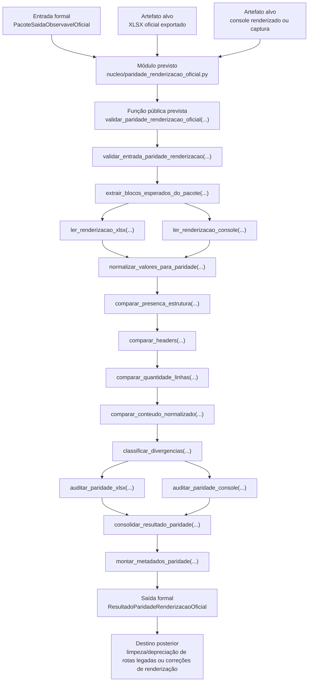

# Contrato Individual — Etapa 10 — Paridade da Renderização Oficial

## 1. Identificação documental

- **Etapa:** 10
- **Nome:** Paridade da Renderização Oficial
- **Entrada formal obrigatória e exclusiva:** `PacoteSaidaObservavelOficial`
- **Artefatos renderizados alvo:** console renderizado, XLSX oficial exportado e demais visualizações formalmente derivadas da Etapa 9
- **Saída formal prevista:** `ResultadoParidadeRenderizacaoOficial`
- **Natureza:** camada posterior à Etapa 9 para validação de paridade entre saída observável oficial em memória e renderizações físicas/observáveis
- **Módulo funcional previsto:** `nucleo/paridade_renderizacao_oficial.py`
- **Função pública prevista:** `validar_paridade_renderizacao_oficial(...) -> ResultadoParidadeRenderizacaoOficial`

## 2. Status normativo

Este contrato formaliza a Etapa 10 como a camada posterior à Etapa 9, responsável por validar se as renderizações físicas ou observáveis preservam o conteúdo de `PacoteSaidaObservavelOficial`.

A Etapa 10 é etapa real da cadeia operacional do projeto `payment-investment-allocation`. Ela não é motor econômico, não é ledger, não é gate de núcleo, não é correção de dados financeiros e não é reexecução decisória.

Este contrato não implementa código funcional. Ele define a fronteira normativa para a frente funcional posterior.

## 3. Posição na cadeia macro

```text
Etapa 9 -> PacoteSaidaObservavelOficial -> Etapa 10 -> ResultadoParidadeRenderizacaoOficial -> limpeza/depreciação controlada de rotas legadas ou correções de renderização
```

Na arquitetura macro, a Etapa 10 corresponde à validação oficial de paridade da renderização. Console e XLSX são artefatos renderizados alvo, não fontes decisórias.

## 4. Função da etapa

A função da Etapa 10 é comparar `PacoteSaidaObservavelOficial` com suas representações renderizadas em console, XLSX e outros formatos observáveis formalizados, verificando preservação estrutural e de conteúdo.

A Etapa 10 pode validar presença de blocos, nomes de abas/seções, headers, quantidade de linhas, conteúdo normalizado, metadados, avisos, bloqueios e lacunas de renderização.

A Etapa 10 não decide novamente. Ela apenas audita se a renderização física preserva a saída observável oficial produzida pela Etapa 9.

## 5. Entrada formal obrigatória e exclusiva

A entrada formal obrigatória e exclusiva da Etapa 10 é:

```text
PacoteSaidaObservavelOficial
```

A Etapa 10 pode receber, como alvos de validação:

- console renderizado ou captura estruturada equivalente;
- XLSX oficial exportado;
- relatório operacional observável exportado;
- metadados de renderização/exportação;
- outros artefatos de visualização formalmente derivados da Etapa 9.

Esses artefatos são objetos de auditoria, não fontes de decisão econômica.

A Etapa 10 não pode consumir diretamente:

- dados brutos;
- planilha operacional como fonte decisória;
- `EstadoTemporalInicial`;
- `ResultadoMotorTemporalConjunto`;
- `LedgerTemporalCanonico`;
- `ResultadoGatesValidacaoNucleo`;
- cache BCB/CDI como fonte decisória;
- logs como fonte de estado;
- scripts diagnósticos como fonte de estado;
- console ou XLSX como fonte econômica.

## 6. Componentes consumíveis da entrada

A Etapa 10 pode consumir componentes materializados em `PacoteSaidaObservavelOficial`, incluindo:

- origem formal;
- status de renderização;
- data de referência;
- `bloco_console`;
- `bloco_xlsx`;
- resumo operacional observável;
- últimos pagamentos;
- próximos pagamentos;
- fontes utilizadas;
- fontes reservadas;
- obrigações cobertas;
- obrigações bloqueadas;
- switchings escolhidos;
- saldos referenciais;
- avisos preservados;
- bloqueios preservados;
- lacunas de renderização;
- auditoria da Etapa 9;
- metadados de renderização/exportação.

A Etapa 10 também pode ler conteúdo de artefatos renderizados apenas para verificar paridade com esses componentes.

## 7. Saída formal obrigatória

A saída formal obrigatória prevista da Etapa 10 é:

```text
ResultadoParidadeRenderizacaoOficial
```

Esse artefato deve registrar o resultado da comparação entre `PacoteSaidaObservavelOficial` e as renderizações auditadas.

## 8. Componentes mínimos da saída

`ResultadoParidadeRenderizacaoOficial` deve conter, no mínimo:

- origem formal em `PacoteSaidaObservavelOficial`;
- status geral de paridade;
- data de referência;
- artefatos renderizados auditados;
- resumo de paridade por alvo;
- resultado de paridade do console, quando auditado;
- resultado de paridade do XLSX, quando auditado;
- divergências estruturais;
- divergências de headers;
- divergências de quantidade de linhas;
- divergências de conteúdo;
- divergências de serialização;
- divergências de normalização numérica;
- divergências de data/datetime;
- lacunas de renderização;
- melhorias de ergonomia identificadas;
- divergências materiais, se existirem;
- metadados da auditoria;
- decisão de aceite, aceite com ressalva ou reprovação da paridade.

## 9. Processo interno da etapa

A Etapa 10 deve executar processo determinístico de validação de paridade:

1. receber `PacoteSaidaObservavelOficial`;
2. validar tipo formal da entrada;
3. receber ou localizar artefatos renderizados alvo, quando fornecidos pela execução;
4. extrair blocos esperados do pacote observável;
5. ler renderização XLSX, quando disponível;
6. ler renderização de console, quando disponível ou capturada;
7. normalizar valores para comparação de paridade;
8. comparar presença de seções/abas;
9. comparar headers;
10. comparar quantidade de linhas;
11. comparar conteúdo normalizado;
12. classificar divergências;
13. separar divergência material de divergência de serialização ou normalização;
14. auditar paridade XLSX;
15. auditar paridade console;
16. consolidar o resultado;
17. montar metadados;
18. emitir `ResultadoParidadeRenderizacaoOficial`.

## 10. O que a etapa pode fazer

A Etapa 10 pode:

- consumir `PacoteSaidaObservavelOficial`;
- ler XLSX exportado como artefato renderizado;
- ler console renderizado ou captura equivalente;
- comparar estrutura de abas/seções;
- comparar headers;
- comparar quantidade de linhas;
- comparar conteúdo normalizado;
- normalizar `datetime` à meia-noite como `date` ISO;
- tratar inteiros e floats monetariamente equivalentes como iguais;
- aplicar quantização monetária a duas casas decimais ou tolerância absoluta contratada;
- classificar divergências;
- emitir decisão de paridade;
- recomendar correção de renderização quando necessário;
- recomendar melhoria de ergonomia sem alterar decisão econômica.

## 11. O que a etapa não pode fazer

A Etapa 10 não pode:

- reotimizar;
- revalorar;
- escolher nova fonte;
- trocar pacote vencedor;
- alterar obrigação coberta;
- alterar obrigação bloqueada;
- alterar switching escolhido;
- alterar saldo;
- corrigir dados financeiros;
- alterar motor temporal;
- alterar ledger temporal;
- alterar gates de validação;
- alterar ranking;
- alterar regras de liquidez;
- alterar regras de rendimento;
- alterar regras de pagamento;
- alterar regras fiscais;
- alterar patrimônio líquido terminal;
- usar XLSX como fonte de decisão econômica;
- usar console como fonte de decisão econômica;
- consultar dados brutos para suprir divergência;
- consultar planilha operacional para suprir divergência;
- modificar `PacoteSaidaObservavelOficial` como forma de corrigir renderização;
- mascarar divergência material como normalização aceitável.

## 12. Relação com a etapa anterior

A Etapa 10 depende exclusivamente da Etapa 9.

A Etapa 9 entrega `PacoteSaidaObservavelOficial`, contendo os blocos oficiais para console, XLSX e demais componentes observáveis. A Etapa 10 consome esse pacote como referência de verdade para validar artefatos renderizados.

A Etapa 10 não reabre a Etapa 9. Se detectar divergência, deve classificá-la e indicar se a correção pertence à renderização, ao exportador, ao console, ao XLSX ou a uma lacuna upstream formalmente identificada.

## 13. Relação com a etapa posterior

A Etapa 10 entrega `ResultadoParidadeRenderizacaoOficial` para camadas posteriores de:

- limpeza e depreciação controlada de rotas legadas;
- correções específicas de renderização;
- consolidação de formatos oficiais;
- congelamento de saída observável validada;
- governança de release operacional.

A etapa posterior não deve retornar ao motor, ledger ou gates para decidir novamente.

## 14. Schema/funções públicas previstas ou implementadas

A Etapa 10 ainda não possui implementação funcional neste contrato documental. Os nomes abaixo constituem mapa funcional previsto para guiar a `ETAPA10-FUNCIONAL-01`. A frente funcional posterior pode ajustar nomes internos por simplicidade e compatibilidade com o código vivo, desde que preserve entrada formal, saída formal e responsabilidade contratual.

### 14.1. Módulo funcional previsto

```text
nucleo/paridade_renderizacao_oficial.py
```

### 14.2. Artefato formal previsto

```python
ResultadoParidadeRenderizacaoOficial
```

### 14.3. Classes auxiliares previstas

```python
ResumoParidadeRenderizacaoOficial
DivergenciaParidadeRenderizacao
AuditoriaParidadeConsole
AuditoriaParidadeXLSX
MetadadosParidadeRenderizacao
```

### 14.4. Função pública prevista

```python
validar_paridade_renderizacao_oficial(
    pacote_saida_observavel: PacoteSaidaObservavelOficial,
    caminho_xlsx: Path | str | None = None,
    console_renderizado: object | None = None,
) -> ResultadoParidadeRenderizacaoOficial
```

### 14.5. Blocos funcionais internos previstos

```python
validar_entrada_paridade_renderizacao(...)
extrair_blocos_esperados_do_pacote(...)
ler_renderizacao_xlsx(...)
ler_renderizacao_console(...)
normalizar_valores_para_paridade(...)
comparar_presenca_estrutura(...)
comparar_headers(...)
comparar_quantidade_linhas(...)
comparar_conteudo_normalizado(...)
classificar_divergencias(...)
auditar_paridade_xlsx(...)
auditar_paridade_console(...)
consolidar_resultado_paridade(...)
montar_metadados_paridade(...)
```

## 15. Auditoria esperada

A auditoria da Etapa 10 deve verificar, no mínimo:

- se a entrada é `PacoteSaidaObservavelOficial`;
- se o XLSX auditado deriva da execução correspondente;
- se as abas esperadas existem;
- se não há abas observáveis extras inesperadas;
- se headers coincidem;
- se quantidade de linhas coincide;
- se conteúdo coincide após normalização contratada;
- se divergências de data/datetime são classificadas corretamente;
- se divergências numéricas monetariamente equivalentes são classificadas corretamente;
- se divergências materiais são preservadas sem mascaramento;
- se console e XLSX não são usados como fonte econômica;
- se motor, ledger e gates não foram consultados diretamente para corrigir renderização.

## 16. Critérios de aceite

A Etapa 10 será aceita funcionalmente quando:

1. consumir `PacoteSaidaObservavelOficial` como referência de verdade;
2. produzir `ResultadoParidadeRenderizacaoOficial`;
3. auditar pelo menos XLSX oficial exportado;
4. auditar console quando houver captura estruturada disponível;
5. comparar estrutura, headers, linhas e conteúdo normalizado;
6. classificar divergências;
7. separar divergência material de normalização aceitável;
8. não alterar decisão econômica;
9. não consultar motor, ledger ou gates como fonte decisória;
10. indicar se a paridade está aprovada, aprovada com ressalva ou reprovada.

Nesta frente documental, o aceite se limita à criação do contrato, atualização mínima do README e criação do log, sem alteração funcional.

## 17. Fluxograma operacional-explicativo completo



## 18. Condição de parada

A Etapa 10 deve emitir resultado bloqueado, reprovado ou aprovado com ressalva quando:

- a entrada não for `PacoteSaidaObservavelOficial`;
- o artefato renderizado esperado não existir;
- houver ausência de aba/seção obrigatória;
- houver divergência estrutural não justificável;
- houver divergência de headers não justificável;
- houver divergência de linhas não justificável;
- houver divergência material de conteúdo;
- normalização aceitável não for suficiente para explicar a divergência;
- houver tentativa de usar console ou XLSX como fonte econômica;
- houver necessidade de alterar motor, ledger, gates, contrato, modelo ou decisão econômica para obter paridade.

A parada deve preservar evidência objetiva e classificar a divergência sem corrigir a decisão econômica.

## 19. Histórico documental / adendos funcionais consolidados

- `ETAPA9-CONTRATO-01`: cria `PacoteSaidaObservavelOficial` como saída formal da Etapa 9.
- `ETAPA9-FUNCIONAL-01`: implementa pacote mínimo da Etapa 9.
- `ETAPA9-COMPLETA-01`: integra a Etapa 9 ao runtime, console e XLSX.
- `POS-ETAPA9-AUDITORIA-01`: valida Etapa 9 consolidada em `main`.
- `ETAPA10-CONTRATO-01`: cria este contrato individual da Etapa 10, definindo `ResultadoParidadeRenderizacaoOficial` como saída formal prevista.

Esta frente não altera código, runtime, contratos das Etapas 1–9, contrato operacional mestre, modelo matemático-estatístico-financeiro, dados, saídas, scripts diagnósticos, console ou XLSX.
