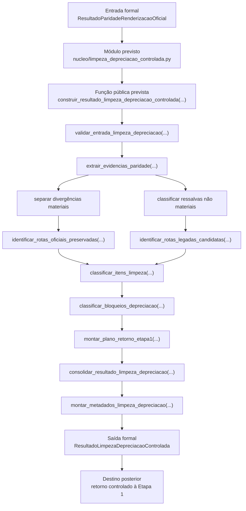

# Contrato Individual — Etapa 11 — Limpeza e Depreciação Controlada

## 1. Identificação documental

- **Etapa:** 11
- **Nome:** Limpeza e Depreciação Controlada
- **Entrada formal obrigatória e exclusiva:** `ResultadoParidadeRenderizacaoOficial`
- **Saída formal prevista:** `ResultadoLimpezaDepreciacaoControlada`
- **Natureza:** camada posterior à Etapa 10 para classificar, depreciar e orientar remoção controlada de rotas legadas, resíduos de renderização e artefatos substituídos pela cadeia oficial.
- **Módulo funcional previsto:** `nucleo/limpeza_depreciacao_controlada.py`
- **Função pública prevista:** `construir_resultado_limpeza_depreciacao_controlada(...) -> ResultadoLimpezaDepreciacaoControlada`

## 2. Status normativo

Este contrato formaliza a Etapa 11 como a camada posterior à Etapa 10, em aderência ao contrato operacional mestre, que define a Etapa 11 como `limpeza e depreciação controlada, com retorno à etapa 1`.

A Etapa 11 é etapa real da cadeia operacional do projeto `payment-investment-allocation`. Ela não é motor econômico, não é ledger, não é gate de núcleo, não é nova renderização, não é nova validação de paridade e não é diagnóstico decisório de fontes futuras.

Este contrato não implementa código funcional. Ele define a fronteira normativa para frentes funcionais posteriores.

## 3. Posição na cadeia macro

```text
Etapa 10 -> ResultadoParidadeRenderizacaoOficial -> Etapa 11 -> ResultadoLimpezaDepreciacaoControlada -> retorno controlado à Etapa 1
```

Na arquitetura macro, a Etapa 11 corresponde à limpeza e depreciação controlada posterior à validação de paridade da renderização. Ela opera sobre evidências de paridade e release observável, não sobre decisão econômica.

## 4. Função da etapa

A função da Etapa 11 é usar `ResultadoParidadeRenderizacaoOficial` para classificar rotas legadas, resíduos de renderização, formatos substituídos, artefatos depreciáveis e pendências de limpeza operacional, produzindo um resultado auditável de depreciação controlada.

A Etapa 11 deve indicar quais rotas, funções, logs, scripts, outputs ou formatos posteriores podem ser:

- mantidos como oficiais;
- mantidos temporariamente por compatibilidade;
- depreciados;
- removidos em frente posterior específica;
- preservados apenas como histórico;
- bloqueados para remoção por dependência ainda ativa.

A Etapa 11 classifica e recomenda limpeza/depreciação controlada, mas não remove automaticamente arquivos, funções ou rotas. Qualquer remoção efetiva deve ocorrer somente em frente posterior específica, com escopo próprio e validação própria.

A Etapa 11 não corrige decisões econômicas. Ela não cria fonte, não escolhe lote, não altera obrigação, não altera switching e não modifica patrimônio terminal.

## 5. Entrada formal obrigatória e exclusiva

A entrada formal obrigatória e exclusiva da Etapa 11 é:

```text
ResultadoParidadeRenderizacaoOficial
```

A Etapa 11 pode consultar metadados de repositório, caminhos, lista de arquivos e referências de runtime apenas como objetos de classificação de limpeza, nunca como fontes decisórias econômicas.

A Etapa 11 não pode consumir diretamente:

- dados brutos;
- planilha operacional como fonte decisória;
- `PacoteEntradaResolvida`;
- `PacoteValidacaoPreExecucao`;
- `PacoteDadosOperacionaisCanonicos`;
- `EstadoTemporalInicial`;
- `ResultadoMotorTemporalConjunto`;
- `LedgerTemporalCanonico`;
- `ResultadoGatesValidacaoNucleo`;
- `SaidaCanonicaOficial`;
- `PacoteSaidaObservavelOficial` como entrada formal paralela;
- cache BCB/CDI como fonte decisória;
- console ou XLSX como fonte econômica;
- logs como fonte de estado econômico.

## 6. Componentes consumíveis da entrada

A Etapa 11 pode consumir componentes materializados em `ResultadoParidadeRenderizacaoOficial`, incluindo:

- artefato;
- etapa;
- status geral de paridade;
- indicador `ok`;
- entrada formal declarada da Etapa 10;
- divergências;
- resumo de paridade;
- auditoria XLSX;
- auditoria console;
- metadados da auditoria;
- divergências materiais;
- divergências não materiais;
- ressalvas;
- status de artefatos renderizados auditados.

A Etapa 11 deve tratar ressalvas como `CONSOLE_NAO_AUDITADO` como evidência de pendência de limpeza, compatibilidade ou melhoria futura, não como autorização para reabrir Etapa 10 ou para alterar decisão econômica.

## 7. Saída formal obrigatória

A saída formal obrigatória prevista da Etapa 11 é:

```text
ResultadoLimpezaDepreciacaoControlada
```

Esse artefato deve registrar o resultado da classificação de limpeza e depreciação controlada posterior à paridade da renderização.

## 8. Componentes mínimos da saída

`ResultadoLimpezaDepreciacaoControlada` deve conter, no mínimo:

- origem formal em `ResultadoParidadeRenderizacaoOficial`;
- status geral da limpeza/depreciação;
- data de referência, quando disponível na entrada ou metadados;
- artefatos avaliados;
- rotas oficiais preservadas;
- rotas legadas identificadas;
- rotas legadas bloqueadas para remoção;
- rotas legadas candidatas à depreciação;
- arquivos ou funções candidatos à remoção futura;
- arquivos ou funções que devem permanecer como histórico;
- pendências não materiais de release observável;
- bloqueios de limpeza;
- recomendações de depreciação controlada;
- plano de retorno à Etapa 1;
- metadados da auditoria;
- decisão de aceite, aceite com ressalva ou bloqueio da limpeza.

## 9. Processo interno da etapa

A Etapa 11 deve executar processo determinístico de limpeza e depreciação controlada:

1. receber `ResultadoParidadeRenderizacaoOficial`;
2. validar tipo formal da entrada;
3. verificar status geral de paridade;
4. separar divergências materiais de ressalvas não materiais;
5. identificar artefatos renderizados já validados;
6. identificar rotas oficiais preservadas;
7. identificar rotas legadas ou transitórias remanescentes;
8. classificar cada rota ou artefato quanto a manutenção, depreciação, remoção futura, histórico ou bloqueio;
9. preservar evidências de dependência ativa;
10. produzir recomendações de limpeza controlada;
11. montar metadados;
12. emitir `ResultadoLimpezaDepreciacaoControlada`;
13. indicar retorno controlado à Etapa 1 para novo ciclo limpo.

## 10. O que a etapa pode fazer

A Etapa 11 pode:

- consumir `ResultadoParidadeRenderizacaoOficial`;
- verificar se a paridade XLSX foi aprovada;
- verificar se há divergências materiais;
- registrar ressalvas não materiais;
- classificar rotas legadas;
- classificar artefatos transitórios;
- recomendar depreciação controlada;
- recomendar remoção futura em frente específica;
- recomendar preservação histórica;
- recomendar bloqueio de remoção quando houver dependência ativa;
- registrar plano de retorno à Etapa 1.

## 11. O que a etapa não pode fazer

A Etapa 11 não pode:

- reotimizar;
- revalorar;
- escolher nova fonte;
- escolher novo lote;
- trocar pacote vencedor;
- alterar obrigação coberta;
- alterar obrigação bloqueada;
- alterar switching escolhido;
- alterar saldo;
- corrigir dados financeiros;
- alterar motor temporal;
- alterar ledger temporal;
- alterar gates de validação;
- alterar Etapa 9;
- alterar Etapa 10;
- usar console ou XLSX como fonte de decisão econômica;
- consultar dados brutos para suprir lacunas decisórias;
- transformar pendências de fonte futura em decisão econômica;
- criar governança de lacunas decisórias como função autônoma da Etapa 11;
- remover arquivos, funções ou rotas sem frente posterior específica de execução controlada.

## 12. Relação com a etapa anterior

A Etapa 11 depende exclusivamente da Etapa 10.

A Etapa 10 entrega `ResultadoParidadeRenderizacaoOficial`, que registra se a renderização oficial preservou `PacoteSaidaObservavelOficial` nos artefatos auditados.

A Etapa 11 consome esse resultado para decidir o que pode ser limpo, depreciado, preservado ou bloqueado para remoção. Ela não reabre a Etapa 10 nem recalcula paridade.

## 13. Relação com a etapa posterior

A etapa posterior à Etapa 11 é o retorno controlado à Etapa 1, conforme contrato operacional mestre.

Esse retorno não significa reabrir o núcleo econômico. Significa iniciar novo ciclo operacional com rotas limpas, resíduos depreciados e cadeia oficial preservada.

Correções específicas eventualmente recomendadas pela Etapa 11 devem ser abertas em frentes próprias e não podem ser executadas implicitamente dentro da Etapa 11.

## 14. Schema/funções públicas previstas ou implementadas

A Etapa 11 ainda não possui implementação funcional neste contrato documental. Os nomes abaixo constituem mapa funcional previsto para guiar `ETAPA11-FUNCIONAL-01`. A frente funcional posterior pode ajustar nomes internos por simplicidade e compatibilidade com o código vivo, desde que preserve entrada formal, saída formal e responsabilidade contratual.

### 14.1. Módulo funcional previsto

```text
nucleo/limpeza_depreciacao_controlada.py
```

### 14.2. Artefato formal previsto

```python
ResultadoLimpezaDepreciacaoControlada
```

### 14.3. Classes auxiliares previstas

```python
ItemLimpezaDepreciacaoControlada
ResumoLimpezaDepreciacaoControlada
AuditoriaLimpezaDepreciacaoControlada
MetadadosLimpezaDepreciacaoControlada
```

### 14.4. Função pública prevista

```python
construir_resultado_limpeza_depreciacao_controlada(
    resultado_paridade_renderizacao: ResultadoParidadeRenderizacaoOficial,
) -> ResultadoLimpezaDepreciacaoControlada
```

Essa função deve construir o resultado classificatório da limpeza/depreciação controlada. Ela não deve executar remoção efetiva de arquivos, funções, rotas, logs, saídas ou artefatos.

### 14.5. Blocos funcionais internos previstos

```python
validar_entrada_limpeza_depreciacao(...)
extrair_evidencias_paridade(...)
classificar_ressalvas_nao_materiais(...)
identificar_rotas_oficiais_preservadas(...)
identificar_rotas_legadas_candidatas(...)
classificar_itens_limpeza(...)
classificar_bloqueios_depreciacao(...)
montar_plano_retorno_etapa1(...)
consolidar_resultado_limpeza_depreciacao(...)
montar_metadados_limpeza_depreciacao(...)
```

## 15. Auditoria esperada

A auditoria da Etapa 11 deve verificar, no mínimo:

- se a entrada é `ResultadoParidadeRenderizacaoOficial`;
- se a origem formal declarada da Etapa 10 está preservada;
- se divergências materiais bloqueiam depreciação automática;
- se ressalvas não materiais são classificadas sem reabrir decisão econômica;
- se rotas oficiais são preservadas;
- se rotas legadas são apenas classificadas, não removidas implicitamente;
- se console e XLSX não são usados como fontes econômicas;
- se motor, ledger e gates não foram consultados diretamente para decidir limpeza;
- se o retorno à Etapa 1 é registrado como próximo ciclo operacional limpo, não como reversão contratual.

## 16. Critérios de aceite

A Etapa 11 será aceita funcionalmente quando:

1. consumir `ResultadoParidadeRenderizacaoOficial` como entrada formal exclusiva;
2. produzir `ResultadoLimpezaDepreciacaoControlada`;
3. classificar divergências materiais como bloqueio de depreciação automática;
4. classificar ressalvas não materiais como pendência de limpeza, compatibilidade ou melhoria futura;
5. identificar rotas oficiais preservadas;
6. identificar rotas legadas candidatas à depreciação;
7. indicar itens bloqueados para remoção por dependência ativa;
8. emitir plano de retorno controlado à Etapa 1;
9. não alterar decisão econômica;
10. não consultar motor, ledger ou gates como fonte decisória.

Nesta frente documental, o aceite se limita à criação do contrato, atualização mínima do README e criação do log, sem alteração funcional.

## 17. Fluxograma operacional-explicativo completo



## 18. Condição de parada

A Etapa 11 deve emitir resultado bloqueado ou aprovado com ressalva quando:

- a entrada não for `ResultadoParidadeRenderizacaoOficial`;
- houver divergência material de paridade ainda não resolvida;
- houver dependência ativa de rota legada candidata à remoção;
- houver tentativa de usar limpeza para corrigir decisão econômica;
- houver necessidade de alterar motor, ledger, gates, contrato, modelo ou decisão econômica para efetuar depreciação;
- houver tentativa de remover arquivo, função ou rota sem frente posterior específica.

A parada deve preservar evidência objetiva e classificar a causa sem corrigir decisão econômica.

## 19. Histórico documental / adendos funcionais consolidados

- `ETAPA10-CONTRATO-01`: define `ResultadoParidadeRenderizacaoOficial` como saída formal da Etapa 10.
- `ETAPA10-FUNCIONAL-01`: implementa auditor oficial de paridade.
- `ETAPA10-RUNTIME-01`: integra a Etapa 10 ao runtime após geração do XLSX.
- `FECHAMENTO-ETAPA10-01`: congela a Etapa 10 como finalizada no escopo de paridade XLSX/runtime.
- `ETAPA11-CONTRATO-01`: cria este contrato individual da Etapa 11 como Limpeza e Depreciação Controlada, em aderência ao contrato mestre.

Esta frente não altera código, runtime, contratos das Etapas 1–10, contrato operacional mestre, modelo matemático-estatístico-financeiro, dados, saídas, scripts diagnósticos, console ou XLSX.
