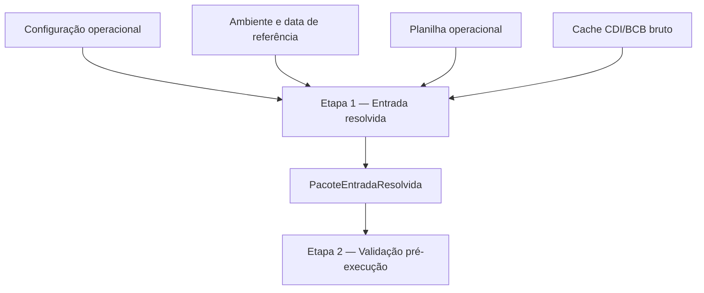

# CONTRATO INDIVIDUAL DA ETAPA 1 — ENTRADA RESOLVIDA

## 1. Status

Este documento é o contrato individual canônico da **Etapa 1 — Entrada resolvida**.

Ele é subordinado ao contrato operacional mestre e ao modelo matemático-estatístico-financeiro oficial.

## 2. Função da etapa

A Etapa 1 é a camada responsável por consolidar entrada física, configuração, ambiente e insumos externos brutos em um único artefato auditável.

A Etapa 1 não produz dados operacionais canônicos e não monta estado temporal.

## 3. Entrada da etapa

A Etapa 1 consome:

- configuração operacional;
- ambiente de execução;
- data de referência resolvida;
- planilha operacional obtida por download ou fallback local;
- cache CDI/BCB como insumo externo bruto e auditável.

## 4. Saída formal da etapa

A saída formal da Etapa 1 é:

`PacoteEntradaResolvida`

## 5. Conteúdo mínimo da saída

O `PacoteEntradaResolvida` contém, conceitualmente:

- `PacoteConfig`;
- `ContextoExecucao`;
- `PacotePlanilha`;
- `MapaAbasResolvidas`;
- `MapaColunasResolvidas`;
- `quadros_brutos`;
- `quadros_estruturais_resolvidos`;
- `JanelaConsultaCDI`;
- `PacoteCacheCDIDiario`;
- `AuditoriaEntradaBruta`;
- `AuditoriaResolucaoEntrada`;
- `AuditoriaCacheCDI`.

## 6. Relação com a Etapa 2

A Etapa 2 deve consumir `PacoteEntradaResolvida`.

A Etapa 2 não deve reler a planilha, resolver aliases, reconstruir mapas ou buscar BCB como substituto da Etapa 1.

## 7. O que a Etapa 1 pode fazer

A Etapa 1 pode:

- resolver ambiente mínimo;
- carregar configuração;
- resolver data de referência;
- obter planilha;
- resolver abas;
- resolver colunas;
- produzir quadros estruturais resolvidos;
- derivar janela bruta CDI;
- carregar cache CDI;
- registrar auditorias.

## 8. O que a Etapa 1 não pode fazer

A Etapa 1 não pode:

- criar carteira canônica;
- criar gastos canônicos;
- criar salários canônicos;
- criar switching canônico;
- criar inventário canônico;
- integrar inventário com switching;
- calcular rendimento;
- executar replay;
- montar estado temporal;
- decidir pagamento;
- decidir switching;
- gerar ledger;
- gerar saída canônica;
- gerar console;
- gerar XLSX.

## 9. Fluxograma

