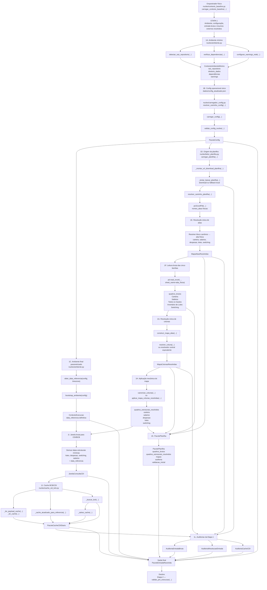

# CONTRATO INDIVIDUAL DA ETAPA 1 — PACOTEENTRADARESOLVIDA

> Cópia canônica derivada do documento-fonte já existente:
>
> `logs/iteracoes/ME-V17-F0-V32A_FORMALIZA_ETAPA1_PACOTE_ENTRADA_RESOLVIDA.md`
>
> O documento original permanece preservado como log histórico. Esta cópia organiza o mesmo contrato individual na pasta canônica `relatorios/principais/contratos_individuais/`.

## 1. Identificação do documento-fonte

- MICROETAPA: V17-F0-V.3.2A
- TIPO: DOCUMENTAL / ARQUITETURAL
- CLASSE: FORMALIZA_ETAPA1_COMO_PACOTE_ENTRADA_RESOLVIDA
- ALTERA CÓDIGO: NÃO
- ALTERA MOTOR: NÃO
- ALTERA SAÍDA CANÔNICA: NÃO
- ALTERA DADOS: NÃO
- ALTERA CACHE: NÃO
- ALTERA RENDERIZAÇÃO: NÃO

## 2. Problema motivador

A Etapa 1 ainda podia ser lida como um conjunto solto de configuração, ambiente e planilha.

Funções de aliases, resolução de abas, resolução de colunas e canonização estrutural estavam conceitualmente dispersas entre camadas. Como consequência, as Etapas 2 e 3 poderiam recriar resolução de entrada, aumentando duplicidade de funções, divergência semântica e dificuldade de continuidade do pipeline.

A microetapa formalizou a Etapa 1 como produtora de um artefato único e auditável:

`PacoteEntradaResolvida`

## 3. Decisão arquitetural

A Etapa 1 passa a ser formalizada como:

```text
ambiente mínimo
+ config operacional
+ ambiente final com data de referência
+ planilha
+ resolução estrutural de abas e colunas
+ janela bruta para CDI
+ cache BCB/CDI auditado
+ PacoteEntradaResolvida
```

O `PacoteEntradaResolvida` deve ser validado pela Etapa 2 e consumido pela Etapa 3.

## 4. Conteúdo conceitual do PacoteEntradaResolvida

O `PacoteEntradaResolvida` contém:

- `PacoteConfig`;
- `ContextoExecucao`;
- `PacotePlanilha`;
- `MapaAbasResolvidas`;
- `MapaColunasResolvidas`;
- `quadros_brutos`;
- `quadros_estruturais_resolvidos`;
- `JanelaConsultaCDI`;
- `PacoteCacheCDIDiario`;
- `AuditoriaEntradaBruta`;
- `AuditoriaResolucaoEntrada`;
- `AuditoriaCacheCDI`.

## 5. Conteúdo normativo do PacotePlanilha

O `PacotePlanilha`, dentro do `PacoteEntradaResolvida`, contém as cinco famílias operacionais em forma bruta e estruturalmente resolvida:

1. `Carteira`;
2. `Salários` / recebidos brutos;
3. `Todos os Gastos` / despesas;
4. `Inventário de Lotes`;
5. `Switching` / switchings já realizados brutos.

Esses quadros não são artefatos operacionais canônicos.

Eles são entradas estruturais validáveis pela Etapa 2 e transformáveis pela Etapa 3.

## 6. Distinção entre Etapa 1 e Etapa 3

Na Etapa 1, `quadros_canonicos`, quando esse nome aparecer no código existente, deve ser interpretado conceitualmente como:

`quadros_estruturais_resolvidos`

Dados operacionais canônicos pertencem à Etapa 3.

Não pertencem à Etapa 1:

- carteira canônica;
- gastos canônicos;
- salários canônicos;
- switching canônico;
- inventário canônico;
- integração entre `Inventário de Lotes` e switchings já realizados.

## 7. Cache BCB/CDI

O cache CDI/BCB entra na Etapa 1 como insumo externo bruto, cacheável e auditável.

A Etapa 1 deve:

- obter a série CDI;
- auditar origem;
- registrar fetch ou fallback;
- registrar janela de consulta;
- registrar status de atualização do cache.

A Etapa 1 não deve usar essa série para cálculo de rendimento, replay, valoração ou decisão econômica.

O uso econômico da série CDI pertence às etapas posteriores.

## 8. Fronteira da Etapa 1

A Etapa 1 pode:

- resolver ambiente mínimo;
- carregar config;
- resolver data de referência definitiva;
- obter planilha;
- resolver abas;
- resolver colunas;
- produzir quadros estruturais resolvidos;
- derivar janela bruta CDI;
- carregar cache CDI;
- registrar auditorias.

A Etapa 1 não pode:

- criar carteira canônica;
- criar gastos canônicos;
- criar salários canônicos;
- criar switching canônico;
- criar inventário canônico;
- integrar inventário com switching;
- calcular rendimento;
- executar replay;
- montar estado temporal;
- decidir pagamento;
- decidir switching;
- gerar ledger;
- gerar saída canônica;
- gerar console;
- gerar XLSX.

## 9. Relação com Etapa 2

A Etapa 2 valida o `PacoteEntradaResolvida`.

A Etapa 2 não deve:

- reler planilha;
- baixar planilha;
- abrir workbook;
- resolver aliases;
- resolver colunas;
- canonizar colunas;
- carregar cache BCB;
- corrigir dados;
- transformar dados.

A Etapa 2 deve retornar:

- status;
- erros;
- avisos;
- evidências.

## 10. Relação com Etapa 3

A Etapa 3 consome o `PacoteEntradaResolvida` validado e transforma os quadros estruturais resolvidos em artefatos operacionais canônicos.

A Etapa 3 deve criar, entre outros:

- carteira canônica;
- gastos canônicos;
- salários/recebidos canônicos;
- switching canônico de switchings já realizados;
- inventário canônico base;
- inventário canônico completo, integrando `Inventário de Lotes` e switchings já realizados.

A Etapa 3 não deve recriar resolvedores locais de aliases e colunas quando o mapa resolvido da Etapa 1 já existir.

## 11. Fluxograma da Etapa 1 — PacoteEntradaResolvida


