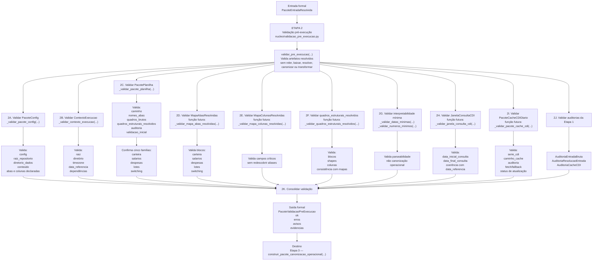

# Contrato Individual — Etapa 2 — Validação Pré-Execução

## 1. Identificação documental

- **Etapa:** 2
- **Nome:** Validação Pré-Execução
- **Entrada formal obrigatória e exclusiva:** `PacoteEntradaResolvida`
- **Saída formal obrigatória:** `PacoteValidacaoPreExecucao`
- **Natureza:** gate puro de validação estrutural pré-execução
- **Módulo central:** `nucleo/validacao_pre_execucao.py`
- **Função pública implementada:** `validar_pre_execucao(...)`

## 2. Status normativo

Este contrato formaliza a Etapa 2 como validação estrutural do `PacoteEntradaResolvida` produzido pela Etapa 1.

A Etapa 2 é gate puro: valida completude, coerência, auditabilidade e interpretabilidade mínima, mas não corrige dados, não transforma dados e não cria artefatos canônicos.

## 3. Posição na cadeia macro

```text
Etapa 1 -> PacoteEntradaResolvida -> Etapa 2 -> PacoteValidacaoPreExecucao -> Etapa 3
```

## 4. Função da etapa

A Etapa 2 valida se a entrada resolvida pela Etapa 1 está apta para ser consumida pela Etapa 3. Seu papel é bloquear a progressão quando a entrada não estiver completa, coerente ou minimamente interpretável.

## 5. Entrada formal obrigatória e exclusiva

A entrada formal obrigatória e exclusiva da Etapa 2 é:

```text
PacoteEntradaResolvida
```

No código histórico, essa entrada pode ainda aparecer fisicamente distribuída como `PacoteConfig`, `ContextoExecucao` e `PacotePlanilha`. Arquiteturalmente, esses elementos são tratados como componentes do `PacoteEntradaResolvida`.

## 6. Componentes consumíveis da entrada

A Etapa 2 pode consumir somente componentes materializados no `PacoteEntradaResolvida`, incluindo:

- `PacoteConfig`;
- `ContextoExecucao`;
- `PacotePlanilha`;
- `MapaAbasResolvidas`;
- `MapaColunasResolvidas`;
- `quadros_brutos`;
- `quadros_estruturais_resolvidos`;
- `JanelaConsultaCDI`;
- `PacoteCacheCDIDiario`;
- `AuditoriaEntradaBruta`;
- `AuditoriaResolucaoEntrada`;
- `AuditoriaCacheCDI`.

## 7. Saída formal obrigatória

A saída formal obrigatória da Etapa 2 é:

```text
PacoteValidacaoPreExecucao
```

## 8. Componentes mínimos da saída

`PacoteValidacaoPreExecucao` deve conter, no mínimo:

- `ok`;
- `erros`;
- `avisos`;
- `evidencias`.

O pacote registra se o `PacoteEntradaResolvida` está apto para consumo pela Etapa 3.

## 9. Processo interno da etapa

A Etapa 2 deve validar:

1. `PacoteConfig`;
2. `ContextoExecucao`;
3. `PacotePlanilha`;
4. `MapaAbasResolvidas`;
5. `MapaColunasResolvidas`;
6. `quadros_estruturais_resolvidos`;
7. interpretabilidade mínima de datas;
8. interpretabilidade mínima de números;
9. `JanelaConsultaCDI`;
10. `PacoteCacheCDIDiario`;
11. auditorias da Etapa 1;
12. consolidação de status, erros, avisos e evidências.

## 10. O que a etapa pode fazer

A Etapa 2 pode:

- validar presença de artefatos;
- validar existência de caminhos;
- validar consistência de configuração;
- validar contexto de execução;
- validar presença das cinco famílias operacionais;
- validar mapas de abas resolvidas;
- validar mapas de colunas resolvidas;
- validar quadros estruturais resolvidos;
- validar interpretabilidade mínima de datas e números;
- validar janela CDI;
- validar pacote cache CDI;
- validar auditorias da Etapa 1;
- emitir erros;
- emitir avisos;
- registrar evidências.

## 11. O que a etapa não pode fazer

A Etapa 2 não pode:

- baixar planilha;
- abrir workbook;
- reler abas;
- resolver aliases;
- resolver colunas para uso operacional;
- canonizar colunas;
- criar quadros estruturais;
- carregar cache BCB;
- buscar BCB online;
- salvar cache;
- corrigir dados;
- limpar dados;
- normalizar dados operacionalmente;
- criar carteira canônica;
- criar gastos canônicos;
- criar salários canônicos;
- criar switching canônico;
- criar inventário canônico;
- integrar inventário com switching;
- calcular rendimento;
- executar replay;
- montar estado temporal;
- decidir pagamento;
- decidir switching;
- gerar ledger;
- gerar saída canônica;
- renderizar console;
- gerar XLSX.

## 12. Relação com a etapa anterior

A Etapa 2 consome exclusivamente o `PacoteEntradaResolvida` produzido pela Etapa 1. Ela não deve recriar a resolução estrutural da entrada já feita pela Etapa 1.

## 13. Relação com a etapa posterior

A Etapa 2 entrega `PacoteValidacaoPreExecucao` para a Etapa 3. A Etapa 3 só deve iniciar canonização operacional quando a validação pré-execução permitir progressão.

## 14. Schema/funções públicas previstas ou implementadas

Módulo funcional:

```text
nucleo/validacao_pre_execucao.py
```

Função pública implementada:

```python
validar_pre_execucao(...) -> PacoteValidacaoPreExecucao
```

Funções ou blocos internos preservados no contrato:

```text
_validar_pacote_config(...)
_validar_contexto_execucao(...)
_validar_pacote_planilha(...)
_validar_mapa_abas_resolvidas(...)
_validar_mapa_colunas_resolvidas(...)
_validar_quadros_estruturais_resolvidos(...)
_validar_datas_minimas(...)
_validar_numeros_minimos(...)
_validar_janela_consulta_cdi(...)
_validar_pacote_cache_cdi(...)
```

Artefato formal:

```python
PacoteValidacaoPreExecucao
```

## 15. Auditoria esperada

A auditoria da Etapa 2 deve registrar:

- artefatos presentes e ausentes;
- inconsistências de config e contexto;
- inconsistências em mapas de abas e colunas;
- inconsistências em quadros estruturais;
- falhas de interpretabilidade mínima;
- situação da janela CDI;
- situação do cache CDI;
- erros impeditivos;
- avisos não impeditivos;
- evidências de validação.

## 16. Critérios de aceite

A Etapa 2 é aceita quando:

1. consome somente `PacoteEntradaResolvida`;
2. valida os componentes mínimos da entrada resolvida;
3. produz `PacoteValidacaoPreExecucao`;
4. preserva seu papel de gate puro;
5. não relê planilha;
6. não baixa planilha;
7. não reconstrói aliases, abas ou colunas;
8. não transforma dados;
9. não altera cache;
10. não gera artefatos canônicos ou observáveis.

## 17. Fluxograma operacional-explicativo completo



## 18. Condição de parada

A Etapa 2 deve bloquear a progressão para a Etapa 3 quando houver erro impeditivo de completude, consistência ou interpretabilidade mínima do `PacoteEntradaResolvida`.

## 19. Histórico documental / adendos funcionais consolidados

Este contrato foi originalmente derivado de:

```text
logs/iteracoes/ME-V17-F0-V32B_FORMALIZA_ETAPA2_VALIDACAO_PACOTE_ENTRADA_RESOLVIDA.md
```

A versão atual apenas reorganiza o conteúdo no padrão estrutural único dos contratos individuais das Etapas 1–7, preservando a Etapa 2 como gate puro de pré-execução.
