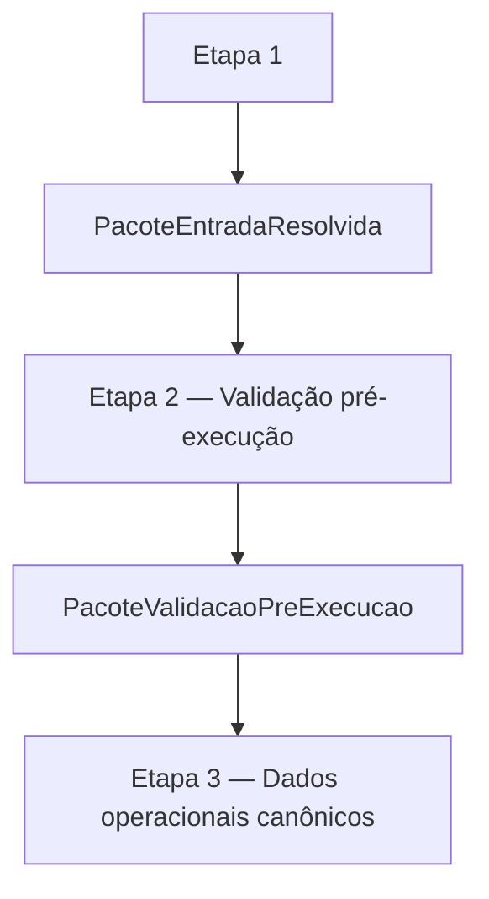

# CONTRATO INDIVIDUAL DA ETAPA 2 — VALIDAÇÃO PRÉ-EXECUÇÃO

## 1. Status

Este documento é o contrato individual canônico da **Etapa 2 — Validação pré-execução**.

Ele é subordinado ao contrato operacional mestre e ao modelo matemático-estatístico-financeiro oficial.

## 2. Função da etapa

A Etapa 2 é o gate puro de validação pré-execução do `PacoteEntradaResolvida`.

Ela verifica se a entrada resolvida produzida pela Etapa 1 está completa, coerente, auditável e minimamente interpretável para permitir a canonização operacional da Etapa 3.

A Etapa 2 não reconstrói a entrada e não transforma dados em entidades operacionais canônicas.

## 3. Entrada formal da etapa

A entrada formal da Etapa 2 é:

`PacoteEntradaResolvida`

## 4. Saída formal da etapa

A saída formal da Etapa 2 é:

`PacoteValidacaoPreExecucao`

## 5. Conteúdo mínimo da saída

O `PacoteValidacaoPreExecucao` contém, no mínimo:

- `ok`;
- `erros`;
- `avisos`;
- `evidencias`.

## 6. Relação com a Etapa 3

A Etapa 3 deve consumir:

- `PacoteEntradaResolvida` validado;
- `PacoteValidacaoPreExecucao`.

A Etapa 3 não deve prosseguir quando a validação pré-execução bloquear a entrada.

## 7. O que a Etapa 2 pode fazer

A Etapa 2 pode validar:

- presença de artefatos;
- existência de caminhos;
- consistência de configuração;
- contexto de execução;
- presença das famílias operacionais;
- mapas de abas resolvidas;
- mapas de colunas resolvidas;
- quadros estruturais resolvidos;
- interpretabilidade mínima de datas;
- interpretabilidade mínima de números;
- janela CDI;
- pacote cache CDI;
- auditorias da Etapa 1.

## 8. O que a Etapa 2 não pode fazer

A Etapa 2 não pode:

- baixar planilha;
- abrir workbook;
- reler abas;
- resolver aliases;
- resolver colunas para uso operacional;
- canonizar colunas;
- criar quadros estruturais;
- carregar cache BCB;
- buscar BCB online;
- salvar cache;
- corrigir dados;
- limpar dados;
- normalizar dados operacionalmente;
- criar carteira canônica;
- criar gastos canônicos;
- criar salários canônicos;
- criar switching canônico;
- criar inventário canônico;
- integrar inventário com switching;
- calcular rendimento;
- executar replay;
- montar estado temporal;
- decidir pagamento;
- decidir switching;
- gerar ledger;
- gerar saída canônica;
- renderizar console;
- gerar XLSX.

## 9. Fluxograma

