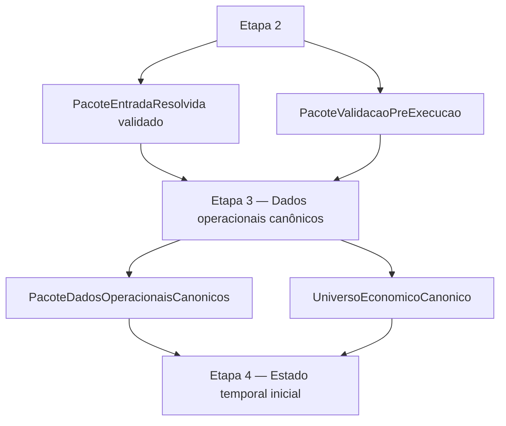

# CONTRATO INDIVIDUAL DA ETAPA 3 — DADOS OPERACIONAIS CANÔNICOS

## 1. Status

Este documento é o contrato individual canônico da **Etapa 3 — Dados operacionais e universo econômico canônico**.

Ele é subordinado ao contrato operacional mestre e ao modelo matemático-estatístico-financeiro oficial.

## 2. Função da etapa

A Etapa 3 é a camada de canonização operacional do `PacoteEntradaResolvida` validado.

Ela transforma quadros estruturais resolvidos em dados operacionais canônicos e universo econômico canônico.

A Etapa 3 não monta estado temporal inicial e não executa motor temporal.

## 3. Entradas formais da etapa

A Etapa 3 recebe:

- `PacoteEntradaResolvida` validado;
- `PacoteValidacaoPreExecucao`.

## 4. Saídas formais da etapa

A Etapa 3 produz:

- `PacoteDadosOperacionaisCanonicos`;
- `UniversoEconomicoCanonico`.

## 5. Conteúdo mínimo da saída

A saída normativa da Etapa 3 contém:

- `carteira_canonica`;
- `universo_economico_canonico`;
- `gastos_canonicos`;
- `salarios_canonicos`;
- `switching_canonico`;
- `inventario_canonico_base`;
- `inventario_canonico_completo`;
- auditorias;
- validações.

## 6. Relação com a Etapa 4

A Etapa 4 deve consumir os dados operacionais canônicos produzidos pela Etapa 3.

A Etapa 4 não deve reconstruir carteira, gastos, recebidos, switching ou inventário a partir da planilha bruta.

## 7. Regra sobre switchings já realizados

A aba `Switching` representa switchings já realizados ou declarados na entrada operacional.

Na Etapa 3, esses registros podem gerar internamente lotes destino derivados, mas tais lotes são artefatos intermediários de construção do `inventario_canonico_completo`.

Nenhuma etapa posterior deve consumir lista paralela de lotes destino de switching como fonte operacional independente.

## 8. O que a Etapa 3 pode fazer

A Etapa 3 pode:

- criar carteira canônica;
- criar produtos canônicos;
- criar universo econômico canônico;
- criar ranking da Carteira;
- criar gastos/pagamentos canônicos;
- criar salários/recebidos canônicos;
- criar switching canônico de switchings já realizados;
- criar inventário canônico base;
- gerar internamente lotes destino de switchings já realizados;
- integrar esses lotes ao inventário canônico base;
- criar inventário canônico completo;
- resolver `produto_key` usando a Carteira canônica;
- classificar minimamente lotes;
- registrar auditorias e validações de canonização.

## 9. O que a Etapa 3 não pode fazer

A Etapa 3 não pode:

- baixar planilha;
- abrir workbook;
- resolver abas físicas;
- resolver aliases de colunas;
- canonizar colunas estruturais;
- buscar BCB online;
- salvar cache BCB;
- calcular rendimento;
- executar replay passado;
- montar estado temporal inicial;
- normalizar vencimentos temporalmente;
- decidir pagamento;
- decidir switching candidato;
- promover switching do motor;
- materializar switching candidato;
- executar pacote do dia;
- gerar ledger;
- aplicar gates de núcleo;
- gerar saída canônica;
- renderizar console;
- gerar XLSX;
- expor lotes destino de switching como fonte operacional paralela ao `inventario_canonico_completo`.

## 10. Fluxograma

