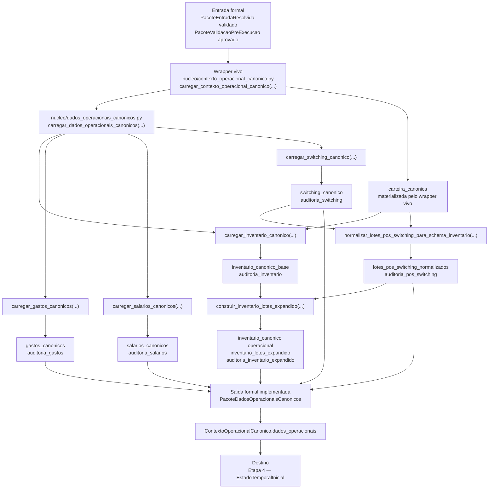

# Contrato Individual — Etapa 3 — Dados Operacionais Canônicos

## 1. Identificação documental

- **Etapa:** 3
- **Nome:** Dados Operacionais Canônicos / Canonização Operacional
- **Entrada formal obrigatória:** `PacoteEntradaResolvida` validado e `PacoteValidacaoPreExecucao` aprovado
- **Saída formal implementada:** `PacoteDadosOperacionaisCanonicos`
- **Artefatos conceituais embutidos:** universo econômico operacional e auditorias de canonização materializadas dentro de `PacoteDadosOperacionaisCanonicos` e `ContextoOperacionalCanonico`
- **Natureza:** transformação operacional canônica da entrada validada
- **Módulo vivo:** `nucleo/dados_operacionais_canonicos.py`
- **Função pública viva:** `carregar_dados_operacionais_canonicos(...)`
- **Wrapper vivo atual do runtime:** `nucleo/contexto_operacional_canonico.py` / `carregar_contexto_operacional_canonico(...)`
- **Função contratual-alvo histórica/conceitual:** `construir_pacote_canonizacao_operacional(...)`, ainda não materializada como função viva com esse nome

## 2. Status normativo

Este contrato formaliza a Etapa 3 como camada de transformação da entrada resolvida e validada em dados operacionais canônicos.

A Etapa 3 é a primeira etapa que transforma dados estruturais em entidades operacionais canônicas. Ela não decide pagamentos, não executa motor temporal, não gera ledger e não renderiza saída observável.

No runtime vivo, a Etapa 3 é materializada por `carregar_dados_operacionais_canonicos(...)` dentro de `carregar_contexto_operacional_canonico(...)`. Os artefatos conceituais `UniversoEconomicoCanonico` e `PacoteAuditoriaCanonizacaoOperacional` permanecem como responsabilidades contratuais de conteúdo, mas não devem ser interpretados como classes/funções vivas independentes enquanto não forem implementados com esses nomes.

## 3. Posição na cadeia macro

```text
Etapa 2 -> PacoteValidacaoPreExecucao -> Etapa 3 -> PacoteDadosOperacionaisCanonicos -> Etapa 4
```

No runtime vivo, a saída da Etapa 3 é disponibilizada no campo `dados_operacionais` de `ContextoOperacionalCanonico`, junto a outros componentes derivados que servem de interface física para a Etapa 4.

## 4. Função da etapa

A Etapa 3 transforma os quadros estruturais resolvidos e validados em dados operacionais canônicos, distinguindo entrada estrutural de entidades econômicas operacionais.

Ela canoniza inventário, gastos, salários/recebidos e switchings já realizados, além de integrar lotes pós-switching ao inventário operacional e preservar auditorias de canonização.

## 5. Entrada formal obrigatória e exclusiva

A entrada formal da Etapa 3 é composta por:

```text
PacoteEntradaResolvida validado
PacoteValidacaoPreExecucao aprovado
```

A Etapa 3 não deve reler planilha, redescobrir aliases ou resolver colunas novamente quando os mapas resolvidos da Etapa 1 e validados pela Etapa 2 já existirem.

No runtime vivo, esses componentes chegam por `ContextoOperacionalCanonico`, que encapsula `PacoteEntradaResolvida`, `PacoteValidacaoPreExecucao`, `PacotePlanilha`, configuração, contexto e cache.

## 6. Componentes consumíveis da entrada

A Etapa 3 pode consumir:

- `PacoteConfig`;
- `ContextoExecucao`;
- `PacotePlanilha`;
- `MapaAbasResolvidas`;
- `MapaColunasResolvidas`;
- `quadros_estruturais_resolvidos/carteira`;
- `quadros_estruturais_resolvidos/salarios`;
- `quadros_estruturais_resolvidos/despesas`;
- `quadros_estruturais_resolvidos/lotes`;
- `quadros_estruturais_resolvidos/switching`;
- `PacoteValidacaoPreExecucao`;
- auditorias da Etapa 1 e Etapa 2;
- `carteira_canonica` quando já materializada pelo wrapper vivo para resolução de produto.

## 7. Saída formal obrigatória

A saída formal implementada da Etapa 3 é:

```text
PacoteDadosOperacionaisCanonicos
```

Os conteúdos conceituais de universo econômico e auditoria de canonização devem estar representados por campos, dataframes, metadados e auditorias dentro de `PacoteDadosOperacionaisCanonicos` e de `ContextoOperacionalCanonico`, até que existam classes formais independentes com esses nomes.

## 8. Componentes mínimos da saída

A Etapa 3 deve produzir, no mínimo:

- inventário canônico operacional;
- gastos canônicos;
- salários canônicos, quando aplicável;
- switching canônico de switchings já realizados;
- lotes pós-switching normalizados;
- inventário de lotes expandido como espelho/auditoria;
- auditoria de inventário;
- auditoria de gastos;
- auditoria de salários;
- auditoria de switching;
- auditoria de inventário expandido;
- nomes de abas operacionais resolvidas.

## 9. Processo interno da etapa

A Etapa 3 deve:

1. receber entrada validada da Etapa 1/2 por `PacoteEntradaResolvida` e `PacoteValidacaoPreExecucao`;
2. usar `PacotePlanilha` e `config` já resolvidos;
3. carregar/canonizar inventário por `carregar_inventario_canonico(...)`;
4. carregar/canonizar gastos por `carregar_gastos_canonicos(...)`;
5. carregar/canonizar salários/recebidos por `carregar_salarios_canonicos(...)`;
6. carregar/canonizar switchings já realizados por `carregar_switching_canonico(...)`;
7. normalizar lotes pós-switching por `normalizar_lotes_pos_switching_para_schema_inventario(...)`;
8. integrar inventário base e lotes pós-switching por `construir_inventario_lotes_expandido(...)`;
9. preservar auditorias por bloco;
10. montar `PacoteDadosOperacionaisCanonicos`;
11. disponibilizar o pacote em `ContextoOperacionalCanonico.dados_operacionais` para a Etapa 4.

## 10. O que a etapa pode fazer

A Etapa 3 pode:

- transformar quadros estruturais resolvidos em entidades canônicas;
- padronizar campos operacionais;
- criar identificadores canônicos;
- integrar inventário com switchings já realizados;
- normalizar lotes pós-switching já materializados;
- produzir auditorias de canonização;
- preservar espelhos/auditorias quando necessários para rastreabilidade.

## 11. O que a etapa não pode fazer

A Etapa 3 não pode:

- reler planilha;
- baixar planilha;
- redescobrir aliases;
- resolver colunas novamente como rota paralela;
- executar motor temporal;
- decidir pagamento;
- decidir switching futuro;
- calcular trajetória temporal conjunta;
- gerar ledger;
- executar gates de validação de núcleo;
- renderizar console;
- gerar XLSX;
- gerar saída canônica final.

## 12. Relação com a etapa anterior

A Etapa 3 consome o `PacoteEntradaResolvida` da Etapa 1 após aprovação pela Etapa 2. A validação pré-execução é condição de entrada para a canonização operacional.

## 13. Relação com a etapa posterior

A Etapa 3 entrega `PacoteDadosOperacionaisCanonicos` para a Etapa 4 — Estado Temporal Inicial.

No runtime vivo, a Etapa 4 consome esses dados por meio de `ContextoOperacionalCanonico`, sem retornar à planilha ou aos quadros brutos como fonte normativa alternativa.

## 14. Schema/funções públicas previstas ou implementadas

Módulo vivo:

```text
nucleo/dados_operacionais_canonicos.py
```

Função pública viva:

```python
carregar_dados_operacionais_canonicos(
    pacote_planilha: PacotePlanilha,
    config: Mapping[str, Any],
    *,
    data_referencia: date,
    carteira_canonica: Optional[PacoteCarteiraCanonica] = None,
) -> PacoteDadosOperacionaisCanonicos
```

Funções centrais vivas preservadas no contrato:

```text
carregar_inventario_canonico(...)
carregar_gastos_canonicos(...)
carregar_salarios_canonicos(...)
carregar_switching_canonico(...)
normalizar_lotes_pos_switching_para_schema_inventario(...)
construir_inventario_lotes_expandido(...)
```

Wrapper vivo atual:

```text
nucleo/contexto_operacional_canonico.py
carregar_contexto_operacional_canonico(...)
```

Artefato formal implementado:

```python
PacoteDadosOperacionaisCanonicos
```

Nomes contratuais conceituais ainda não materializados como classes/funções vivas independentes:

```text
construir_pacote_canonizacao_operacional(...)
UniversoEconomicoCanonico
PacoteAuditoriaCanonizacaoOperacional
```

Esses nomes não devem ser usados como evidência de implementação viva até que existam no código.

## 15. Auditoria esperada

A auditoria da Etapa 3 deve registrar:

- completude do inventário canônico;
- completude dos gastos canônicos;
- completude dos salários/recebidos canônicos;
- consistência dos switchings já realizados;
- consistência do inventário canônico operacional;
- lotes pós-switching integrados;
- inconsistências de canonização;
- avisos e bloqueios por bloco;
- aptidão dos dados operacionais para a Etapa 4.

## 16. Critérios de aceite

A Etapa 3 é aceita quando:

1. consome apenas entrada resolvida e validada;
2. produz `PacoteDadosOperacionaisCanonicos`;
3. canoniza inventário, gastos, salários/recebidos e switching;
4. integra inventário e switchings já realizados de modo rastreável;
5. preserva auditorias por bloco;
6. não promete classes/funções inexistentes como implementação viva;
7. não decide pagamentos ou switching futuro;
8. não executa motor temporal;
9. não gera ledger, console, XLSX ou saída canônica final.

## 17. Fluxograma operacional-explicativo completo



## 18. Condição de parada

A Etapa 3 deve bloquear ou propagar erro auditável quando componentes estruturais necessários para inventário, gastos, salários/recebidos ou switching não puderem ser canonizados com segurança mínima.

## 19. Histórico documental / adendos funcionais consolidados

Este contrato foi originalmente derivado de:

```text
logs/iteracoes/ME-V17-F0-V32C_FORMALIZA_ETAPA3_CANONIZACAO_OPERACIONAL.md
```

A versão atual alinha a documentação ao script vivo: `carregar_dados_operacionais_canonicos(...)` passa a ser a função pública efetivamente implementada, `PacoteDadosOperacionaisCanonicos` passa a ser a saída formal implementada, e os nomes `UniversoEconomicoCanonico`, `PacoteAuditoriaCanonizacaoOperacional` e `construir_pacote_canonizacao_operacional(...)` ficam explicitamente classificados como nomes contratuais/conceituais ainda não materializados como código vivo independente.
