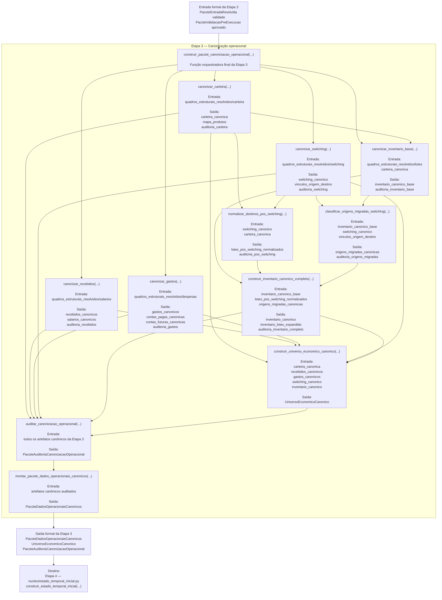

# Contrato Individual — Etapa 3 — Dados Operacionais Canônicos

## 1. Identificação documental

- **Etapa:** 3
- **Nome:** Dados Operacionais Canônicos / Canonização Operacional
- **Entrada formal obrigatória:** `PacoteEntradaResolvida` validado e `PacoteValidacaoPreExecucao` aprovado
- **Saídas formais obrigatórias:** `PacoteDadosOperacionaisCanonicos`, `UniversoEconomicoCanonico`, `PacoteAuditoriaCanonizacaoOperacional`
- **Natureza:** transformação operacional canônica da entrada validada
- **Função orquestradora:** `construir_pacote_canonizacao_operacional(...)`

## 2. Status normativo

Este contrato formaliza a Etapa 3 como camada de transformação da entrada resolvida e validada em artefatos operacionais canônicos.

A Etapa 3 é a primeira etapa que transforma dados estruturais em entidades operacionais canônicas. Ela não decide pagamentos, não executa motor temporal, não gera ledger e não renderiza saída observável.

## 3. Posição na cadeia macro

```text
Etapa 2 -> PacoteValidacaoPreExecucao -> Etapa 3 -> PacoteDadosOperacionaisCanonicos / UniversoEconomicoCanonico / PacoteAuditoriaCanonizacaoOperacional -> Etapa 4
```

## 4. Função da etapa

A Etapa 3 transforma os quadros estruturais resolvidos e validados em artefatos operacionais canônicos, distinguindo entrada estrutural de entidades econômicas operacionais.

Ela canoniza carteira, recebidos, gastos, switching já realizado e inventário, além de construir o universo econômico canônico e auditar a canonização.

## 5. Entrada formal obrigatória e exclusiva

A entrada formal da Etapa 3 é composta por:

```text
PacoteEntradaResolvida validado
PacoteValidacaoPreExecucao aprovado
```

A Etapa 3 não deve reler planilha, redescobrir aliases ou resolver colunas novamente quando os mapas resolvidos da Etapa 1 e validados pela Etapa 2 já existirem.

## 6. Componentes consumíveis da entrada

A Etapa 3 pode consumir:

- `PacoteConfig`;
- `ContextoExecucao`;
- `PacotePlanilha`;
- `MapaAbasResolvidas`;
- `MapaColunasResolvidas`;
- `quadros_estruturais_resolvidos/carteira`;
- `quadros_estruturais_resolvidos/salarios`;
- `quadros_estruturais_resolvidos/despesas`;
- `quadros_estruturais_resolvidos/lotes`;
- `quadros_estruturais_resolvidos/switching`;
- `PacoteValidacaoPreExecucao`;
- auditorias da Etapa 1 e Etapa 2.

## 7. Saída formal obrigatória

As saídas formais obrigatórias da Etapa 3 são:

```text
PacoteDadosOperacionaisCanonicos
UniversoEconomicoCanonico
PacoteAuditoriaCanonizacaoOperacional
```

## 8. Componentes mínimos da saída

A Etapa 3 deve produzir, no mínimo:

- carteira canônica;
- recebidos canônicos;
- salários canônicos, quando aplicável;
- gastos canônicos;
- contas pagas canônicas;
- contas futuras canônicas;
- switching canônico de switchings já realizados;
- vínculos origem/destino de switching;
- inventário canônico base;
- lotes pós-switching normalizados;
- origens migradas canônicas;
- inventário canônico completo;
- inventário de lotes expandido como espelho/auditoria, quando aplicável;
- universo econômico canônico;
- auditorias por bloco;
- pacote de auditoria da canonização operacional.

## 9. Processo interno da etapa

A Etapa 3 deve:

1. verificar entrada validada;
2. orquestrar a canonização operacional;
3. canonizar carteira;
4. canonizar recebidos;
5. canonizar gastos;
6. canonizar switchings já realizados;
7. canonizar inventário base;
8. normalizar destinos pós-switching;
9. classificar origens migradas por switching;
10. construir inventário canônico completo;
11. construir universo econômico canônico;
12. auditar a canonização operacional;
13. montar `PacoteDadosOperacionaisCanonicos`;
14. emitir os artefatos formais da Etapa 3.

## 10. O que a etapa pode fazer

A Etapa 3 pode:

- transformar quadros estruturais resolvidos em entidades canônicas;
- padronizar campos operacionais;
- criar identificadores canônicos;
- integrar inventário com switchings já realizados;
- construir universo econômico canônico;
- produzir auditorias de canonização;
- preservar espelhos/auditorias quando necessários para rastreabilidade.

## 11. O que a etapa não pode fazer

A Etapa 3 não pode:

- reler planilha;
- baixar planilha;
- redescobrir aliases;
- resolver colunas novamente como rota paralela;
- executar motor temporal;
- decidir pagamento;
- decidir switching futuro;
- calcular trajetória temporal conjunta;
- gerar ledger;
- executar gates de validação de núcleo;
- renderizar console;
- gerar XLSX;
- gerar saída canônica final.

## 12. Relação com a etapa anterior

A Etapa 3 consome o `PacoteEntradaResolvida` da Etapa 1 após aprovação pela Etapa 2. A validação pré-execução é condição de entrada para a canonização operacional.

## 13. Relação com a etapa posterior

A Etapa 3 entrega `PacoteDadosOperacionaisCanonicos`, `UniversoEconomicoCanonico` e `PacoteAuditoriaCanonizacaoOperacional` para a Etapa 4 — Estado Temporal Inicial.

A Etapa 4 deve consumir os artefatos canonizados, sem retornar à planilha ou aos quadros brutos.

## 14. Schema/funções públicas previstas ou implementadas

Funções centrais preservadas no contrato:

```text
construir_pacote_canonizacao_operacional(...)
canonizar_carteira(...)
canonizar_recebidos(...)
canonizar_gastos(...)
canonizar_switching(...)
canonizar_inventario_base(...)
normalizar_destinos_pos_switching(...)
classificar_origens_migradas_switching(...)
construir_inventario_canonico_completo(...)
construir_universo_economico_canonico(...)
auditar_canonizacao_operacional(...)
montar_pacote_dados_operacionais_canonicos(...)
```

Artefatos formais:

```python
PacoteDadosOperacionaisCanonicos
UniversoEconomicoCanonico
PacoteAuditoriaCanonizacaoOperacional
```

## 15. Auditoria esperada

A auditoria da Etapa 3 deve registrar:

- completude da carteira canônica;
- completude dos recebidos canônicos;
- completude dos gastos canônicos;
- consistência dos switchings já realizados;
- consistência do inventário canônico;
- vínculos origem/destino de switching;
- inconsistências de canonização;
- avisos e bloqueios por bloco;
- aptidão dos artefatos para a Etapa 4.

## 16. Critérios de aceite

A Etapa 3 é aceita quando:

1. consome apenas entrada resolvida e validada;
2. produz `PacoteDadosOperacionaisCanonicos`;
3. produz `UniversoEconomicoCanonico`;
4. produz `PacoteAuditoriaCanonizacaoOperacional`;
5. canoniza carteira, recebidos, gastos, switching e inventário;
6. integra inventário e switchings já realizados de modo rastreável;
7. não decide pagamentos ou switching futuro;
8. não executa motor temporal;
9. não gera ledger, console, XLSX ou saída canônica final.

## 17. Fluxograma operacional-explicativo completo



## 18. Condição de parada

A Etapa 3 deve bloquear a progressão para a Etapa 4 quando os artefatos canônicos mínimos não puderem ser construídos ou auditados de modo suficiente para formar o estado temporal inicial.

## 19. Histórico documental / adendos funcionais consolidados

Este contrato foi originalmente derivado de:

```text
logs/iteracoes/ME-V17-F0-V32C_FORMALIZA_ETAPA3_CANONIZACAO_OPERACIONAL.md
```

A versão atual apenas reorganiza o conteúdo no padrão estrutural único dos contratos individuais das Etapas 1–7, preservando a semântica da Etapa 3 como canonização operacional.
