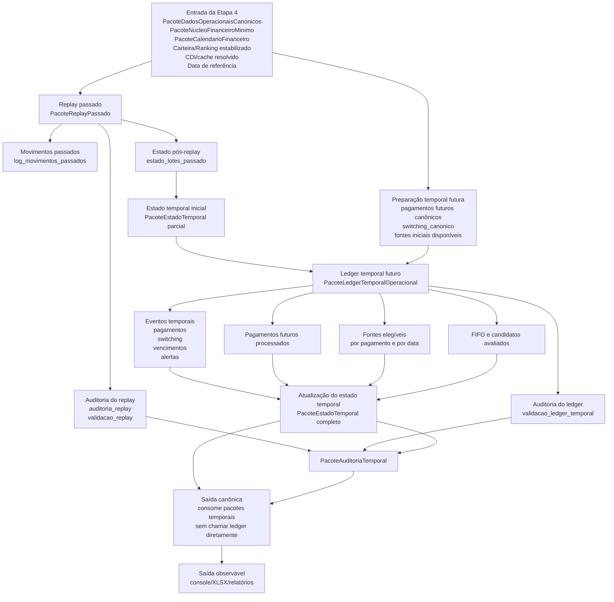

# CONTRATO INDIVIDUAL DA ETAPA 4 — CONTRATOS E FLUXOGRAMA MÍNIMOS

> Cópia canônica derivada do documento-fonte já existente:
>
> `logs/iteracoes/ME-V17-F0-V4B_ESPECIFICA_CONTRATOS_FLUXOGRAMA_ETAPA4.md`
>
> O documento original permanece preservado como log histórico. Esta cópia organiza o mesmo contrato individual na pasta canônica `relatorios/principais/contratos_individuais/`.

## 1. Identificação do documento-fonte

- MICROETAPA: ME-V17-F0-V4B
- VERSAO_CANDIDATA: V17-F0-V.4B
- TIPO: DOCUMENTAL / CONTRATO INTERNO / SEM ALTERAÇÃO DE CÓDIGO
- CLASSE: ESPECIFICA_CONTRATOS_FLUXOGRAMA_MINIMOS_ETAPA4
- BASELINE_DE_ENTRADA: V17-F0-V.4A
- ALTERA_CÓDIGO: não
- ALTERA_REPLAY: não
- ALTERA_LEDGER: não
- ALTERA_ESTADO_TEMPORAL: não
- ALTERA_SAIDA_CANONICA: não
- ALTERA_SAIDA_OBSERVAVEL: não
- ALTERA_CONSOLE: não
- ALTERA_XLSX: não
- ALTERA_DADOS: não
- ALTERA_CACHE: não

## 2. Objetivo

Definir os contratos mínimos da Etapa 4, incluindo:

```text
PacoteReplayPassado
PacoteLedgerTemporalOperacional
PacoteEstadoTemporal
PacoteAuditoriaTemporal
fronteiras entre replay, ledger, estado e saída
fluxograma Mermaid normativo da Etapa 4
```

Esta microetapa não implementa código. Ela especifica a arquitetura alvo mínima para orientar as próximas auditorias e adaptações executáveis.

## 3. Definição normativa da Etapa 4

A Etapa 4 é a camada temporal do pipeline.

Ela começa depois da Etapa 3, quando os dados operacionais já foram canonizados, e termina antes da saída canônica.

Escopo da Etapa 4:

```text
replay de pagamentos passados
estado pós-replay
ledger temporal futuro
eventos temporais
fontes elegíveis
saldos por lote e por data
vencimentos
alertas temporais
auditoria temporal
```

Fora do escopo da Etapa 4:

```text
leitura física da planilha
resolução de abas e colunas
validação pré-execução
canonização operacional de inventário/gastos/salários/switching
ranking visual da carteira
renderização de console
renderização de XLSX
formatação final da saída observável
```

## 4. Entradas formais mínimas da Etapa 4

A Etapa 4 deve receber, no mínimo:

```text
PacoteDadosOperacionaisCanonicos
PacoteNucleoFinanceiroMinimo
PacoteCalendarioFinanceiro
PacoteCarteiraCanonica ou ranking/metadata de carteira já estabilizados
data_referencia
serie_cdi/cache_cdi resolvido
config_temporal_reduzida
```

Durante a transição, ainda é permitido receber:

```text
contexto amplo
```

mas seu uso deve ser classificado por consumidor real.

A Etapa 4 não deve depender como fonte primária de:

```text
pacote_planilha
quadros_brutos
planilha física
abas brutas
```

Exceção transitória aceita:

```text
fallback legado auditável de Switching no ledger
```

Esse fallback não deve ser fonte primária quando `switching_canonico` estiver disponível.

## 5. Contrato mínimo — PacoteReplayPassado

### 5.1. Objetivo

Representar o resultado completo e auditável do replay dos pagamentos passados até a data de referência.

### 5.2. Origem atual

O artefato atual mais próximo é:

```text
PacoteReplayPassadoControlado
```

em:

```text
nucleo/replay_passado_controlado.py
```

### 5.3. Campos mínimos obrigatórios

```text
versao
modo_execucao
data_referencia
lotes_apos_replay
log_movimentos_passados
estado_lotes_passado
audit_trilha_pagamentos_passados
auditoria_replay
validacao_replay
metadados_origem
```

### 5.4. Campo: `lotes_apos_replay`

Tipo conceitual:

```text
list[Lote]
```

Responsabilidade:

```text
conter os lotes após aplicação de rendimentos, saques históricos, exaustões e normalização de resíduos sub-limiar até a data de referência
```

Não deve conter:

```text
correções visuais da saída
ranking de carteira
pagamentos futuros
```

### 5.5. Campo: `log_movimentos_passados`

Tipo conceitual:

```text
DataFrame ou list[dict]
```

Campos mínimos:

```text
movimento_id
despesa_id
data_movimento
descricao_pagamento
lote_id
fonte_pagamento
valor_pagamento
valor_bruto_sacado
imposto
valor_liquido_sacado
saldo_antes
saldo_depois
status_cobertura
motivo_inconsistencia
```

### 5.6. Campo: `estado_lotes_passado`

Tipo conceitual:

```text
DataFrame ou list[dict]
```

Campos mínimos:

```text
lote_id
data_recebimento
data_aplicacao
data_base_fiscal
valor_inicial
saldo_bruto_pos_replay
saldo_liquido_pos_replay
principal_remanescente
fator_acumulado
esgotado_no_replay
vezes_usado_no_replay
total_bruto_sacado
total_imposto_pago
total_liquido_sacado
investimento
situacao_investimento
carencia_ate
regra_iof
```

### 5.7. Campo: `auditoria_replay`

Deve registrar, no mínimo:

```text
qtd_contas_historicas
qtd_contas_com_lote_informado
qtd_contas_processadas
qtd_contas_cobertas_integralmente
qtd_contas_parcialmente_cobertas
qtd_contas_nao_cobertas
qtd_lotes_historicos_nao_aportados_materializados
qtd_lotes_historicos_alias_resolvidos
qtd_lotes_resolvidos_por_limiar_pos_replay
saldo_bruto_total_pos_replay
saldo_liquido_total_pos_replay
qtd_movimentos_saldo_historico
qtd_inconsistencias_materiais
```

### 5.8. Campo: `validacao_replay`

Deve conter:

```text
ok
erros_bloqueantes
avisos
evidencias
```

### 5.9. Fronteira do replay

O replay passado pode:

```text
processar contas pagas até a data de referência
consumir lotes explicitamente informados
materializar caixa histórico quando Lote usado = Saldo exclusivo
normalizar resíduos sub-limiar
produzir estado pós-passado
```

O replay passado não deve:

```text
escolher lote para pagamento futuro
executar switching econômico futuro
montar extrato futuro
formatar saída canônica
renderizar XLSX/console
```

## 6. Contrato mínimo — PacoteLedgerTemporalOperacional

### 6.1. Objetivo

Representar o resultado temporal futuro a partir do estado pós-replay, incluindo pagamentos futuros, eventos de switching, saldos, fontes elegíveis e alertas.

### 6.2. Origem atual

O artefato atual mais próximo é:

```text
PacoteLedgerTemporal
```

em:

```text
nucleo/pacote_ledger_temporal.py
```

mas ele ainda está em modo shadow.

### 6.3. Campos mínimos obrigatórios

```text
versao
modo_execucao
data_referencia
eventos_temporais
estado_temporal_por_data
saldos_por_lote
saldos_disponiveis_por_data
vencimentos_processados
pagamentos_futuros_processados
fontes_elegiveis_por_pagamento
fontes_elegiveis_por_data
fifo_candidatos_avaliados
alertas_temporais
auditoria_ledger_temporal
validacao_ledger_temporal
metadados_origem
```

### 6.4. Campo: `eventos_temporais`

Cada evento deve ter, no mínimo:

```text
evento_id
data_evento
tipo_evento
subtipo_evento
lote_id
lote_origem
lote_destino
pagamento_id
valor_evento
valor_bruto
valor_liquido
imposto
saldo_antes
saldo_depois
status_evento
motivo_bloqueio
fonte_temporal
origem_dado
```

Tipos mínimos de evento:

```text
pagamento_futuro
switching
vencimento
capitalizacao
alerta_temporal
```

### 6.5. Campo: `pagamentos_futuros_processados`

Cada pagamento deve ter:

```text
pagamento_id
data_pagamento
descricao_pagamento
valor_pagamento
status_pagamento_temporal
cobertura_integral
lote_sugerido_operacional
lote_reserva
necessita_switching
switching_antes_pagamento
switching_depois_pagamento
motivo_bloqueio
pacote_dia
```

### 6.6. Campo: `fontes_elegiveis_por_pagamento`

Cada registro deve ter:

```text
pagamento_id
data_pagamento
fonte_candidata_id
tipo_fonte_candidata
origem_fonte_candidata
saldo_liquido_disponivel
saldo_bruto_disponivel
carencia_ok
vencimento_ok
migracao_ok
motivo_descarte_fonte
status_fonte
```

### 6.7. Campo: `fifo_candidatos_avaliados`

Cada linha deve ter:

```text
pagamento_id
data_pagamento
lote_id
ordem_avaliacao
saldo_liquido_disponivel
valor_pagamento
cobertura_integral
status_candidato
motivo_bloqueio
fonte_temporal
```

### 6.8. Campo: `auditoria_ledger_temporal`

Deve registrar:

```text
qtd_eventos_temporais
qtd_pagamentos_futuros_processados
qtd_fifo_candidatos_avaliados
qtd_saldos_por_lote
qtd_alertas_temporais
fonte_primaria_switching_ledger
fallback_legado_switching_auditavel
usa_contexto_amplo
usa_planilha_bruta_como_fonte_primaria
usa_planilha_bruta_apenas_fallback
campos_ausentes_preenchidos_vazios
retorno_legado_chaves
```

### 6.9. Campo: `validacao_ledger_temporal`

Deve conter:

```text
ok
erros_bloqueantes
avisos
evidencias
```

### 6.10. Fronteira do ledger

O ledger temporal pode:

```text
processar pagamentos futuros
avaliar fontes elegíveis
processar eventos de switching já canônicos
materializar eventos temporais
controlar saldos temporais por lote
registrar alertas e bloqueios
```

O ledger temporal não deve:

```text
ler planilha bruta como fonte primária
resolver abas ou colunas
canonizar Switching
renderizar saída
formatar console/XLSX
corrigir visualmente lotes exauridos
```

## 7. Contrato mínimo — PacoteEstadoTemporal

### 7.1. Objetivo

Formalizar o estado temporal derivado de replay e ledger, separando-o da saída canônica.

### 7.2. Campos mínimos obrigatórios

```text
versao
data_referencia
estado_lotes_por_data
estado_lotes_final
saldos_por_lote
saldos_disponiveis_por_data
fontes_disponiveis_por_data
vencimentos_por_data
migracoes_por_data
auditoria_estado_temporal
validacao_estado_temporal
```

### 7.3. Campo: `estado_lotes_por_data`

Cada registro deve ter:

```text
data_referencia_temporal
lote_id
status_temporal
saldo_bruto
saldo_liquido
principal_remanescente
fator_acumulado
disponivel_para_pagamento
disponivel_para_switching
carencia_ate
vencido
data_vencimento
migrado
migrado_em
lote_pos_switching
origem_estado
```

### 7.4. Campo: `estado_lotes_final`

Deve representar o fechamento na data de referência ou no fim da janela futura, conforme parâmetro de execução:

```text
lote_id
status_final
saldo_bruto_final
saldo_liquido_final
patrimonio_liquido_final
total_bruto_sacado
total_liquido_sacado
total_imposto_pago
rendimento_liquido_acumulado
```

### 7.5. Fronteira do estado temporal

O estado temporal pode:

```text
consolidar replay passado e ledger futuro
expor saldos e disponibilidade por data
registrar vencimentos e migrações
servir de fonte para saída canônica
```

O estado temporal não deve:

```text
executar decisão econômica nova
formatar saída final
resolver dados brutos
alterar retrospectivamente o replay
```

## 8. Contrato mínimo — PacoteAuditoriaTemporal

### 8.1. Objetivo

Concentrar auditorias e validações temporais para reduzir lógica diagnóstica dispersa na saída canônica.

### 8.2. Campos mínimos obrigatórios

```text
versao
data_referencia
auditoria_replay
auditoria_ledger
auditoria_estado_temporal
auditoria_fontes_elegiveis
auditoria_switching_temporal
auditoria_invariantes
auditoria_residuos_legados
validacao_temporal_global
```

### 8.3. Invariantes mínimos

```text
saldo_lote_nao_negativo
pagamento_futuro_nao_usa_lote_exaurido
origem_migrada_nao_permanece_disponivel
switching_canonico_usado_como_fonte_primaria
fallback_switching_bruto_nao_usado_quando_canonico_presente
saida_canonica_nao_recalcula_saldo_temporal
patrimonio_temporal_reconciliavel
```

### 8.4. Auditoria de resíduos legados

Deve registrar:

```text
usa_contexto_amplo
usa_pacote_planilha
usa_quadros_brutos
usa_planilha_bruta_como_fonte_primaria
usa_planilha_bruta_apenas_fallback
usa_retorno_ledger_dict_legado
saida_chama_ledger_diretamente
```

## 9. Fronteiras entre subcamadas

### 9.1. Replay → Estado temporal

O replay entrega:

```text
lotes_apos_replay
estado_lotes_passado
log_movimentos_passados
auditoria_replay
validacao_replay
```

O estado temporal recebe isso como base inicial.

### 9.2. Estado temporal → Ledger

O ledger deve receber:

```text
estado inicial por lote
pagamentos futuros canônicos
switching_canonico
fontes disponíveis por data
calendário financeiro
serie CDI/cache resolvido
```

### 9.3. Ledger → Estado temporal

O ledger devolve:

```text
eventos temporais
pagamentos futuros processados
saldos por lote
fontes elegíveis
alertas temporais
```

### 9.4. Etapa 4 → Saída canônica

A saída canônica deve receber pacotes prontos:

```text
PacoteReplayPassado
PacoteLedgerTemporalOperacional
PacoteEstadoTemporal
PacoteAuditoriaTemporal
```

A saída canônica não deve chamar diretamente:

```text
construir_ledger_temporal_conjunto(...)
```

na arquitetura final.

## 10. Fluxograma Mermaid normativo da Etapa 4



## 11. Fluxo transitório atual versus fluxo alvo

### 11.1. Fluxo transitório atual

```text
saida_canonica
  escolhe quadro_futuro
  monta mapa_central
  chama construir_ledger_temporal_conjunto(...)
  interpreta eventos
  monta extrato futuro
```

### 11.2. Fluxo alvo

```text
Etapa 4
  constrói PacoteReplayPassado
  constrói PacoteEstadoTemporal inicial
  constrói PacoteLedgerTemporalOperacional
  completa PacoteEstadoTemporal
  constrói PacoteAuditoriaTemporal
saida_canonica
  apenas consome pacotes temporais
```
