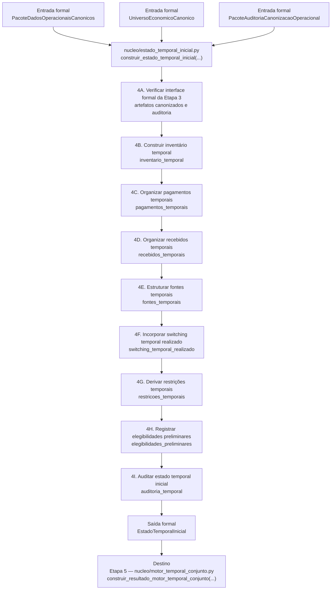

# Contrato Individual — Etapa 4 — Estado Temporal Inicial

## 1. Identificação documental

- **Etapa:** 4
- **Nome:** Estado Temporal Inicial
- **Artefato formal de saída:** `EstadoTemporalInicial`
- **Módulo funcional:** `nucleo/estado_temporal_inicial.py`
- **Função pública implementada:** `construir_estado_temporal_inicial(...)`
- **Natureza:** contrato individual operacional-explicativo

## 2. Status normativo

Este contrato é normativo para a Etapa 4 e substitui leituras anteriores que não estejam alinhadas à cadeia funcional consolidada das Etapas 1–7.

Logs históricos e documentos anteriores permanecem preservados como histórico, mas não prevalecem sobre este corpo contratual vivo.

## 3. Posição na cadeia macro

```text
Etapa 3 -> PacoteDadosOperacionaisCanonicos / UniversoEconomicoCanonico -> Etapa 4 -> EstadoTemporalInicial -> Etapa 5
```

## 4. Função da etapa

A Etapa 4 transforma os dados operacionais canonizados e o universo econômico canônico em um estado temporal inicial, estruturando os elementos necessários para que a Etapa 5 execute o motor temporal conjunto sem consultar fontes externas à entrada formal da Etapa 4.

A Etapa 4 não executa decisões econômicas finais; ela organiza o estado inicial para que a decisão conjunta ocorra na Etapa 5.

## 5. Entrada formal obrigatória e exclusiva

A entrada formal contratual da Etapa 4 é composta pelos artefatos produzidos pela Etapa 3:

- `PacoteDadosOperacionaisCanonicos`;
- `UniversoEconomicoCanonico`;
- `PacoteAuditoriaCanonizacaoOperacional`.

A interface física atual pode receber um contexto operacional consolidado quando o runtime ainda materializa os artefatos intermediários internamente. Essa interface física não autoriza a Etapa 4 a buscar planilha, console, XLSX, logs, diagnósticos ou artefatos de etapas posteriores como fonte de estado.

## 6. Componentes consumíveis da entrada

A Etapa 4 pode consumir somente componentes materializados na entrada formal, incluindo:

- recebidos canonizados;
- pagamentos canonizados;
- inventário canônico de lotes;
- regras econômicas canônicas;
- universo de fontes elegíveis;
- informações de switching já canonizadas;
- auditoria de completude e consistência da canonização.

## 7. Saída formal obrigatória

A saída formal obrigatória da Etapa 4 é:

```text
EstadoTemporalInicial
```

## 8. Componentes mínimos da saída

`EstadoTemporalInicial` deve conter, no mínimo:

- inventário temporal;
- pagamentos temporais;
- recebidos temporais;
- fontes temporais;
- switching temporal realizado;
- restrições temporais;
- elegibilidades preliminares;
- auditoria temporal;
- metadados de origem da Etapa 3.

## 9. Processo interno da etapa

A Etapa 4 deve:

1. verificar a presença dos artefatos formais da Etapa 3;
2. construir o inventário temporal;
3. organizar pagamentos temporais;
4. organizar recebidos temporais;
5. estruturar fontes temporais;
6. materializar switching temporal realizado quando já estiver canonizado;
7. derivar restrições temporais;
8. registrar elegibilidades preliminares;
9. executar auditoria temporal;
10. emitir `EstadoTemporalInicial`.

## 10. O que a etapa pode fazer

A Etapa 4 pode:

- reorganizar dados canonizados em estruturas temporais;
- materializar índices temporais iniciais;
- derivar restrições e elegibilidades preliminares a partir da entrada formal;
- registrar auditoria de formação do estado temporal inicial;
- sinalizar incompletudes da entrada formal sem buscar fontes externas.

## 11. O que a etapa não pode fazer

A Etapa 4 não pode:

- produzir artefatos observáveis oficiais;
- executar pagamento real;
- executar switching real;
- escolher pacote temporal vencedor;
- reotimizar decisões econômicas;
- consultar planilha diretamente;
- consultar logs ou diagnósticos como fonte de estado;
- consumir artefatos de etapas posteriores;
- produzir `ResultadoMotorTemporalConjunto`;
- produzir `LedgerTemporalCanonico`;
- gerar saída canônica, console ou XLSX.

## 12. Relação com a etapa anterior

A Etapa 4 depende exclusivamente da Etapa 3. A Etapa 3 entrega dados operacionais canonizados, universo econômico canônico e auditoria de canonização operacional; a Etapa 4 apenas estrutura esses elementos em perspectiva temporal inicial.

## 13. Relação com a etapa posterior

A Etapa 4 fornece `EstadoTemporalInicial` para a Etapa 5 — Motor Temporal Conjunto. A Etapa 5 deve consumir esse estado como entrada formal exclusiva.

## 14. Schema/funções públicas previstas ou implementadas

Módulo funcional:

```text
nucleo/estado_temporal_inicial.py
```

Função pública implementada:

```python
construir_estado_temporal_inicial(...) -> EstadoTemporalInicial
```

Artefato formal:

```python
EstadoTemporalInicial
```

## 15. Auditoria esperada

A auditoria da Etapa 4 deve registrar:

- completude dos componentes temporais;
- coerência de datas;
- presença de pagamentos, recebidos, fontes e inventário temporal;
- eventuais incompletudes preservadas;
- aptidão do estado para consumo pela Etapa 5.

## 16. Critérios de aceite

A Etapa 4 é aceita quando:

1. consome somente a entrada formal da Etapa 3;
2. produz `EstadoTemporalInicial`;
3. materializa os componentes temporais mínimos;
4. registra auditoria temporal;
5. não produz artefatos observáveis oficiais;
6. não executa decisão econômica final;
7. não consulta fontes externas à entrada formal;
8. não gera replay, ledger, saída canônica, console ou XLSX.

## 17. Fluxograma operacional-explicativo completo



## 18. Condição de parada

A Etapa 4 deve parar com incompletude auditada quando a entrada formal da Etapa 3 não permitir estruturar o estado temporal inicial mínimo.

## 19. Adendos funcionais consolidados

Não há adendos funcionais ativos fora deste corpo contratual. O corpo vivo da Etapa 4 é o presente documento.
