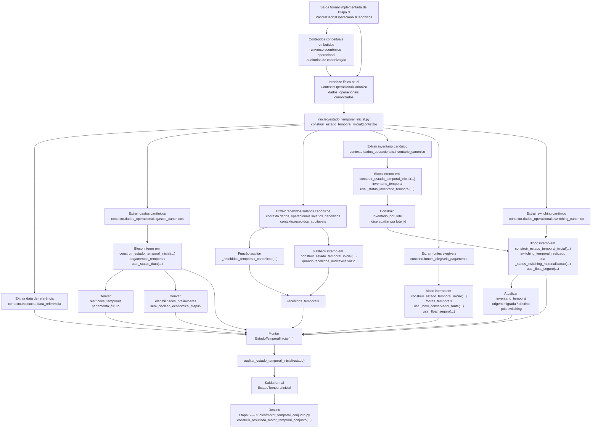

# Contrato Individual — Etapa 4 — Estado Temporal Inicial

## 1. Identificação documental

- **Etapa:** 4
- **Nome:** Estado Temporal Inicial
- **Artefato formal de saída:** `EstadoTemporalInicial`
- **Módulo funcional:** `nucleo/estado_temporal_inicial.py`
- **Função pública implementada:** `construir_estado_temporal_inicial(...)`
- **Natureza:** contrato individual operacional-explicativo

## 2. Status normativo

Este contrato é normativo para a Etapa 4 e substitui leituras anteriores que não estejam alinhadas à cadeia funcional consolidada das Etapas 1–7.

Logs históricos e documentos anteriores permanecem preservados como histórico, mas não prevalecem sobre este corpo contratual vivo.

## 3. Posição na cadeia macro

```text
Etapa 3 -> PacoteDadosOperacionaisCanonicos -> Etapa 4 -> EstadoTemporalInicial -> Etapa 5
```

No runtime vivo, conteúdos conceituais de universo econômico operacional e auditorias de canonização chegam embutidos em `PacoteDadosOperacionaisCanonicos` e `ContextoOperacionalCanonico`, não como classes independentes obrigatórias.

## 4. Função da etapa

A Etapa 4 transforma dados operacionais canonizados e seus conteúdos conceituais embutidos de universo econômico/auditoria em um estado temporal inicial, estruturando os elementos necessários para que a Etapa 5 execute o motor temporal conjunto sem consultar fontes externas à entrada formal implementada da Etapa 4.

A Etapa 4 não executa decisões econômicas finais; ela organiza o estado inicial para que a decisão conjunta ocorra na Etapa 5.

## 5. Entrada formal obrigatória e exclusiva

A entrada formal implementada da Etapa 4 é:

```text
PacoteDadosOperacionaisCanonicos
```

Conteúdos conceituais antes referidos como `UniversoEconomicoCanonico` e `PacoteAuditoriaCanonizacaoOperacional` são responsabilidades contratuais de conteúdo da Etapa 3, mas, no runtime vivo atual, estão materializados como campos, dataframes, metadados e auditorias dentro de `PacoteDadosOperacionaisCanonicos` e `ContextoOperacionalCanonico`.

A interface física atual da função pública é:

```python
construir_estado_temporal_inicial(contexto: ContextoOperacionalCanonico) -> EstadoTemporalInicial
```

Essa interface física não autoriza a Etapa 4 a buscar planilha, console, XLSX, logs, diagnósticos ou artefatos de etapas posteriores como fonte de estado.

## 6. Componentes consumíveis da entrada

A Etapa 4 pode consumir somente componentes materializados na entrada formal implementada e no wrapper vivo `ContextoOperacionalCanonico`, incluindo:

- recebidos canonizados ou auditáveis;
- pagamentos canonizados;
- inventário canônico de lotes;
- regras econômicas canônicas já materializadas no contexto;
- universo de fontes elegíveis já materializado no contexto;
- informações de switching já canonizadas;
- auditorias de completude e consistência da canonização embutidas nos artefatos da Etapa 3;
- data de referência, calendário financeiro e cache CDI já materializados no contexto.

## 7. Saída formal obrigatória

A saída formal obrigatória da Etapa 4 é:

```text
EstadoTemporalInicial
```

## 8. Componentes mínimos da saída

`EstadoTemporalInicial` deve conter, no mínimo:

- inventário temporal;
- pagamentos temporais;
- recebidos temporais;
- fontes temporais;
- switching temporal realizado;
- restrições temporais;
- elegibilidades preliminares;
- auditoria temporal;
- metadados de origem da Etapa 3.


## 8-A. Identificação operacional prevista de recebidos temporais — `REGRA-LOTE-ID-OPERACIONAL-RECEBIDO-01`

Recebidos e salários temporalizados pela Etapa 4 devem preservar o identificador técnico original e, quando houver valor e data suficientes, devem receber identificador operacional previsto em padrão `Lote (ID)`.

Campos normativos esperados nos recebidos temporais, quando aplicável:

```text
fonte_id_tecnico
lote_id_operacional_previsto
tipo_lote_operacional
```

A regra de formação é:

```text
lote_id_operacional_previsto = Lote <valor> <mês>.
```

Exemplo:

```text
fonte_id_tecnico = recebido:recebido::salario_auto_00019
lote_id_operacional_previsto = Lote 3900 jun.
tipo_lote_operacional = recebido_temporal
```

Essa identificação prevista não representa decisão econômica nem consumo da fonte. A Etapa 4 apenas estrutura o estado temporal inicial para que a Etapa 5 decida, a partir do `EstadoTemporalInicial`, se o recebido será usado, reservado, mantido ou futuramente aportado.

A Etapa 4 continua proibida de escolher pacote vencedor, executar pagamento, gerar ledger, console ou XLSX.

## 9. Processo interno da etapa

A Etapa 4 deve executar uma orquestração de construção temporal em `construir_estado_temporal_inicial(...)`, composta por blocos independentes e blocos derivados. A ordem documental abaixo não implica dependência causal entre todos os blocos; as dependências reais são explicitadas no fluxograma da seção 17.

A Etapa 4 deve:

1. verificar a interface formal implementada da Etapa 3 e a interface física atual;
2. extrair data de referência e componentes canonizados do contexto operacional consolidado;
3. construir `pagamentos_temporais` a partir de gastos canônicos, usando `_status_data(...)`;
4. construir `inventario_temporal` a partir do inventário canônico, usando `_status_inventario_temporal(...)`;
5. construir `recebidos_temporais` a partir de recebidos auditáveis ou salários canônicos, usando `_recebidos_temporais_canonicos(...)` quando disponível;
6. construir `fontes_temporais` a partir de fontes elegíveis de pagamento, usando `_bool_conservador_fonte(...)` e `_float_seguro(...)`;
7. construir `switching_temporal_realizado` a partir do switching canônico, usando `_status_switching_materializacao(...)` e `_float_seguro(...)`;
8. atualizar `inventario_temporal` quando switchings materializados exigirem marcação de origem migrada ou destino pós-switching;
9. derivar `restricoes_temporais` e `elegibilidades_preliminares` a partir de `pagamentos_temporais`;
10. montar `EstadoTemporalInicial(...)` agregando os blocos temporais;
11. executar `auditar_estado_temporal_inicial(...)`;
12. emitir `EstadoTemporalInicial`.

## 10. O que a etapa pode fazer

A Etapa 4 pode:

- reorganizar dados canonizados em estruturas temporais;
- materializar índices temporais iniciais;
- derivar restrições e elegibilidades preliminares a partir da entrada formal;
- registrar auditoria de formação do estado temporal inicial;
- sinalizar incompletudes da entrada formal sem buscar fontes externas.

## 11. O que a etapa não pode fazer

A Etapa 4 não pode:

- produzir artefatos observáveis oficiais;
- executar pagamento real;
- executar switching real;
- escolher pacote temporal vencedor;
- reotimizar decisões econômicas;
- consultar planilha diretamente;
- consultar logs ou diagnósticos como fonte de estado;
- consumir artefatos de etapas posteriores;
- produzir `ResultadoMotorTemporalConjunto`;
- produzir `LedgerTemporalCanonico`;
- gerar saída canônica, console ou XLSX.

## 12. Relação com a etapa anterior

A Etapa 4 depende exclusivamente da Etapa 3. A Etapa 3 entrega `PacoteDadosOperacionaisCanonicos`, contendo os dados operacionais canonizados e os conteúdos conceituais embutidos de universo econômico operacional e auditorias de canonização. A Etapa 4 apenas estrutura esses elementos em perspectiva temporal inicial.

## 13. Relação com a etapa posterior

A Etapa 4 fornece `EstadoTemporalInicial` para a Etapa 5 — Motor Temporal Conjunto. A Etapa 5 deve consumir esse estado como entrada formal exclusiva.

## 14. Schema/funções públicas previstas ou implementadas

Módulo funcional:

```text
nucleo/estado_temporal_inicial.py
```

Função pública implementada:

```python
construir_estado_temporal_inicial(contexto: ContextoOperacionalCanonico) -> EstadoTemporalInicial
```

Artefato formal:

```python
EstadoTemporalInicial
```

## 15. Auditoria esperada

A auditoria da Etapa 4 deve registrar:

- completude dos componentes temporais;
- coerência de datas;
- presença de pagamentos, recebidos, fontes e inventário temporal;
- eventuais incompletudes preservadas;
- aptidão do estado para consumo pela Etapa 5.

## 16. Critérios de aceite

A Etapa 4 é aceita quando:

1. consome somente a entrada formal implementada da Etapa 3 e componentes embutidos no `ContextoOperacionalCanonico`;
2. produz `EstadoTemporalInicial`;
3. materializa os componentes temporais mínimos;
4. registra auditoria temporal;
5. não produz artefatos observáveis oficiais;
6. não executa decisão econômica final;
7. não consulta fontes externas à entrada formal;
8. não gera replay, ledger, saída canônica, console ou XLSX.

## 17. Fluxograma operacional-explicativo completo



## 18. Condição de parada

A Etapa 4 deve parar com incompletude auditada quando a entrada formal implementada da Etapa 3 não permitir estruturar o estado temporal inicial mínimo.

## 19. Adendos funcionais consolidados

Este contrato foi ajustado pela MICRO-CONTRATOS-04 para alinhar a entrada da Etapa 4 à Etapa 3 pós-PR #435: `PacoteDadosOperacionaisCanonicos` é a entrada formal implementada, enquanto universo econômico operacional e auditorias de canonização são conteúdos conceituais embutidos no `ContextoOperacionalCanonico`.
