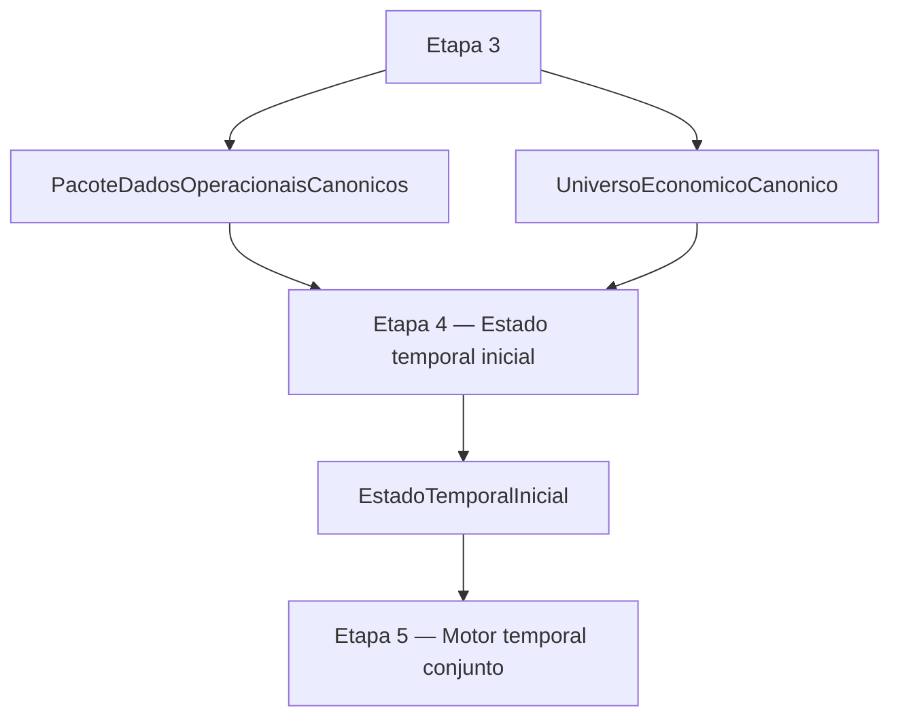

# CONTRATO INDIVIDUAL DA ETAPA 4 — ESTADO TEMPORAL INICIAL

## 1. Status

Este documento é o contrato individual canônico da **Etapa 4 — Estado temporal inicial**.

Ele é subordinado ao contrato operacional mestre e ao modelo matemático-estatístico-financeiro oficial.

## 2. Função da etapa

A Etapa 4 prepara o estado temporal inicial auditável para a Etapa 5.

Ela recebe os dados operacionais canônicos da Etapa 3 e constrói a fonte formal de transição para o motor temporal conjunto.

A Etapa 4 não é motor decisório, não é camada de saída, não é renderização e não é ponte de compatibilidade entre arquiteturas.

## 3. Entradas formais da etapa

A Etapa 4 recebe, no mínimo:

- `PacoteDadosOperacionaisCanonicos`;
- `UniversoEconomicoCanonico`;
- `inventario_canonico_completo`;
- pagamentos canônicos;
- recebidos canônicos;
- switching canônico de eventos já declarados ou materializados;
- cache CDI/BCB resolvido;
- calendário financeiro;
- parâmetros fiscais, operacionais e temporais vigentes.

## 4. Saída formal da etapa

A saída formal da Etapa 4 é:

`EstadoTemporalInicial`

## 5. Conteúdo mínimo da saída

O `EstadoTemporalInicial` deve consolidar, no mínimo:

- `pagamentos_temporais`;
- `recebidos_temporais`;
- `fontes_temporais`;
- `inventario_temporal`;
- `switching_temporal_realizado`;
- restrições temporais;
- elegibilidades temporais preliminares;
- auditoria temporal.

## 6. Relação com a Etapa 5

A Etapa 5 deve consumir `EstadoTemporalInicial` como entrada formal.

A Etapa 5 não deve reconstruir estado temporal a partir de console, XLSX, saída observável, relatórios, logs, diagnósticos ou artefatos históricos.

## 7. O que a Etapa 4 pode fazer

A Etapa 4 pode:

- receber os dados operacionais canônicos da Etapa 3;
- consumir o inventário canônico completo;
- construir o estado temporal inicial;
- consolidar estado temporal auditável antes do motor;
- normalizar lotes ativos, vencidos, exauridos, futuros e disponíveis;
- materializar recebidos já disponíveis;
- manter recebidos futuros como indisponíveis até a data correta;
- manter pagamentos vencidos e futuros como obrigações temporais;
- registrar switchings já declarados ou materializados como eventos de estado quando aplicável;
- preparar elegibilidades temporais;
- preparar restrições de liquidez, carência, vencimento e disponibilidade;
- preparar o estado para a Etapa 5.

## 8. O que a Etapa 4 não pode fazer

A Etapa 4 não pode:

- decidir pagamento;
- decidir switching candidato;
- promover switching;
- executar pacote do dia;
- gerar ledger canônico do pacote escolhido;
- gerar saída canônica;
- corrigir saída;
- renderizar console;
- gerar XLSX;
- reconstruir estado temporal a partir de console, XLSX, saída observável, relatórios, logs, diagnósticos ou artefatos históricos;
- usar artefatos históricos, adaptadores, wrappers ou rotas alternativas como fonte normativa de estado;
- iniciar funcionalmente a Etapa 5.

## 9. Fluxograma

