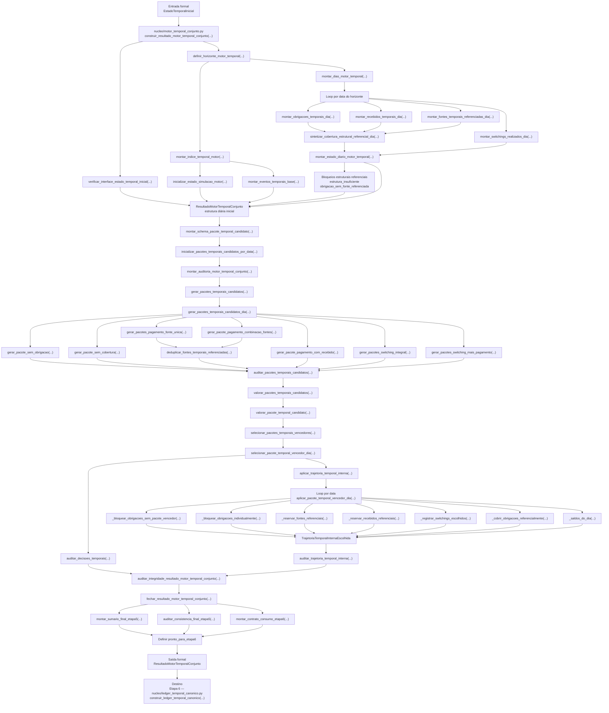

# Contrato Individual — Etapa 5 — Motor Temporal Conjunto

## 1. Identificação documental

- **Etapa:** 5
- **Nome:** Motor Temporal Conjunto
- **Entrada formal exclusiva:** `EstadoTemporalInicial`
- **Saída formal exclusiva:** `ResultadoMotorTemporalConjunto`
- **Módulo funcional:** `nucleo/motor_temporal_conjunto.py`
- **Função pública implementada:** `construir_resultado_motor_temporal_conjunto(...)`

## 2. Status normativo

Este contrato consolida o corpo principal da Etapa 5 e incorpora o fechamento funcional da etapa. Notas históricas anteriores permanecem apenas como referência documental e não prevalecem sobre este texto normativo.

## 3. Posição na cadeia macro

```text
Etapa 4 -> EstadoTemporalInicial -> Etapa 5 -> ResultadoMotorTemporalConjunto -> Etapa 6
```

## 4. Função da etapa

A Etapa 5 executa o motor temporal conjunto sobre o `EstadoTemporalInicial`, gerando uma trajetória temporal referencial com pacotes candidatos, valoração, seleção por data, obrigações cobertas e bloqueadas, fontes/reservas referenciais, switchings escolhidos, auditoria final e prontidão para a Etapa 6.

A Etapa 5 é a etapa responsável por decidir, no nível referencial interno, os pacotes vencedores e a trajetória temporal conjunta. Etapas posteriores não devem reotimizar nem revalorar essas decisões.

## 5. Entrada formal obrigatória e exclusiva

A entrada formal exclusiva da Etapa 5 é:

```text
EstadoTemporalInicial
```

## 6. Componentes consumíveis da entrada

A Etapa 5 pode consumir apenas componentes do `EstadoTemporalInicial`, incluindo:

- inventário temporal;
- pagamentos temporais;
- recebidos temporais;
- fontes temporais;
- switching temporal realizado;
- restrições temporais;
- elegibilidades preliminares;
- auditoria temporal;
- metadados formais preservados no estado.

## 7. Saída formal obrigatória

A saída formal obrigatória da Etapa 5 é:

```text
ResultadoMotorTemporalConjunto
```

## 8. Componentes mínimos da saída

`ResultadoMotorTemporalConjunto` deve conter, no mínimo:

- data de referência;
- horizonte temporal;
- estrutura diária referencial;
- pacotes candidatos conjuntos;
- pacotes valorados;
- pacote vencedor por data;
- trajetória temporal interna;
- eventos internos referenciais;
- obrigações cobertas temporalmente;
- obrigações bloqueadas temporalmente;
- fontes e reservas referenciais;
- switchings escolhidos temporalmente;
- auditoria final;
- `pronto_para_etapa6`.

## 9. Processo interno da etapa

A Etapa 5 deve executar uma orquestração de motor temporal conjunto em `construir_resultado_motor_temporal_conjunto(...)`. Essa orquestração combina blocos sequenciais, loops por data, ramos alternativos de geração de pacotes, valoração, seleção, aplicação stateful da trajetória, auditorias em múltiplas camadas e fechamento funcional.

A ordem documental abaixo descreve a cadeia principal da função pública, mas não deve ser lida como sequência linear simples de todos os subblocos. Dentro da montagem diária, da geração de pacotes e da aplicação da trajetória existem ramos paralelos, condicionais e agregações explicitados no fluxograma da seção 17.

A Etapa 5 deve:

1. verificar a interface contratual do `EstadoTemporalInicial`, usando `verificar_interface_estado_temporal_inicial(...)`;
2. definir horizonte temporal, usando `definir_horizonte_motor_temporal(...)`;
3. montar índice temporal, usando `montar_indice_temporal_motor(...)`;
4. inicializar estado de simulação, eventos base e dias do motor;
5. para cada data do horizonte, montar obrigações, recebidos, fontes referenciadas e switchings realizados do dia;
6. sintetizar a cobertura estrutural referencial do dia;
7. montar o estado diário do motor temporal;
8. montar schema de pacote temporal candidato;
9. gerar pacotes candidatos por ramos alternativos, incluindo sem obrigação, sem cobertura, pagamento com fonte única, combinação de fontes, pagamento com recebido, switching integral e switching mais pagamento;
10. auditar os pacotes candidatos contra o schema;
11. valorar pacotes candidatos;
12. selecionar pacote vencedor por data e registrar descartes;
13. auditar decisões temporais;
14. aplicar a trajetória temporal interna de forma stateful, preservando saldos e reservas acumuladas por fonte ao longo das datas;
15. aplicar cada pacote vencedor por data, registrando eventos internos, reservas referenciais, obrigações cobertas, obrigações bloqueadas e switchings escolhidos conforme o tipo de pacote;
16. auditar trajetória temporal interna;
17. auditar integridade do resultado motor temporal conjunto;
18. executar fechamento funcional com `fechar_resultado_motor_temporal_conjunto(...)`;
19. montar o contrato de consumo exclusivo da Etapa 6;
20. definir `pronto_para_etapa6`;
21. emitir `ResultadoMotorTemporalConjunto`.

## 10. O que a etapa pode fazer

A Etapa 5 pode:

- simular e valorar pacotes referenciais;
- escolher pacote vencedor por data dentro do motor temporal;
- materializar trajetória temporal interna;
- registrar decisões referenciais;
- preservar bloqueios e incompletudes;
- produzir auditoria final da trajetória.

## 11. O que a etapa não pode fazer

A Etapa 5 não pode:

- consultar planilha diretamente;
- renderizar console;
- exportar XLSX;
- produzir saída canônica final;
- executar pagamento real;
- executar switching real;
- alterar artefatos da Etapa 4;
- consultar Etapas 1–3 fora do que já estiver materializado no `EstadoTemporalInicial`;
- produzir o ledger da Etapa 6;
- produzir gates de validação da Etapa 7.

## 12. Relação com a etapa anterior

A Etapa 5 consome exclusivamente `EstadoTemporalInicial` produzido pela Etapa 4. Qualquer informação necessária deve estar materializada nesse artefato.

## 13. Relação com a etapa posterior

A Etapa 5 entrega `ResultadoMotorTemporalConjunto` para a Etapa 6 — Ledger Temporal Canônico. A Etapa 6 deve consumir o resultado sem reotimizar ou revalorar decisões.

## 14. Schema/funções públicas previstas ou implementadas

Módulo funcional:

```text
nucleo/motor_temporal_conjunto.py
```

Função pública implementada:

```python
construir_resultado_motor_temporal_conjunto(
    estado_temporal_inicial: EstadoTemporalInicial,
) -> ResultadoMotorTemporalConjunto
```

Artefato formal:

```python
ResultadoMotorTemporalConjunto
```

## 15. Auditoria esperada

A auditoria da Etapa 5 deve registrar:

- validade da interface de entrada;
- horizonte temporal utilizado;
- consistência da estrutura diária;
- pacotes candidatos e vencedores;
- obrigações cobertas e bloqueadas;
- fontes e reservas referenciais;
- switchings escolhidos;
- bloqueios finais;
- `pronto_para_etapa6`.

## 16. Critérios de aceite

A Etapa 5 é aceita quando:

1. consome somente `EstadoTemporalInicial`;
2. monta estrutura diária;
3. gera pacotes candidatos;
4. valora pacotes;
5. escolhe pacote vencedor por data;
6. materializa trajetória temporal interna;
7. registra obrigações cobertas e bloqueadas;
8. registra fontes, reservas e switchings referenciais;
9. produz auditoria final;
10. define `pronto_para_etapa6`;
11. emite `ResultadoMotorTemporalConjunto`.

## 17. Fluxograma operacional-explicativo completo



## 18. Condição de parada

A Etapa 5 deve parar com bloqueio auditado quando o `EstadoTemporalInicial` não permitir montar a estrutura temporal mínima ou quando a trajetória não puder ser fechada de forma funcional.

## 19. Adendos funcionais consolidados

O fechamento funcional da Etapa 5 está incorporado ao corpo principal deste contrato. Histórico anterior deve ser lido apenas como nota documental, sem contrariar a entrada exclusiva `EstadoTemporalInicial` e a saída exclusiva `ResultadoMotorTemporalConjunto`.
