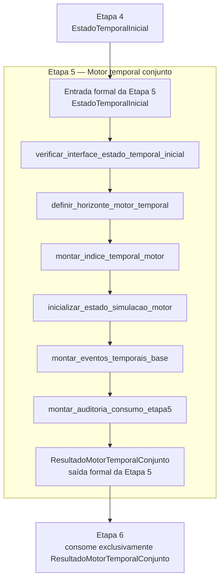
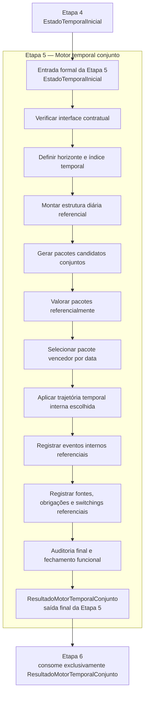

# CONTRATO INDIVIDUAL DA ETAPA 5 — MOTOR TEMPORAL CONJUNTO

> Cópia canônica derivada do contrato individual já existente:
>
> `relatorios/principais/CONTRATO_ETAPA5_MOTOR_TEMPORAL_CONJUNTO.md`
>
> O arquivo original da raiz de `relatorios/principais/` foi removido na ME-CONTRATOS-01 para evitar duplicidade normativa. Esta cópia organiza o contrato individual na pasta canônica `relatorios/principais/contratos_individuais/`.

## 1. Identificação documental

- MICROETAPA DE CRIAÇÃO DO CONTRATO: ME-ETAPA5-00
- MICROETAPA DE ORGANIZAÇÃO: ME-CONTRATOS-01
- MICROETAPA DE REVISÃO CONTRATUAL: ME-ETAPA5-01
- TIPO: DOCUMENTAL / CONTRATUAL
- CLASSE: CONTRATO_INDIVIDUAL_ETAPA5_MOTOR_TEMPORAL_CONJUNTO
- ALTERA CÓDIGO: NÃO
- ALTERA MOTOR: NÃO
- ALTERA LEDGER: NÃO
- ALTERA SAÍDA CANÔNICA: NÃO
- ALTERA DADOS: NÃO
- ALTERA CONSOLE: NÃO
- ALTERA XLSX: NÃO

## 2. Status normativo

Este documento é o contrato individual canônico da **Etapa 5 — Motor temporal conjunto**.

Ele é subordinado ao contrato operacional mestre e ao modelo matemático-estatístico-financeiro oficial.

A Etapa 5 é a camada de transição formal entre:

```text
Etapa 4 -> EstadoTemporalInicial -> Etapa 5 -> ResultadoMotorTemporalConjunto -> Etapa 6
```

## 3. Função da etapa

A Etapa 5 consome a saída formal da Etapa 4 e inicia a camada do motor temporal conjunto.

A Etapa 5 não refaz a Etapa 4. Sua função inicial é montar a estrutura interna do motor a partir do `EstadoTemporalInicial`, preservando a separação entre estado inicial, motor, ledger, saída canônica, console e XLSX.

Na primeira implementação funcional, a Etapa 5 deve produzir a saída canônica da própria etapa com preenchimento estrutural inicial, sem criar artefato provisório, compatível ou transitório.

## 4. Entrada formal da etapa

A entrada formal obrigatória e exclusiva da Etapa 5 é:

`EstadoTemporalInicial`

A Etapa 5 deve consumir esse artefato diretamente.

A Etapa 5 não pode reconstruir `EstadoTemporalInicial` a partir de:

- dados das Etapas 1–3;
- planilha original;
- console;
- XLSX;
- saída observável;
- logs;
- relatórios históricos;
- scripts diagnósticos;
- CSVs auxiliares;
- artefatos derivados de renderização.

## 5. O que já pertence à Etapa 4

A Etapa 5 não deve refazer, recanonizar ou reclassificar os componentes que já pertencem à Etapa 4, incluindo:

- `pagamentos_temporais`;
- `recebidos_temporais`;
- `fontes_temporais`;
- `inventario_temporal`;
- `switching_temporal_realizado`;
- restrições temporais;
- elegibilidades temporais preliminares;
- auditoria temporal;
- status temporal dos lotes;
- fontes disponíveis ou indisponíveis já resolvidas pela Etapa 4.

A Etapa 5 pode apenas consumir, referenciar e indexar esses componentes para iniciar o motor temporal conjunto.

## 6. Saída formal da etapa

A saída formal obrigatória da Etapa 5 é:

`ResultadoMotorTemporalConjunto`

Esse artefato deve nascer com nome canônico desde a primeira implementação funcional da etapa e ser enriquecido progressivamente conforme novas microetapas funcionais forem contratadas.

É proibido criar artefato transitório de saída para a Etapa 5, incluindo, mas não limitado a:

- `ResultadoMotorTemporalMinimo`;
- wrappers compatíveis;
- resultados shadow;
- resultados paralelos;
- aliases temporários de saída.

## 7. Contrato de interface com a Etapa 6

A Etapa 6 deve consumir exclusivamente:

`ResultadoMotorTemporalConjunto`

A Etapa 6 não pode consumir diretamente:

- `EstadoTemporalInicial`;
- dados das Etapas 1–4;
- planilha original;
- console;
- XLSX;
- saída observável;
- logs;
- relatórios históricos;
- scripts diagnósticos;
- qualquer artefato interno da Etapa 5 que não seja `ResultadoMotorTemporalConjunto`.

A Etapa 6 deve depender exclusivamente da saída formal da Etapa 5, preservando a mesma lógica sequencial das etapas anteriores: cada etapa consome a saída formal da etapa imediatamente anterior.

## 8. Escopo inicial da Etapa 5

Na primeira implementação funcional, a Etapa 5 pode preencher apenas a porção inicial estrutural de `ResultadoMotorTemporalConjunto`.

Essa porção inicial pode conter:

- data de referência;
- horizonte do motor;
- identificador ou evidência de origem do `EstadoTemporalInicial`;
- janela temporal do motor;
- índice temporal interno do motor;
- estado inicial de simulação do motor;
- eventos temporais base referenciados a partir do estado recebido;
- status de interface da Etapa 5;
- auditoria de consumo do `EstadoTemporalInicial`.

Esses campos representam preparação do motor, não decisão econômica completa.

## 9. O que a Etapa 5 pode fazer inicialmente

A Etapa 5 pode:

- verificar apenas a interface contratual mínima do `EstadoTemporalInicial`;
- definir horizonte ou janela do motor;
- montar índice temporal interno para iteração do motor;
- inicializar o estado interno de simulação a partir do estado recebido;
- referenciar eventos temporais já presentes no `EstadoTemporalInicial`;
- montar auditoria de consumo da entrada formal;
- retornar `ResultadoMotorTemporalConjunto`.

A verificação permitida é apenas de interface contratual. Ela não autoriza revalidação profunda, correção, reconstrução ou nova canonização dos componentes produzidos pela Etapa 4.

## 10. O que a Etapa 5 não pode fazer inicialmente

A Etapa 5 não pode:

- reconstruir `EstadoTemporalInicial`;
- recanonizar pagamentos;
- recanonizar recebidos;
- recanonizar fontes;
- recanonizar inventário;
- reinterpretar switchings realizados;
- recalcular disponibilidade preliminar já resolvida;
- escolher fonte ótima final;
- selecionar lote de pagamento;
- executar pagamento;
- liquidar conta;
- escolher pacote vencedor;
- decidir switching candidato;
- promover switching candidato;
- executar switching novo;
- materializar novo lote pós-switching;
- criar ledger oficial;
- criar saída canônica final;
- alterar console;
- alterar XLSX;
- alterar dados;
- alterar planilha operacional;
- alterar ranking da Carteira;
- alterar regras econômicas;
- usar saída observável como fonte de estado;
- usar log histórico como norma viva;
- usar diagnóstico como motor auxiliar;
- criar fallback legado;
- criar wrapper transitório;
- criar rota paralela;
- criar sentinela;
- criar script diagnóstico;
- reintroduzir `ContextoBaseline`;
- reintroduzir `ContextoSaidaCanonicaCompat`.

## 11. Funções previstas

As funções previstas para a primeira implementação funcional devem ser restritas ao início do motor:

```python
def verificar_interface_estado_temporal_inicial(
    estado: EstadoTemporalInicial,
) -> StatusInterfaceEtapa5:
    ...


def definir_horizonte_motor_temporal(
    estado: EstadoTemporalInicial,
    parametros: ParametrosEtapa5,
) -> HorizonteMotorTemporal:
    ...


def montar_indice_temporal_motor(
    estado: EstadoTemporalInicial,
    horizonte: HorizonteMotorTemporal,
) -> IndiceTemporalMotor:
    ...


def inicializar_estado_simulacao_motor(
    estado: EstadoTemporalInicial,
    indice: IndiceTemporalMotor,
) -> EstadoSimulacaoMotorTemporal:
    ...


def montar_eventos_temporais_base(
    estado: EstadoTemporalInicial,
    indice: IndiceTemporalMotor,
) -> EventosTemporaisBase:
    ...


def montar_auditoria_consumo_etapa5(
    estado: EstadoTemporalInicial,
    status_interface: StatusInterfaceEtapa5,
) -> AuditoriaConsumoEtapa5:
    ...


def construir_resultado_motor_temporal_conjunto(
    estado: EstadoTemporalInicial,
    parametros: ParametrosEtapa5,
) -> ResultadoMotorTemporalConjunto:
    ...
```

Essas funções não devem refazer a Etapa 4. Elas apenas inicializam a camada de motor a partir da saída formal da Etapa 4.

## 12. Entradas e saídas das funções previstas

| Função | Entrada | Saída | Motivo | Limite |
|---|---|---|---|---|
| `verificar_interface_estado_temporal_inicial` | `EstadoTemporalInicial` | `StatusInterfaceEtapa5` | confirmar que a Etapa 5 recebeu a saída formal da Etapa 4 | não revalidar semanticamente pagamentos, fontes, inventário ou switchings |
| `definir_horizonte_motor_temporal` | `EstadoTemporalInicial`, `ParametrosEtapa5` | `HorizonteMotorTemporal` | definir janela operacional do motor | não criar eventos ou obrigações novas |
| `montar_indice_temporal_motor` | `EstadoTemporalInicial`, `HorizonteMotorTemporal` | `IndiceTemporalMotor` | criar índice interno de navegação temporal | não recanonizar dados da Etapa 4 |
| `inicializar_estado_simulacao_motor` | `EstadoTemporalInicial`, `IndiceTemporalMotor` | `EstadoSimulacaoMotorTemporal` | criar estado inicial interno do motor | não executar pagamento, switching ou consumo de fonte |
| `montar_eventos_temporais_base` | `EstadoTemporalInicial`, `IndiceTemporalMotor` | `EventosTemporaisBase` | referenciar eventos já presentes no estado | não gerar, ranquear ou promover eventos novos |
| `montar_auditoria_consumo_etapa5` | `EstadoTemporalInicial`, `StatusInterfaceEtapa5` | `AuditoriaConsumoEtapa5` | registrar consumo direto da saída formal da Etapa 4 | não usar logs históricos como fonte normativa |
| `construir_resultado_motor_temporal_conjunto` | `EstadoTemporalInicial`, `ParametrosEtapa5` | `ResultadoMotorTemporalConjunto` | orquestrar a primeira abertura funcional da Etapa 5 | não chamar ledger, console, XLSX, saída canônica ou diagnóstico auxiliar |

## 13. Fluxograma



## 14. Condição de parada

Qualquer necessidade de escolher fonte ótima, executar pagamento, promover switching, criar ledger oficial, gerar saída canônica final, alterar console, alterar XLSX, usar diagnóstico auxiliar como motor ou reconstruir estado a partir de renderização deve interromper a microetapa funcional em curso e exigir novo contrato específico antes da implementação.

## 16. Adendo final pós-MACRO-ETAPA5-D

Este adendo atualiza a leitura normativa do contrato individual da Etapa 5 após o fechamento funcional da MACRO-ETAPA5-D.

Sempre que houver divergência entre este adendo e linguagem anterior de “escopo inicial”, “primeira implementação funcional” ou “não escolher pacote vencedor”, prevalece este adendo final. A linguagem anterior permanece apenas como histórico do contrato original da abertura da Etapa 5.

### 16.1. Estado funcional final da Etapa 5

Após a MACRO-ETAPA5-D, a Etapa 5 produz `ResultadoMotorTemporalConjunto` como artefato final da etapa.

Esse artefato é a única saída formal da Etapa 5 e a única entrada permitida para a Etapa 6.

A Etapa 5 continua consumindo exclusivamente `EstadoTemporalInicial` como entrada formal. Ela não refaz a Etapa 4, não recanoniza dados e não usa console, XLSX, saída observável, logs ou diagnósticos como fonte normativa de estado.

### 16.2. Componentes finais de `ResultadoMotorTemporalConjunto`

O artefato final da Etapa 5 pode conter:

- estrutura diária referencial;
- schema único de `PacoteTemporalCandidato`;
- pacotes candidatos conjuntos;
- valoração referencial dos pacotes;
- seleção interna do pacote vencedor por data;
- trajetória temporal interna escolhida;
- eventos internos referenciais;
- fontes reservadas temporalmente;
- obrigações cobertas temporalmente;
- obrigações bloqueadas temporalmente;
- switchings escolhidos temporalmente;
- auditoria da trajetória;
- sumário final da Etapa 5;
- auditoria final da Etapa 5;
- fechamento funcional da Etapa 5;
- contrato de consumo exclusivo pela Etapa 6;
- indicador `pronto_para_etapa6`;
- metadados finais da Etapa 5.

### 16.3. Contrato de consumo pela Etapa 6

A Etapa 6 deve consumir exclusivamente `ResultadoMotorTemporalConjunto`.

A Etapa 6 não pode consumir diretamente:

- `EstadoTemporalInicial`;
- dados das Etapas 1–4;
- planilha original;
- console;
- XLSX;
- saída observável;
- logs;
- relatórios históricos;
- scripts diagnósticos;
- qualquer artefato interno da Etapa 5 que não seja `ResultadoMotorTemporalConjunto`.

Dentro de `ResultadoMotorTemporalConjunto`, a Etapa 6 pode consumir:

- `data_referencia`;
- `horizonte_motor`;
- `decisoes_temporais_por_data`;
- `pacote_vencedor_por_data`;
- `trajetoria_temporal_interna_escolhida`;
- `eventos_trajetoria_temporal`;
- `estado_temporal_interno_por_data`;
- `fontes_reservadas_temporalmente`;
- `obrigacoes_cobertas_temporalmente`;
- `obrigacoes_bloqueadas_temporalmente`;
- `switchings_escolhidos_temporalmente`;
- `auditoria_final_etapa5`;
- `fechamento_funcional_etapa5`;
- `contrato_consumo_etapa6`;
- `pronto_para_etapa6`;
- `metadados`.

`pronto_para_etapa6 = False` não invalida a existência de `ResultadoMotorTemporalConjunto`. Esse valor indica que a Etapa 6 deve respeitar bloqueios, pendências e estados não executáveis ao construir o ledger.

### 16.4. Limites preservados

Mesmo no estado final pós-MACRO-ETAPA5-D, a Etapa 5 não pode:

- executar pagamento oficial;
- liquidar obrigação oficialmente;
- consumir saldo oficial como execução;
- executar switching novo oficialmente;
- materializar novo lote pós-switching oficial;
- criar ledger oficial;
- criar saída canônica final;
- alterar console;
- alterar XLSX;
- alterar dados;
- alterar planilha operacional;
- alterar ranking da Carteira;
- alterar regras econômicas;
- usar saída observável como fonte de estado;
- usar log histórico como norma viva;
- usar diagnóstico como motor auxiliar;
- criar fallback legado;
- criar wrapper transitório;
- criar rota paralela;
- criar sentinela;
- criar script diagnóstico;
- reintroduzir `ContextoBaseline`;
- reintroduzir `ContextoSaidaCanonicaCompat`.

### 16.5. Auditoria final da Etapa 5

A auditoria final da Etapa 5 deve impedir falso `pronto_para_etapa6=True`.

Devem ser promovidos a bloqueios finais, quando presentes:

- `auditoria_motor_temporal_conjunto.ok == False`;
- `bloqueios_estruturais`;
- `auditoria_trajetoria_temporal_interna.ok == False`;
- `obrigacoes_bloqueadas_temporalmente`;
- obrigação aberta sem pacote vencedor;
- decisão sem pacote vencedor materializado;
- evento interno com indicação de ledger;
- evento interno com indicação de execução oficial.

Eventos internos da Etapa 5 são referenciais e não equivalem a ledger oficial.

### 16.6. Fluxo final da Etapa 5



### 16.7. Decisão de encerramento funcional

A Etapa 5 está funcionalmente encerrada quando:

- `EstadoTemporalInicial` permanece como entrada exclusiva;
- `ResultadoMotorTemporalConjunto` é produzido como saída final;
- `ResultadoMotorTemporalConjunto` contém decisões, trajetória, bloqueios, auditorias e fechamento funcional;
- a Etapa 6 está contratualmente obrigada a consumir exclusivamente `ResultadoMotorTemporalConjunto`;
- não há ledger oficial na Etapa 5;
- não há execução oficial de pagamento ou switching;
- não há alteração de console, XLSX, saída canônica ou dados;
- a auditoria final impede falso `pronto_para_etapa6=True`.

