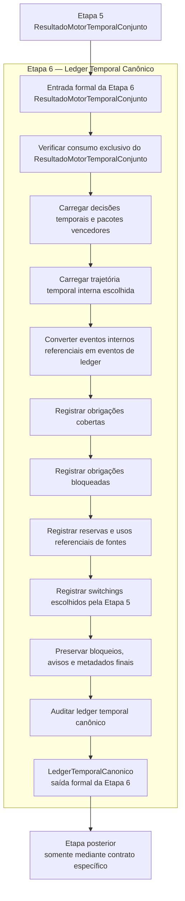

# CONTRATO INDIVIDUAL DA ETAPA 6 — LEDGER TEMPORAL CANÔNICO

## 1. Identificação documental

- MACROETAPA DE CRIAÇÃO DO CONTRATO: MACRO-ETAPA6-0
- TIPO: DOCUMENTAL / CONTRATUAL
- CLASSE: CONTRATO_INDIVIDUAL_ETAPA6_LEDGER_TEMPORAL_CANONICO
- BASELINE DE ENTRADA: `5a8033c`
- ETAPA ANTERIOR: Etapa 5 — Motor temporal conjunto
- SAÍDA FORMAL DA ETAPA ANTERIOR: `ResultadoMotorTemporalConjunto`
- ETAPA CONTRATADA: Etapa 6 — Ledger Temporal Canônico
- SAÍDA FORMAL DA ETAPA CONTRATADA: `LedgerTemporalCanonico`
- ALTERA CÓDIGO: NÃO
- ALTERA MOTOR: NÃO
- ALTERA LEDGER FUNCIONAL: NÃO
- ALTERA SAÍDA CANÔNICA: NÃO
- ALTERA DADOS: NÃO
- ALTERA CONSOLE: NÃO
- ALTERA XLSX: NÃO
- CRIA SCRIPT DIAGNÓSTICO: NÃO

## 2. Status normativo

Este documento é o contrato individual canônico da **Etapa 6 — Ledger Temporal Canônico**.

Ele é subordinado ao contrato operacional mestre, ao modelo matemático-estatístico-financeiro oficial, aos contratos individuais das Etapas 1–5 e ao contrato individual final da Etapa 5 pós-MACRO-ETAPA5-D.

A Etapa 6 é a camada de transição formal entre:

```text
Etapa 5 -> ResultadoMotorTemporalConjunto -> Etapa 6 -> LedgerTemporalCanonico -> Etapa posterior
```

Logs, relatórios históricos, console, XLSX, scripts diagnósticos e saídas observáveis não são fonte normativa de estado para esta etapa.

## 3. Função da etapa

A Etapa 6 consome exclusivamente `ResultadoMotorTemporalConjunto` e constrói `LedgerTemporalCanonico` como materialização contábil-canônica, temporal, sequencial e auditável da trajetória decidida pela Etapa 5.

A Etapa 6 não escolhe novamente pacotes vencedores, não reotimiza, não revalora pacotes, não decide novas fontes, não executa switching novo e não reconstrói estados anteriores.

Sua função é transformar decisões, trajetória temporal interna, obrigações cobertas, obrigações bloqueadas, reservas, usos referenciais de fontes, switchings escolhidos e auditorias finais já contidos em `ResultadoMotorTemporalConjunto` em um ledger canônico consumível por etapas posteriores.

## 4. Entrada formal da etapa

A entrada formal obrigatória e exclusiva da Etapa 6 é:

`ResultadoMotorTemporalConjunto`

A Etapa 6 deve consumir esse artefato diretamente.

A Etapa 6 não pode consumir diretamente:

- `EstadoTemporalInicial`;
- dados das Etapas 1–4;
- planilha original;
- console;
- XLSX;
- saída observável;
- logs;
- relatórios históricos;
- scripts diagnósticos;
- CSVs auxiliares;
- cache operacional;
- artefatos derivados de renderização;
- qualquer estrutura interna da Etapa 5 que não esteja formalmente contida em `ResultadoMotorTemporalConjunto`.

## 5. Saída formal da etapa

A saída formal obrigatória e exclusiva da Etapa 6 é:

`LedgerTemporalCanonico`

Esse artefato deve nascer com nome canônico desde a primeira implementação funcional da etapa.

É proibido criar artefato transitório de saída para a Etapa 6, incluindo, mas não limitado a:

- ledger provisório;
- ledger shadow;
- ledger compatível;
- ledger paralelo;
- wrapper transitório;
- alias temporário de saída;
- fallback legado de ledger;
- ponte compatível com console, XLSX ou diagnóstico.

## 6. Definição conceitual de `LedgerTemporalCanonico`

`LedgerTemporalCanonico` é o artefato canônico interno da Etapa 6 para registrar a trajetória temporal decidida pela Etapa 5.

Ele deve representar, de forma auditável e sequencial:

1. obrigações cobertas pela trajetória da Etapa 5;
2. obrigações bloqueadas pela trajetória da Etapa 5;
3. fontes utilizadas referencialmente;
4. fontes reservadas referencialmente;
5. switchings escolhidos internamente pela Etapa 5;
6. datas e sequência temporal dos eventos;
7. motivos de bloqueio e pendências;
8. rastreabilidade para decisão temporal;
9. rastreabilidade para pacote vencedor;
10. rastreabilidade para eventos internos da Etapa 5;
11. auditoria de consistência;
12. metadados de origem indicando `ResultadoMotorTemporalConjunto`.

`LedgerTemporalCanonico` não representa execução bancária real.

`LedgerTemporalCanonico` não altera dados de origem.

`LedgerTemporalCanonico` não materializa pagamentos em instituições financeiras.

`LedgerTemporalCanonico` não substitui console, XLSX ou saída observável final.

## 7. Blocos de `ResultadoMotorTemporalConjunto` consumíveis pela Etapa 6

A Etapa 6 pode consumir, quando existentes no artefato final da Etapa 5, os seguintes blocos de `ResultadoMotorTemporalConjunto`:

- `data_referencia`;
- `horizonte_motor`;
- `decisoes_temporais_por_data`;
- `pacote_vencedor_por_data`;
- `trajetoria_temporal_interna_escolhida`;
- `eventos_trajetoria_temporal`;
- `estado_temporal_interno_por_data`;
- `fontes_reservadas_temporalmente`;
- `obrigacoes_cobertas_temporalmente`;
- `obrigacoes_bloqueadas_temporalmente`;
- `switchings_escolhidos_temporalmente`;
- `auditoria_trajetoria_temporal_interna`;
- `auditoria_final_etapa5`;
- `fechamento_funcional_etapa5`;
- `contrato_consumo_etapa6`;
- `pronto_para_etapa6`;
- `bloqueios_finais`;
- `avisos_finais`;
- `metadados`.

A lista acima não autoriza a Etapa 6 a buscar esses mesmos componentes fora de `ResultadoMotorTemporalConjunto`.

## 8. O que o ledger deve representar

A Etapa 6 deve materializar contabilmente o que a Etapa 5 já decidiu internamente.

O ledger deve conter, no mínimo:

- `data_referencia`;
- `horizonte`;
- eventos temporais de ledger;
- lançamentos por data;
- obrigações cobertas;
- obrigações bloqueadas;
- fontes utilizadas;
- fontes reservadas;
- switchings escolhidos;
- saldos referenciais por data, quando disponíveis em `ResultadoMotorTemporalConjunto`;
- bloqueios;
- avisos;
- auditoria;
- metadados.

A granularidade exata dos lançamentos deve ser definida na macroetapa funcional de schema, mas deve preservar a rastreabilidade temporal, econômica e contratual da decisão da Etapa 5.

## 9. O que a Etapa 6 não pode fazer

A Etapa 6 não pode:

- decidir qual fonte usar;
- selecionar novo pacote temporal;
- recalcular ranking da Carteira;
- recalcular valor econômico de pacotes;
- revalorar alternativas de pagamento;
- reotimizar trajetória temporal;
- escolher novo pacote vencedor;
- executar switching novo;
- executar pagamento bancário real;
- liquidar obrigação oficialmente;
- alterar saldos reais em dados;
- alterar planilha;
- alterar console;
- alterar XLSX;
- gerar saída canônica final;
- usar diagnóstico como motor;
- usar logs como fonte de estado;
- usar saída observável como fonte de estado;
- reconstruir `EstadoTemporalInicial`;
- recanonizar dados das Etapas 1–4;
- criar fallback legado;
- criar rota paralela;
- criar wrapper transitório;
- criar sentinela;
- criar script diagnóstico;
- reintroduzir `ContextoBaseline`;
- reintroduzir `ContextoSaidaCanonicaCompat`.

## 10. Tratamento de `pronto_para_etapa6`

### 10.1. Caso `pronto_para_etapa6 = True`

Quando `ResultadoMotorTemporalConjunto.pronto_para_etapa6` for verdadeiro, a Etapa 6 pode construir `LedgerTemporalCanonico` com base em trajetória internamente consistente.

Mesmo nesse caso, a Etapa 6 deve preservar:

- rastreabilidade para a saída da Etapa 5;
- rastreabilidade para cada pacote vencedor por data;
- rastreabilidade para cada obrigação coberta;
- rastreabilidade para cada fonte utilizada ou reservada;
- rastreabilidade para cada switching escolhido;
- auditoria interna do ledger.

### 10.2. Caso `pronto_para_etapa6 = False`

Quando `ResultadoMotorTemporalConjunto.pronto_para_etapa6` for falso, a Etapa 6 ainda pode construir `LedgerTemporalCanonico`, mas deve preservar explicitamente:

- bloqueios finais;
- pendências;
- obrigações não executáveis;
- estados não liquidáveis;
- motivos de bloqueio vindos da Etapa 5;
- avisos e auditorias finais associados ao bloqueio.

Nesse caso, o ledger deve representar a incompletude operacional de modo explícito.

A Etapa 6 não pode fingir completude quando `ResultadoMotorTemporalConjunto` contém bloqueios.

## 11. Representação de obrigações cobertas

Uma obrigação coberta no ledger deve preservar, quando disponível em `ResultadoMotorTemporalConjunto`:

- identificador da obrigação;
- data da obrigação;
- valor referencial;
- pacote vencedor associado;
- decisão temporal associada;
- fonte ou conjunto de fontes utilizadas referencialmente;
- evento interno da Etapa 5 que originou a cobertura;
- status de cobertura;
- metadados de origem.

A cobertura registrada no ledger é contabilização canônica interna, não execução bancária real.

## 12. Representação de obrigações bloqueadas

Uma obrigação bloqueada no ledger deve preservar, quando disponível em `ResultadoMotorTemporalConjunto`:

- identificador da obrigação;
- data da obrigação;
- valor referencial;
- motivo de bloqueio;
- pacote, decisão ou evento associado, quando existir;
- evidência de ausência de pacote vencedor, quando esse for o motivo;
- status de não execução;
- metadados de origem.

Toda obrigação bloqueada deve ter motivo explícito.

## 13. Representação de reservas de fontes

Uma reserva de fonte no ledger deve preservar, quando disponível em `ResultadoMotorTemporalConjunto`:

- identificador da fonte;
- data da reserva;
- valor referencial reservado;
- obrigação, pacote ou decisão associada;
- janela temporal de validade, quando existir;
- status da reserva;
- metadados de origem.

Reserva de fonte não equivale a bloqueio bancário real.

## 14. Representação de uso referencial de fontes

Um uso referencial de fonte no ledger deve preservar, quando disponível em `ResultadoMotorTemporalConjunto`:

- identificador da fonte;
- data de uso;
- valor bruto referencial;
- valor líquido referencial;
- imposto referencial, quando disponível;
- obrigação associada;
- pacote vencedor associado;
- evento interno da Etapa 5 associado;
- saldo referencial anterior e posterior, quando disponíveis no resultado da Etapa 5;
- metadados de origem.

Uso referencial de fonte não altera saldo real de dado de origem.

## 15. Representação de switchings escolhidos

Um switching escolhido no ledger deve preservar, quando disponível em `ResultadoMotorTemporalConjunto`:

- identificador do switching;
- data do switching;
- fonte ou lote de origem;
- fonte ou lote de destino;
- valor líquido migrado referencial;
- pacote vencedor associado;
- decisão temporal associada;
- evento interno da Etapa 5 associado;
- status do switching;
- metadados de origem.

A Etapa 6 registra switchings escolhidos pela Etapa 5. Ela não promove switchings novos.

## 16. Relação entre ledger, saída canônica, console e XLSX

`LedgerTemporalCanonico` é artefato interno da Etapa 6.

Ele não deve alterar, nesta etapa contratual:

- console;
- XLSX;
- saída canônica final;
- planilha operacional;
- dados de entrada;
- relatórios observáveis finais.

Etapas posteriores poderão consumir `LedgerTemporalCanonico` apenas mediante contrato específico.

Qualquer renderização do ledger em console, XLSX ou saída canônica final exige contrato próprio posterior.

## 17. Schema funcional previsto para macroetapa posterior

A macroetapa funcional posterior de schema poderá definir estruturas equivalentes a:

- `LedgerTemporalCanonico`;
- `EventoLedgerTemporal`;
- `LancamentoObrigacaoLedger`;
- `LancamentoFonteLedger`;
- `LancamentoReservaLedger`;
- `LancamentoSwitchingLedger`;
- `LancamentoBloqueioLedger`;
- `SaldoLedgerTemporal`;
- `AuditoriaLedgerTemporalCanonico`;
- `ParametrosLedgerTemporal`, se necessário.

Este contrato não cria essas estruturas. Ele apenas autoriza sua criação futura sob escopo funcional específico.

## 18. Função pública prevista para macroetapa posterior

A macroetapa funcional posterior de construção poderá implementar função pública equivalente a:

```python
def construir_ledger_temporal_canonico(
    resultado: ResultadoMotorTemporalConjunto,
    parametros: ParametrosLedgerTemporal | None = None,
) -> LedgerTemporalCanonico:
    ...
```

Essa previsão não autoriza implementação nesta macroetapa documental.

A função futura deverá consumir exclusivamente `ResultadoMotorTemporalConjunto`.

## 19. Auditoria interna esperada para a Etapa 6

A auditoria interna do ledger deverá verificar, no mínimo:

- todo evento tem data;
- todo lançamento tem tipo;
- todo pagamento coberto tem obrigação referenciada;
- toda obrigação bloqueada tem motivo;
- todo uso de fonte tem fonte referenciada;
- toda reserva tem fonte e data;
- todo switching escolhido tem origem e destino quando disponíveis;
- nenhuma entrada vem de console, XLSX ou saída observável;
- nenhuma decisão nova é criada na Etapa 6;
- nenhum evento indica execução bancária real;
- `ResultadoMotorTemporalConjunto` é a única origem;
- bloqueios finais da Etapa 5 foram preservados;
- o ledger não contém shadow, fallback legado ou rota paralela.

Essa auditoria deve ser interna ao módulo funcional ou aos testes unitários. Não deve ser criada como script diagnóstico novo.

## 20. Critérios de aceite da Etapa 6

A Etapa 6 só poderá ser considerada concluída se:

1. `LedgerTemporalCanonico` existir como artefato final da Etapa 6;
2. a entrada exclusiva for `ResultadoMotorTemporalConjunto`;
3. nenhuma função da Etapa 6 consumir `EstadoTemporalInicial` diretamente;
4. nenhuma função da Etapa 6 consumir planilha, console, XLSX, logs ou diagnósticos como fonte de estado;
5. obrigações cobertas e bloqueadas forem representadas no ledger;
6. reservas e usos referenciais de fontes forem representados no ledger;
7. switchings escolhidos pela Etapa 5 forem representados no ledger;
8. bloqueios finais da Etapa 5 forem preservados;
9. o ledger tiver auditoria final;
10. o runtime principal continuar passando;
11. não houver scripts diagnósticos novos;
12. não houver ledger paralelo, shadow ou wrapper transitório;
13. o contrato da Etapa 6 estiver coerente com o contrato mestre, com o modelo matemático-estatístico-financeiro oficial e com os contratos das Etapas 1–5.

## 21. Fluxograma da Etapa 6



## 22. Condição de parada

Qualquer necessidade de escolher fonte ótima, selecionar novo pacote vencedor, revalorar decisão, executar pagamento, promover switching novo, reconstruir `EstadoTemporalInicial`, consumir planilha original, alterar console, alterar XLSX, alterar dados, gerar saída canônica final, criar script diagnóstico, criar fallback legado, criar rota paralela ou usar saída observável como fonte de estado deve interromper a macroetapa funcional em curso e exigir novo contrato específico antes da implementação.
