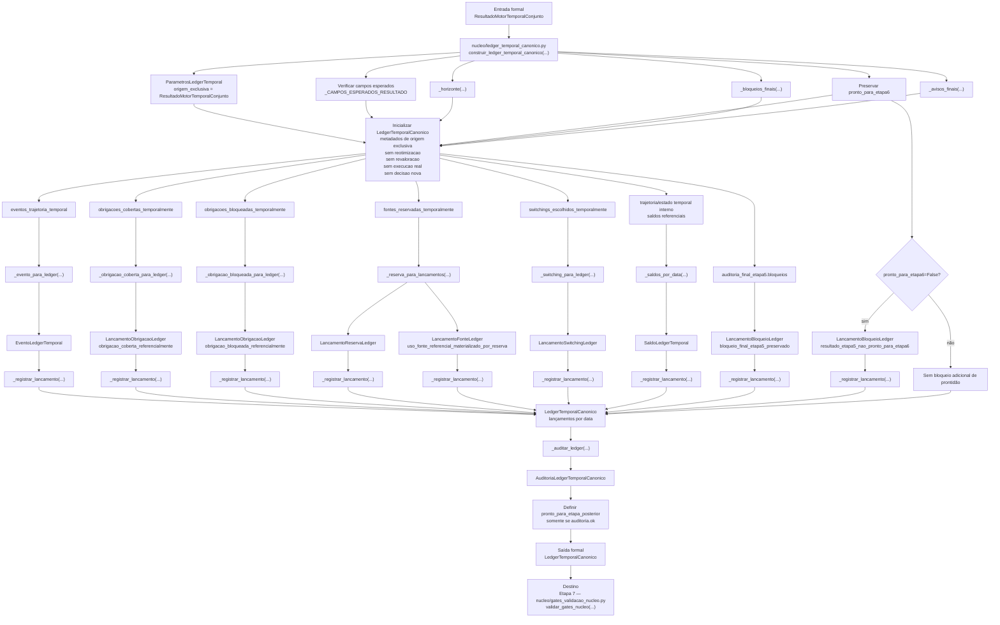

# Contrato Individual — Etapa 6 — Ledger Temporal Canônico

## 1. Identificação documental

- **Etapa:** 6
- **Nome:** Ledger Temporal Canônico
- **Entrada formal exclusiva:** `ResultadoMotorTemporalConjunto`
- **Saída formal exclusiva:** `LedgerTemporalCanonico`
- **Módulo funcional:** `nucleo/ledger_temporal_canonico.py`
- **Função pública implementada:** `construir_ledger_temporal_canonico(...)`

## 2. Status normativo

Este contrato é normativo para a Etapa 6 e formaliza o ledger como artefato canônico intermediário entre o motor temporal conjunto e os gates de validação de núcleo.

## 3. Posição na cadeia macro

```text
Etapa 5 -> ResultadoMotorTemporalConjunto -> Etapa 6 -> LedgerTemporalCanonico -> Etapa 7
```

## 4. Função da etapa

A Etapa 6 transforma o `ResultadoMotorTemporalConjunto` em `LedgerTemporalCanonico`, materializando eventos, lançamentos, obrigações, fontes, reservas, switchings, saldos referenciais, bloqueios, avisos e auditoria em formato próprio para validação pela Etapa 7.

A Etapa 6 não escolhe nova decisão. Ela materializa contabilmente, em forma de ledger canônico, a trajetória e as decisões já fechadas pela Etapa 5.

## 5. Entrada formal obrigatória e exclusiva

A entrada formal exclusiva da Etapa 6 é:

```text
ResultadoMotorTemporalConjunto
```

## 6. Componentes consumíveis da entrada

A Etapa 6 pode consumir componentes já materializados no `ResultadoMotorTemporalConjunto`, incluindo:

- data de referência;
- horizonte temporal;
- decisões temporais por data;
- eventos de trajetória temporal;
- obrigações cobertas;
- obrigações bloqueadas;
- fontes reservadas;
- switchings escolhidos;
- saldos referenciais;
- auditorias internas e finais;
- bloqueios e avisos preservados;
- metadados formais.

## 7. Saída formal obrigatória

A saída formal obrigatória da Etapa 6 é:

```text
LedgerTemporalCanonico
```

## 8. Componentes mínimos da saída

`LedgerTemporalCanonico` deve conter, no mínimo:

- data de referência;
- horizonte;
- eventos;
- lançamentos por data;
- obrigações cobertas;
- obrigações bloqueadas;
- fontes utilizadas;
- fontes reservadas;
- switchings escolhidos;
- saldos referenciais por data;
- bloqueios preservados;
- avisos preservados;
- auditoria do ledger;
- metadados;
- prontidão para a Etapa 7.

## 9. Processo interno da etapa

A Etapa 6 deve executar uma orquestração de materialização contábil-canônica em `construir_ledger_temporal_canonico(...)`. Essa orquestração consome exclusivamente `ResultadoMotorTemporalConjunto` e converte coleções já materializadas pela Etapa 5 em estruturas próprias de ledger.

A ordem documental abaixo descreve a cadeia principal da função pública, mas não deve ser lida como dependência causal entre eventos, obrigações, fontes, reservas, switchings, saldos e bloqueios. Esses elementos são ramos independentes de materialização derivados da mesma entrada formal. A Etapa 6 não reotimiza, não revalora, não escolhe novo pacote, não troca fonte e não cria decisão nova.

A Etapa 6 deve:

1. inicializar `ParametrosLedgerTemporal` e declarar origem exclusiva como `ResultadoMotorTemporalConjunto`;
2. verificar campos esperados da entrada formal;
3. extrair horizonte temporal com `_horizonte(...)`;
4. preservar `pronto_para_etapa6` da Etapa 5;
5. preservar bloqueios finais com `_bloqueios_finais(...)`;
6. preservar avisos finais com `_avisos_finais(...)`;
7. inicializar `LedgerTemporalCanonico` com metadados de não reotimização, não revaloração, não execução real, ausência de decisão nova e fontes proibidas não consumidas;
8. materializar eventos da trajetória por `_evento_para_ledger(...)` e indexá-los por `_registrar_lancamento(...)`;
9. materializar obrigações cobertas por `_obrigacao_coberta_para_ledger(...)` e indexá-las por `_registrar_lancamento(...)`;
10. materializar obrigações bloqueadas por `_obrigacao_bloqueada_para_ledger(...)` e indexá-las por `_registrar_lancamento(...)`;
11. materializar reservas e fontes utilizadas a partir de `fontes_reservadas_temporalmente`, usando `_reserva_para_lancamentos(...)` e `_registrar_lancamento(...)`;
12. materializar switchings escolhidos por `_switching_para_ledger(...)` e indexá-los por `_registrar_lancamento(...)`;
13. materializar saldos referenciais por data com `_saldos_por_data(...)` e indexá-los por `_registrar_lancamento(...)`;
14. materializar bloqueios finais da Etapa 5 como `LancamentoBloqueioLedger`;
15. criar bloqueio explícito quando `ResultadoMotorTemporalConjunto.pronto_para_etapa6=False` e nenhum bloqueio final tiver sido preservado;
16. auditar o ledger com `_auditar_ledger(...)`;
17. definir `pronto_para_etapa_posterior` apenas quando o ledger estiver auditado e coerente;
18. emitir `LedgerTemporalCanonico`.

## 10. O que a etapa pode fazer

A Etapa 6 pode:

- converter estruturas do motor em lançamentos de ledger;
- normalizar eventos referenciais;
- indexar lançamentos por data;
- preservar bloqueios e avisos;
- registrar rastreabilidade interna;
- auditar consistência do ledger produzido.

## 11. O que a etapa não pode fazer

A Etapa 6 não pode:

- reotimizar;
- revalorar;
- escolher pacote vencedor;
- trocar fonte;
- alterar decisão econômica;
- alterar console;
- alterar XLSX;
- alterar saída canônica;
- executar pagamento real;
- executar switching real;
- consultar planilha diretamente;
- criar diagnósticos paralelos;
- consumir artefatos anteriores ao `ResultadoMotorTemporalConjunto` fora do que já estiver materializado na entrada formal;
- executar os gates da Etapa 7.

## 12. Relação com a etapa anterior

A Etapa 6 consome exclusivamente `ResultadoMotorTemporalConjunto`, produzido pela Etapa 5. A Etapa 6 não recalcula a trajetória; apenas materializa o ledger canônico a partir do resultado recebido.

## 13. Relação com a etapa posterior

A Etapa 6 entrega `LedgerTemporalCanonico` para a Etapa 7 — Gates de Validação de Núcleo. A Etapa 7 deve consumir exclusivamente o ledger para validar o núcleo antes de qualquer progressão observável.

## 14. Schema/funções públicas previstas ou implementadas

Módulo funcional:

```text
nucleo/ledger_temporal_canonico.py
```

Função pública implementada:

```python
construir_ledger_temporal_canonico(
    resultado: ResultadoMotorTemporalConjunto,
    parametros: ParametrosLedgerTemporal | None = None,
) -> LedgerTemporalCanonico
```

Artefato formal:

```python
LedgerTemporalCanonico
```

## 15. Auditoria esperada

A auditoria da Etapa 6 deve registrar:

- completude do ledger;
- consistência de datas;
- preservação de bloqueios;
- preservação de avisos;
- coerência de obrigações, fontes, reservas e switchings;
- origem formal exclusiva;
- aptidão para Etapa 7 — Gates de Validação de Núcleo.

## 16. Critérios de aceite

A Etapa 6 é aceita quando:

1. consome somente `ResultadoMotorTemporalConjunto`;
2. produz `LedgerTemporalCanonico`;
3. preserva bloqueios e avisos relevantes;
4. não reotimiza nem revalora;
5. não altera console, XLSX ou saída canônica;
6. audita o ledger;
7. aponta explicitamente para a Etapa 7.

## 17. Fluxograma operacional-explicativo completo



## 18. Condição de parada

A Etapa 6 deve parar com bloqueio auditado quando não for possível formar `LedgerTemporalCanonico` mínimo ou quando a auditoria do ledger detectar inconsistência impeditiva.

## 19. Adendos funcionais consolidados

As regras de não reotimização, não revaloração, não execução real e não alteração de console/XLSX/saída canônica integram o corpo principal deste contrato.
