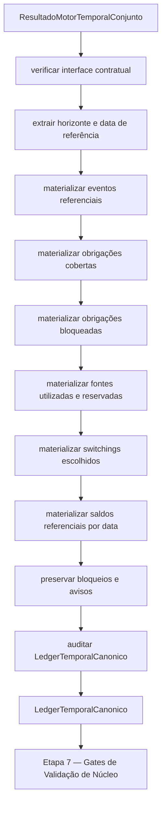

# Contrato Individual — Etapa 6 — Ledger Temporal Canônico

## 1. Identificação documental

- **Etapa:** 6
- **Nome:** Ledger Temporal Canônico
- **Entrada formal exclusiva:** `ResultadoMotorTemporalConjunto`
- **Saída formal exclusiva:** `LedgerTemporalCanonico`
- **Função pública implementada:** `construir_ledger_temporal_canonico(...)`

## 2. Status normativo

Este contrato é normativo para a Etapa 6 e formaliza o ledger como artefato canônico intermediário entre o motor temporal conjunto e os gates de validação de núcleo.

## 3. Posição na cadeia macro

```text
Etapa 5 -> ResultadoMotorTemporalConjunto -> Etapa 6 -> LedgerTemporalCanonico -> Etapa 7
```

## 4. Função da etapa

A Etapa 6 transforma o `ResultadoMotorTemporalConjunto` em `LedgerTemporalCanonico`, materializando eventos, lançamentos, obrigações, fontes, reservas, switchings, saldos referenciais, bloqueios, avisos e auditoria em formato próprio para validação pela Etapa 7.

## 5. Entrada formal obrigatória e exclusiva

A entrada formal exclusiva da Etapa 6 é:

```text
ResultadoMotorTemporalConjunto
```

## 6. Componentes consumíveis da entrada

A Etapa 6 pode consumir componentes já materializados no `ResultadoMotorTemporalConjunto`, incluindo:

- data de referência;
- horizonte temporal;
- decisões temporais por data;
- eventos de trajetória temporal;
- obrigações cobertas;
- obrigações bloqueadas;
- fontes reservadas;
- switchings escolhidos;
- saldos referenciais;
- auditorias internas e finais;
- bloqueios e avisos preservados;
- metadados formais.

## 7. Saída formal obrigatória

A saída formal obrigatória da Etapa 6 é:

```text
LedgerTemporalCanonico
```

## 8. Componentes mínimos da saída

`LedgerTemporalCanonico` deve conter, no mínimo:

- data de referência;
- horizonte;
- eventos;
- lançamentos por data;
- obrigações cobertas;
- obrigações bloqueadas;
- fontes utilizadas;
- fontes reservadas;
- switchings escolhidos;
- saldos referenciais por data;
- bloqueios preservados;
- avisos preservados;
- auditoria do ledger;
- metadados;
- prontidão para etapa posterior.

## 9. Processo interno da etapa

A Etapa 6 deve:

1. verificar a interface contratual do `ResultadoMotorTemporalConjunto`;
2. extrair horizonte e data de referência;
3. materializar eventos de trajetória;
4. converter obrigações cobertas em lançamentos de ledger;
5. converter obrigações bloqueadas em lançamentos de ledger;
6. converter fontes e reservas referenciais;
7. converter switchings escolhidos;
8. materializar saldos referenciais por data;
9. preservar bloqueios finais;
10. preservar avisos relevantes;
11. registrar metadados de origem;
12. auditar o ledger;
13. emitir `LedgerTemporalCanonico`.

## 10. O que a etapa pode fazer

A Etapa 6 pode:

- converter estruturas do motor em lançamentos de ledger;
- normalizar eventos referenciais;
- indexar lançamentos por data;
- preservar bloqueios e avisos;
- registrar rastreabilidade interna;
- auditar consistência do ledger produzido.

## 11. O que a etapa não pode fazer

A Etapa 6 não pode:

- reotimizar;
- revalorar;
- escolher pacote vencedor;
- trocar fonte;
- alterar decisão econômica;
- alterar console;
- alterar XLSX;
- alterar saída canônica;
- executar pagamento real;
- executar switching real;
- consultar planilha diretamente;
- criar diagnósticos paralelos;
- consumir artefatos anteriores ao `ResultadoMotorTemporalConjunto` fora do que já estiver materializado na entrada formal.

## 12. Relação com a etapa anterior

A Etapa 6 consome exclusivamente `ResultadoMotorTemporalConjunto`, produzido pela Etapa 5. A Etapa 6 não recalcula a trajetória; apenas materializa o ledger canônico a partir do resultado recebido.

## 13. Relação com a etapa posterior

A Etapa 6 entrega `LedgerTemporalCanonico` para a Etapa 7 — Gates de Validação de Núcleo. A Etapa 7 deve consumir exclusivamente o ledger para validar o núcleo antes de qualquer progressão observável.

## 14. Schema/funções públicas previstas ou implementadas

Função pública implementada:

```python
construir_ledger_temporal_canonico(
    resultado: ResultadoMotorTemporalConjunto,
    parametros: ParametrosLedgerTemporal | None = None,
) -> LedgerTemporalCanonico
```

Artefato formal:

```python
LedgerTemporalCanonico
```

## 15. Auditoria esperada

A auditoria da Etapa 6 deve registrar:

- completude do ledger;
- consistência de datas;
- preservação de bloqueios;
- preservação de avisos;
- coerência de obrigações, fontes, reservas e switchings;
- origem formal exclusiva;
- aptidão para Etapa 7 — Gates de Validação de Núcleo.

## 16. Critérios de aceite

A Etapa 6 é aceita quando:

1. consome somente `ResultadoMotorTemporalConjunto`;
2. produz `LedgerTemporalCanonico`;
3. preserva bloqueios e avisos relevantes;
4. não reotimiza nem revalora;
5. não altera console, XLSX ou saída canônica;
6. audita o ledger;
7. aponta explicitamente para a Etapa 7.

## 17. Fluxograma operacional-explicativo completo



## 18. Condição de parada

A Etapa 6 deve parar com bloqueio auditado quando não for possível formar `LedgerTemporalCanonico` mínimo ou quando a auditoria do ledger detectar inconsistência impeditiva.

## 19. Adendos funcionais consolidados

As regras de não reotimização, não revaloração, não execução real e não alteração de console/XLSX/saída canônica integram o corpo principal deste contrato.
