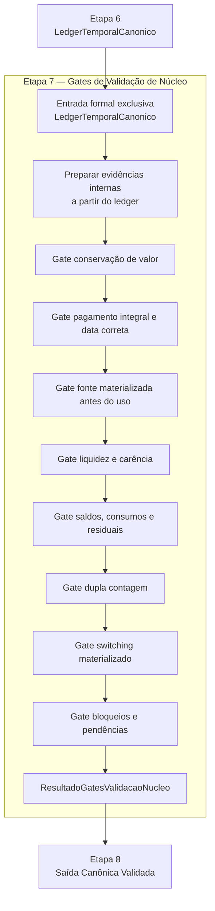

# CONTRATO INDIVIDUAL DA ETAPA 7 — GATES DE VALIDAÇÃO DE NÚCLEO

## 1. Identificação documental

- MACROETAPA DE CRIAÇÃO DO CONTRATO: MACRO-ETAPA7-0
- MACROETAPA DE AJUSTE DOCUMENTAL: MACRO-ETAPA7-0A
- TIPO: DOCUMENTAL / CONTRATUAL
- CLASSE: CONTRATO_INDIVIDUAL_ETAPA7_GATES_VALIDACAO_NUCLEO
- BASELINE DE CRIAÇÃO DO CONTRATO: `ecda2bdf79ea57fe977627b0ead69f5902573ed5`
- BASELINE DO AJUSTE DOCUMENTAL: `0fcf3543531941a2137f15892da1585c223718c5`
- ETAPA ANTERIOR: Etapa 6 — Ledger Temporal Canônico
- SAÍDA FORMAL DA ETAPA ANTERIOR: `LedgerTemporalCanonico`
- ETAPA CONTRATADA: Etapa 7 — Gates de Validação de Núcleo
- ENTRADA FORMAL EXCLUSIVA DA ETAPA CONTRATADA: `LedgerTemporalCanonico`
- SAÍDA FORMAL DA ETAPA CONTRATADA: `ResultadoGatesValidacaoNucleo`
- ALTERA CÓDIGO: NÃO
- ALTERA MOTOR: NÃO
- ALTERA LEDGER FUNCIONAL: NÃO
- ALTERA SAÍDA CANÔNICA: NÃO
- ALTERA DADOS: NÃO
- ALTERA CONSOLE: NÃO
- ALTERA XLSX: NÃO
- CRIA SCRIPT DIAGNÓSTICO: NÃO

## 2. Status normativo

Este documento é o contrato individual canônico da **Etapa 7 — Gates de Validação de Núcleo**.

Ele é subordinado ao contrato operacional mestre, ao modelo matemático-estatístico-financeiro oficial e aos contratos individuais das Etapas 1–6.

A Etapa 7 é a camada de validação formal entre:

```text
Etapa 6 -> LedgerTemporalCanonico -> Etapa 7 -> ResultadoGatesValidacaoNucleo -> Etapa 8
```

Logs, relatórios históricos, console, XLSX, scripts diagnósticos, saídas observáveis e artefatos renderizados não são fonte normativa de estado para esta etapa.

A Etapa 7 não corrige decisões. Ela valida se o núcleo materializado até a Etapa 6 é coerente, completo, auditável e apto para alimentar a Etapa 8 — Saída Canônica Validada.

## 3. Função da etapa

A Etapa 7 consome **direta e exclusivamente** o `LedgerTemporalCanonico` produzido pela Etapa 6 para aplicar gates de validação de núcleo.

Sua função é validar, de forma programática e auditável, a consistência entre pagamentos, fontes, saldos, switchings, bloqueios, liquidez, carência, residuais, dupla contagem e conservação de valor a partir das informações materializadas ou explicitamente referenciadas no próprio ledger.

Informações sobre estado temporal final, decisões econômicas finais, ranking oficial utilizado e auditorias compatíveis só podem ser usadas pela Etapa 7 quando estiverem materializadas dentro do próprio `LedgerTemporalCanonico` ou explicitamente referenciadas por ele em metadados, eventos, lançamentos, saldos, bloqueios, avisos ou auditoria interna.

Essas informações não constituem entradas paralelas independentes.

Referências contidas no `LedgerTemporalCanonico` servem apenas como evidências internas, metadados, identificadores ou rastreabilidade já materializada no próprio ledger. Elas não autorizam a Etapa 7 a buscar, reconstruir, importar, consultar ou consumir diretamente `EstadoTemporalInicial`, `ResultadoMotorTemporalConjunto`, objetos das Etapas 1–5, planilha, logs, diagnósticos, console, XLSX ou saída observável.

A Etapa 7 não decide pagamentos, não escolhe fontes, não troca pacote vencedor, não reotimiza, não revalora, não materializa switching, não corrige saldo temporal e não altera o ledger.

## 4. Entrada formal da etapa

A entrada formal obrigatória e exclusiva da Etapa 7 é:

`LedgerTemporalCanonico`

A Etapa 7 deve consumir esse artefato diretamente.

Informações sobre estado temporal final, decisões econômicas finais, ranking oficial utilizado e auditorias compatíveis só podem ser utilizadas quando estiverem materializadas dentro do próprio `LedgerTemporalCanonico` ou referenciadas explicitamente por ele em seus metadados, eventos, lançamentos, saldos, bloqueios, avisos ou auditoria interna.

Essas informações não constituem entradas auxiliares paralelas e não autorizam reconstrução de estado, consulta ao motor da Etapa 5 ou acesso a artefatos anteriores.

As referências contidas no `LedgerTemporalCanonico` podem ser usadas apenas como evidências internas, metadados, identificadores ou rastreabilidade já materializada no próprio ledger. Elas não autorizam a Etapa 7 a buscar, reconstruir, importar, consultar ou consumir diretamente `EstadoTemporalInicial`, `ResultadoMotorTemporalConjunto`, objetos das Etapas 1–5, planilha, logs, diagnósticos, console, XLSX ou saída observável.

A Etapa 7 não pode consumir diretamente:

- `EstadoTemporalInicial`;
- `ResultadoMotorTemporalConjunto`;
- objetos internos das Etapas 1–5, ainda que identificados ou referenciados no `LedgerTemporalCanonico`, quando isso exigir busca, carregamento, consulta ou consumo direto fora do próprio ledger;
- planilha original;
- console;
- XLSX;
- saída observável;
- saída canônica ainda não validada;
- logs;
- relatórios históricos;
- scripts diagnósticos;
- CSVs auxiliares;
- cache operacional como evidência decisória;
- artefatos de renderização;
- rotas paralelas, wrappers transitórios, fallbacks legados ou shadows.

## 5. Saída formal da etapa

A saída formal obrigatória da Etapa 7 é:

`ResultadoGatesValidacaoNucleo`

Esse artefato deve representar o resultado consolidado dos gates de núcleo aplicados sobre o `LedgerTemporalCanonico`.

O resultado deve conter, no mínimo:

- indicador `ok` geral;
- bloqueios de núcleo;
- avisos de núcleo;
- gates executados;
- gates aprovados;
- gates reprovados;
- evidências mínimas por gate;
- resumo quantitativo;
- metadados de origem;
- prontidão para Etapa 8.

`ResultadoGatesValidacaoNucleo` não é saída canônica, não é console, não é XLSX e não é correção do ledger.

## 6. Gates mínimos obrigatórios

A Etapa 7 deve validar, no mínimo:

1. conservação de valor;
2. pagamento integral das obrigações cobertas;
3. pagamento na data correta;
4. fonte materializada antes do uso;
5. liquidez das fontes usadas;
6. carência das fontes usadas;
7. ausência de saldo negativo indevido;
8. impedimento de dupla contagem;
9. consistência entre switching materializado e lotes/fonte destino;
10. consistência entre pagamentos e fontes consumidas;
11. consistência de saldos antes, consumo, imposto, líquido e saldo depois;
12. consistência de residuais;
13. preservação de bloqueios finais e motivos de bloqueio;
14. aderência ao objetivo econômico terminal quando a evidência estiver no ledger;
15. ausência de decisão nova na Etapa 7;
16. ausência de uso de console, XLSX, saída observável, logs, diagnósticos, `ResultadoMotorTemporalConjunto` ou `EstadoTemporalInicial` como fonte de estado.

## 7. Gate de conservação de valor

O gate de conservação de valor deve verificar se os lançamentos do ledger preservam, de forma referencial e auditável, a relação entre:

- valores de entrada;
- valores consumidos;
- impostos;
- valores líquidos;
- reservas;
- saldos remanescentes;
- bloqueios;
- valores transferidos por switching.

A Etapa 7 pode bloquear a prontidão da Etapa 8 se houver inconsistência material de valor.

A Etapa 7 não pode corrigir valores, recalcular rendimentos ou substituir campos ausentes por inferência externa.

## 8. Gate de pagamento integral e data correta

O gate de pagamento deve verificar, para obrigações cobertas, se:

- a obrigação possui identificador ou referência mínima;
- a data do pagamento corresponde à data contratual da obrigação ou à trajetória materializada no ledger;
- o valor coberto é compatível com o valor da obrigação;
- a cobertura parcial indevida é bloqueada;
- o motivo de bloqueio está explícito quando a obrigação não foi coberta.

A Etapa 7 não pode escolher outra fonte para completar pagamento nem alterar status de obrigação.

## 9. Gate de fonte materializada antes do uso

O gate de fonte deve verificar se toda fonte usada em pagamento, reserva ou switching:

- possui identificador ou referência mínima;
- está materializada antes do uso;
- está temporalmente disponível na data do evento;
- não está exaurida, futura, migrada sem materialização ou bloqueada no momento do uso;
- não é apenas candidata, diagnóstica ou estimada.

Campos operacionais não podem ser preenchidos com fontes candidatas ou não materializadas.

## 10. Gate de liquidez e carência

O gate de liquidez e carência deve verificar, quando a evidência existir no ledger, se a fonte usada:

- é líquida ou resgatável na data;
- não está em carência impeditiva;
- respeita vencimento, disponibilidade e regras operacionais do produto;
- não viola restrição fiscal ou operacional vigente.

A ausência de evidência suficiente no ledger deve gerar aviso ou bloqueio conforme severidade definida na implementação funcional futura.

## 11. Gate de saldos, consumo e residuais

O gate de saldos deve verificar a consistência entre:

- saldo antes;
- valor bruto;
- imposto;
- valor líquido;
- consumo;
- saldo depois;
- residual.

Residuais devem respeitar o tratamento contratual vigente. Saldos negativos indevidos devem bloquear a prontidão para a Etapa 8.

## 12. Gate de dupla contagem

O gate de dupla contagem deve verificar se uma mesma fonte, valor, lote ou evento econômico não foi contado simultaneamente como:

- fonte disponível e fonte consumida;
- origem migrada e destino independente;
- aporte externo e switching;
- pagamento e resíduo disponível;
- lote ativo e lote exaurido;
- reserva e consumo efetivo incompatíveis.

## 13. Gate de switching materializado

O gate de switching deve verificar, quando houver switchings no ledger, se:

- switching candidato, promovido e materializado estão corretamente diferenciados;
- switching candidato ou promovido sem materialização não foi usado como fonte de pagamento;
- origem, destino, produto, data, valor líquido migrado e pacote estão preservados quando disponíveis;
- lotes destino não foram contados em duplicidade;
- origem migrada não permaneceu como fonte operacional disponível após materialização incompatível.

## 14. Gate de bloqueios

O gate de bloqueios deve verificar se:

- obrigações bloqueadas têm motivo explícito;
- bloqueios finais da Etapa 5 preservados pela Etapa 6 continuam visíveis no ledger;
- `pronto_para_etapa_posterior` ou indicador equivalente não é verdadeiro quando existem bloqueios impeditivos;
- pendências não foram mascaradas por renderização ou saída observável.

A Etapa 7 não pode fingir completude quando o ledger contém bloqueios.

## 15. Relação com Etapa 8 — Saída Canônica Validada

A Etapa 8 só pode consumir o resultado da Etapa 7 se os gates de núcleo forem aprovados ou se os bloqueios/avisos forem preservados explicitamente como parte da saída canônica validada.

A saída canônica validada deve consumir exclusivamente:

- `ResultadoGatesValidacaoNucleo`;
- `LedgerTemporalCanonico` validado pela Etapa 7;
- evidências e metadados já materializados ou explicitamente referenciados no ledger validado;
- auditorias compatíveis produzidas pela Etapa 7.

A Etapa 8 poderá organizar, nomear e estruturar informações para consumo humano ou operacional, mas não poderá recalcular decisão econômica, trocar fonte de pagamento, materializar switching, corrigir saldo temporal ou alterar o estado final.

## 16. Relação com Etapa 9 — Renderização Oficial Unificada

Console e XLSX pertencem à Etapa 9.

A Etapa 7 não altera console e não altera XLSX.

Problemas observados em console ou XLSX só podem ser tratados diretamente na renderização se a saída canônica validada da Etapa 8 já contiver a informação correta.

Se a saída canônica não contiver a informação correta, o problema deve ser tratado na Etapa 8.

Se o ledger ou os gates indicarem inconsistência de núcleo, o problema deve ser tratado nas etapas 5, 6 ou 7 conforme a origem, nunca por ajuste visual em console ou XLSX.

## 17. Proibições da Etapa 7

A Etapa 7 não pode:

- decidir pagamento;
- escolher fonte;
- trocar lote sugerido;
- selecionar novo pacote temporal;
- reotimizar trajetória;
- revalorar pacote;
- recalcular ranking da Carteira;
- executar pagamento bancário real;
- executar switching real;
- materializar switching novo;
- corrigir saldo temporal;
- alterar ledger;
- alterar estado temporal final fora do ledger;
- alterar dados;
- alterar planilha;
- alterar console;
- alterar XLSX;
- gerar saída canônica final;
- usar diagnóstico como motor;
- usar logs como fonte de estado;
- usar saída observável como fonte de estado;
- consumir diretamente `ResultadoMotorTemporalConjunto`;
- consumir diretamente `EstadoTemporalInicial`;
- reconstruir `EstadoTemporalInicial`;
- recanonizar dados das Etapas 1–4;
- criar fallback legado;
- criar rota paralela;
- criar wrapper transitório;
- criar sentinela;
- criar script diagnóstico;
- reintroduzir `ContextoBaseline`;
- reintroduzir `ContextoSaidaCanonicaCompat`.

## 18. Schema funcional previsto para macroetapa posterior

A macroetapa funcional posterior poderá definir estruturas equivalentes a:

- `ResultadoGatesValidacaoNucleo`;
- `GateValidacaoNucleo`;
- `EvidenciaGateNucleo`;
- `BloqueioGateNucleo`;
- `AvisoGateNucleo`;
- `ResumoGatesValidacaoNucleo`;
- `ParametrosGatesValidacaoNucleo`, se necessário.

Este contrato não cria essas estruturas. Ele apenas autoriza sua criação futura sob escopo funcional específico.

## 19. Função pública prevista para macroetapa posterior

A macroetapa funcional posterior poderá implementar função pública equivalente a:

```python
def validar_gates_nucleo(
    ledger: LedgerTemporalCanonico,
    parametros: ParametrosGatesValidacaoNucleo | None = None,
) -> ResultadoGatesValidacaoNucleo:
    ...
```

Essa previsão não autoriza implementação nesta macroetapa documental.

A função futura deverá consumir exclusivamente o `LedgerTemporalCanonico` como entrada formal de estado e não poderá consultar planilha, console, XLSX, logs, diagnósticos, `ResultadoMotorTemporalConjunto` ou `EstadoTemporalInicial` como fonte de estado.

## 20. Critérios de aceite da Etapa 7

A Etapa 7 só poderá ser considerada concluída se:

1. `ResultadoGatesValidacaoNucleo` existir como artefato formal da Etapa 7;
2. `validar_gates_nucleo(...)` consumir `LedgerTemporalCanonico` como entrada formal exclusiva;
3. nenhum consumo direto de `ResultadoMotorTemporalConjunto` ou `EstadoTemporalInicial` existir na Etapa 7;
4. os gates mínimos obrigatórios forem executados ou explicitamente classificados como não aplicáveis por ausência contratual de evidência no ledger;
5. conservação de valor for validada ou bloqueada;
6. pagamento integral e pagamento na data correta forem validados ou bloqueados;
7. fonte materializada antes do uso for validada ou bloqueada;
8. liquidez e carência forem validadas ou bloqueadas;
9. saldos, consumos, impostos, líquidos e residuais forem validados ou bloqueados;
10. dupla contagem for validada ou bloqueada;
11. consistência entre switchings materializados e lotes destino for validada ou bloqueada;
12. consistência entre pagamentos e fontes consumidas for validada ou bloqueada;
13. bloqueios e motivos forem preservados;
14. nenhuma decisão nova for criada;
15. nenhum ajuste visual de console ou XLSX for feito;
16. a Etapa 8 receber uma entrada validada, bloqueada ou explicitamente marcada como incompleta.

## 21. Fluxograma da Etapa 7



## 22. Condição de parada

Qualquer necessidade de escolher nova fonte, selecionar novo pacote vencedor, revalorar decisão, executar pagamento, promover switching, materializar destino, reconstruir estado temporal inicial, consumir `ResultadoMotorTemporalConjunto` diretamente, consumir planilha original, alterar console, alterar XLSX, alterar dados, gerar saída canônica final, criar script diagnóstico, criar fallback legado, criar rota paralela ou usar saída observável como fonte de estado deve interromper a macroetapa funcional em curso e exigir correção na etapa contratualmente responsável.

A Etapa 7 não é camada de correção visual. Ela é camada de validação de núcleo.
