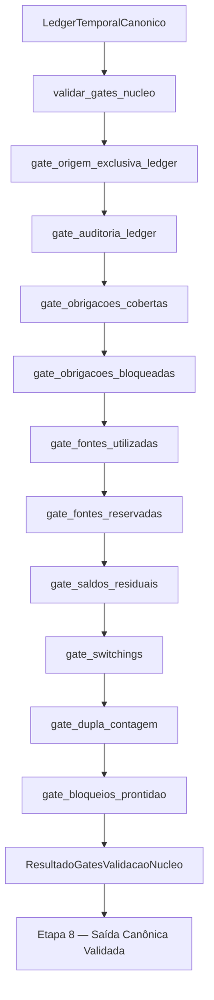

# Contrato Individual — Etapa 7 — Gates de Validação de Núcleo

## 1. Identificação documental

- **Etapa:** 7
- **Nome:** Gates de Validação de Núcleo
- **Entrada formal obrigatória e exclusiva:** `LedgerTemporalCanonico`
- **Saída formal:** `ResultadoGatesValidacaoNucleo`
- **Função pública implementada:** `validar_gates_nucleo(...)`

## 2. Status normativo

Este contrato reflete a implementação final mergeada na PR #426. Ele define a Etapa 7 como camada de validação do núcleo antes de qualquer progressão observável ou preparação de saída posterior.

## 3. Posição na cadeia macro

```text
Etapa 6 -> LedgerTemporalCanonico -> Etapa 7 -> ResultadoGatesValidacaoNucleo -> Etapa 8
```

A referência à Etapa 8 é apenas direcional. Este contrato não implementa a Etapa 8.

## 4. Função da etapa

A Etapa 7 valida o `LedgerTemporalCanonico` produzido pela Etapa 6 por meio de gates formais de núcleo. Ela preserva bloqueios e avisos, registra evidências, calcula prontidão para a próxima etapa e bloqueia progressão observável quando `pronto_para_etapa8=False`.

## 5. Entrada formal obrigatória e exclusiva

A entrada formal obrigatória e exclusiva da Etapa 7 é:

```text
LedgerTemporalCanonico
```

Referências contidas no ledger são apenas evidências internas, metadados, identificadores ou rastreabilidade já materializada. Elas não autorizam busca, reconstrução, importação ou consumo direto de artefatos anteriores.

## 6. Componentes consumíveis da entrada

A Etapa 7 pode consumir somente componentes materializados no `LedgerTemporalCanonico`, incluindo:

- metadados do ledger;
- auditoria do ledger;
- eventos;
- lançamentos por data;
- obrigações cobertas;
- obrigações bloqueadas;
- fontes utilizadas;
- fontes reservadas;
- saldos referenciais;
- switchings escolhidos;
- bloqueios preservados;
- avisos preservados;
- referências originais já embutidas no ledger.

## 7. Saída formal obrigatória

A saída formal obrigatória da Etapa 7 é:

```text
ResultadoGatesValidacaoNucleo
```

## 8. Componentes mínimos da saída

`ResultadoGatesValidacaoNucleo` deve conter, no mínimo:

- `ok`;
- `pronto_para_etapa8`;
- origem formal;
- lista de gates executados;
- bloqueios;
- avisos;
- evidências;
- resumo consolidado;
- metadados.

## 9. Processo interno da etapa

A Etapa 7 deve executar, no mínimo:

1. `gate_origem_exclusiva_ledger`;
2. `gate_auditoria_ledger`;
3. `gate_obrigacoes_cobertas`;
4. `gate_obrigacoes_bloqueadas`;
5. `gate_fontes_utilizadas`;
6. `gate_fontes_reservadas`;
7. `gate_saldos_residuais`;
8. `gate_switchings`;
9. `gate_dupla_contagem`;
10. `gate_bloqueios_prontidao`;
11. consolidação de bloqueios, avisos e evidências;
12. cálculo final de `pronto_para_etapa8`.

## 10. O que a etapa pode fazer

A Etapa 7 pode:

- validar origem exclusiva do ledger;
- validar auditoria do ledger;
- validar obrigações cobertas;
- validar obrigações bloqueadas;
- validar fontes utilizadas;
- validar fontes reservadas;
- validar saldos e residuais;
- validar switchings;
- validar dupla contagem;
- validar bloqueios e prontidão;
- preservar bloqueios e avisos;
- bloquear progressão observável quando `pronto_para_etapa8=False`;
- registrar evidências e metadados do próprio processo de validação.

## 11. O que a etapa não pode fazer

A Etapa 7 não pode:

- alterar o ledger;
- corrigir console;
- gerar XLSX;
- alterar saída canônica;
- renderizar saída observável;
- executar pagamento real;
- executar switching real;
- reotimizar;
- revalorar;
- trocar pacote vencedor;
- consultar `ResultadoMotorTemporalConjunto`;
- consultar `EstadoTemporalInicial`;
- consultar planilha;
- consultar logs ou diagnósticos como fonte de estado;
- criar scripts diagnósticos.

## 12. Relação com a etapa anterior

A Etapa 7 consome exclusivamente `LedgerTemporalCanonico` produzido pela Etapa 6. A Etapa 6 materializa as evidências que a Etapa 7 pode validar; a Etapa 7 não retorna ao motor temporal ou ao estado temporal inicial.

## 13. Relação com a etapa posterior

A Etapa 7 entrega `ResultadoGatesValidacaoNucleo` para orientar a Etapa 8 — Saída Canônica Validada. A progressão observável deve ser bloqueada quando `pronto_para_etapa8=False`. Este contrato não implementa a Etapa 8.

## 14. Schema/funções públicas previstas ou implementadas

Função pública implementada:

```python
validar_gates_nucleo(
    ledger: LedgerTemporalCanonico,
    parametros: ParametrosGatesValidacaoNucleo | None = None,
) -> ResultadoGatesValidacaoNucleo
```

Artefatos formais implementados:

```python
ParametrosGatesValidacaoNucleo
EvidenciaGateNucleo
BloqueioGateNucleo
AvisoGateNucleo
GateValidacaoNucleo
ResumoGatesValidacaoNucleo
ResultadoGatesValidacaoNucleo
```

## 15. Auditoria esperada

A auditoria da Etapa 7 deve registrar:

- gates executados;
- gates aprovados, reprovados e não aplicáveis;
- bloqueios preservados do ledger;
- avisos preservados do ledger;
- bloqueios gerados pelos gates;
- avisos gerados pelos gates;
- contagens de obrigações cobertas e bloqueadas;
- contagens de fontes utilizadas e reservadas;
- contagens de switchings;
- estado final de `pronto_para_etapa8`.

## 16. Critérios de aceite

A Etapa 7 é aceita quando:

1. consome somente `LedgerTemporalCanonico`;
2. produz `ResultadoGatesValidacaoNucleo`;
3. executa os dez gates mínimos;
4. preserva bloqueios e avisos do ledger;
5. bloqueia progressão observável quando `pronto_para_etapa8=False`;
6. não altera ledger;
7. não altera console, XLSX ou saída canônica;
8. não consulta `ResultadoMotorTemporalConjunto`;
9. não consulta `EstadoTemporalInicial`;
10. não consulta planilha, logs ou diagnósticos como fonte de estado.

## 17. Fluxograma operacional-explicativo completo



## 18. Condição de parada

A Etapa 7 deve bloquear progressão observável quando houver bloqueios impeditivos, quando a auditoria do ledger reprovar ou quando `ResultadoGatesValidacaoNucleo.pronto_para_etapa8=False`.

## 19. Adendos funcionais consolidados

A implementação mergeada consolidou:

- bloqueio de runtime antes de console/XLSX quando os gates reprovam;
- validação de fonte utilizada sem valor referencial;
- reconciliação conservadora de uso e reserva por fonte, data e pacote;
- bloqueio de switching sem data;
- validação de aderência terminal quando evidência estiver materializada;
- reconciliação agregada de obrigações cobertas por pacote/data;
- exigência de saldo residual para fonte movimentada.

Essas regras integram o corpo vivo deste contrato.
