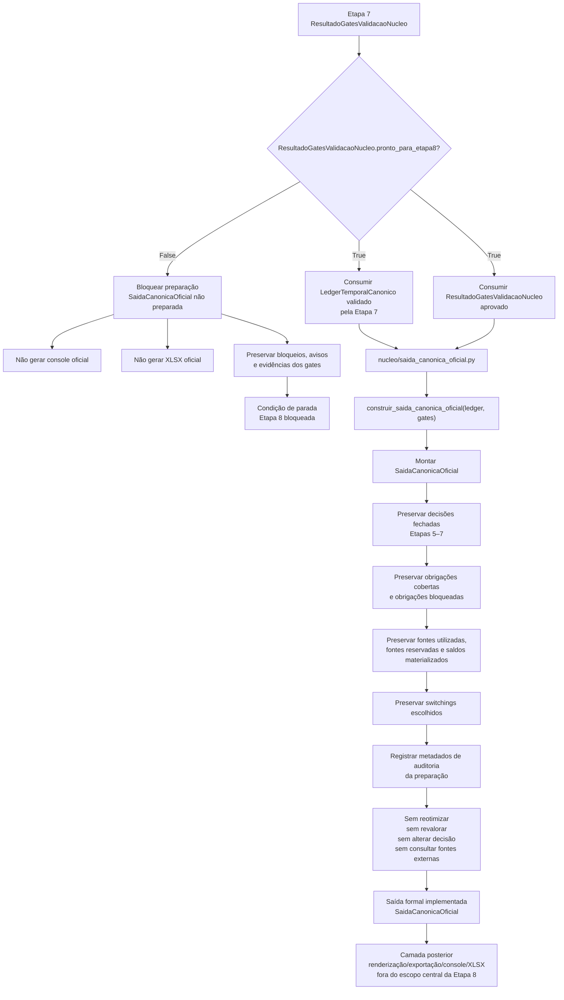

# Contrato Individual — Etapa 8 — Saída Canônica Oficial

## 1. Identificação documental

- **Etapa:** 8
- **Nome:** Saída Canônica Oficial
- **Entrada formal obrigatória e exclusiva:** `ResultadoGatesValidacaoNucleo` aprovado e `LedgerTemporalCanonico` validado pela Etapa 7
- **Saída formal implementada:** `SaidaCanonicaOficial`
- **Módulo funcional implementado:** `nucleo/saida_canonica_oficial.py`
- **Função pública implementada:** `construir_saida_canonica_oficial(ledger, gates) -> SaidaCanonicaOficial`

## 2. Status normativo

Este contrato formaliza a Etapa 8 como a primeira camada autorizada a preparar a saída canônica oficial após aprovação dos gates da Etapa 7.

A partir da `CONTRATO-ETAPA8-ALINHAMENTO-01`, este contrato passa a refletir o estado funcional real: o artefato `SaidaCanonicaOficial` e a função pública `construir_saida_canonica_oficial(...)` estão implementados em `nucleo/saida_canonica_oficial.py`.

Este alinhamento documental não altera runtime, não altera código funcional, não move funções legadas, não cria console, não gera XLSX e não altera contratos das Etapas 1–7.

## 3. Posição na cadeia macro

```text
Etapa 7 -> ResultadoGatesValidacaoNucleo aprovado + LedgerTemporalCanonico validado -> Etapa 8 -> SaidaCanonicaOficial -> camada posterior de renderização/exportação
```

A Etapa 8 nasce depois da validação do núcleo. Ela não substitui a Etapa 7, não reabre o ledger, não consulta etapas anteriores e não executa renderização final de console ou XLSX.

## 4. Função da etapa

A Etapa 8 prepara a saída canônica oficial do projeto a partir do `LedgerTemporalCanonico` já validado e do `ResultadoGatesValidacaoNucleo` aprovado.

Sua função é transformar evidências, decisões, bloqueios, avisos, obrigações, fontes, saldos, switchings e metadados já materializados no ledger validado em um artefato canônico oficial, apto a ser consumido por camadas posteriores de apresentação, renderização, exportação, console ou XLSX.

A Etapa 8 não decide novamente. Ela organiza, fecha e disponibiliza a forma canônica oficial da decisão já validada.

## 5. Entrada formal obrigatória e exclusiva

A entrada formal obrigatória da Etapa 8 é composta exclusivamente por:

```text
ResultadoGatesValidacaoNucleo aprovado
LedgerTemporalCanonico validado pela Etapa 7
```

A Etapa 8 só pode avançar quando:

```text
ResultadoGatesValidacaoNucleo.pronto_para_etapa8=True
```

Se `pronto_para_etapa8=False`, a Etapa 8 deve bloquear progressão e não deve preparar saída canônica oficial.

## 6. Componentes consumíveis da entrada

A Etapa 8 pode consumir somente componentes já aprovados ou preservados pela Etapa 7, incluindo:

- `LedgerTemporalCanonico` validado;
- `ResultadoGatesValidacaoNucleo` aprovado;
- metadados de validação dos gates;
- bloqueios preservados;
- avisos preservados;
- evidências materializadas no ledger;
- eventos do ledger;
- obrigações cobertas;
- obrigações bloqueadas;
- fontes utilizadas;
- fontes reservadas;
- saldos referenciais materializados;
- switchings escolhidos e materializados;
- resumo consolidado dos gates;
- componentes necessários para montar a saída canônica oficial, desde que derivados do ledger validado.

Referências históricas embutidas no ledger são permitidas apenas como rastreabilidade já materializada. Elas não autorizam busca direta em artefatos anteriores.

## 7. Saída formal obrigatória

A saída formal obrigatória implementada da Etapa 8 é:

```text
SaidaCanonicaOficial
```

`SaidaCanonicaOficial` é o artefato canônico oficial da Etapa 8, implementado em `nucleo/saida_canonica_oficial.py`.

A saída não deve ser confundida automaticamente com funções ou artefatos legados do runtime. Funções pré-existentes do runtime podem continuar existindo como camada operacional legada ou transitória, mas não substituem o artefato formal da Etapa 8.

## 8. Componentes mínimos da saída

`SaidaCanonicaOficial` contém, no mínimo, conforme implementação atual:

- origem formal da saída;
- referência ao tipo do `LedgerTemporalCanonico` consumido;
- referência ao tipo do `ResultadoGatesValidacaoNucleo` consumido;
- indicador de prontidão da Etapa 8;
- status de preparação;
- data de referência;
- resumo canônico da saída;
- decisões e eventos preservados do ledger;
- obrigações cobertas preservadas;
- obrigações bloqueadas preservadas;
- fontes utilizadas preservadas;
- fontes reservadas preservadas;
- switchings escolhidos preservados;
- saldos referenciais por data preservados;
- bloqueios e avisos do ledger;
- bloqueios, avisos e evidências dos gates;
- bloqueios próprios de preparação da Etapa 8;
- metadados de auditoria da própria preparação.

O schema implementado é representado pelas classes `SaidaCanonicaOficial`, `ResumoSaidaCanonicaOficial` e `BloqueioPreparacaoSaidaCanonicaOficial`.


## 8-A. Preservação canônica de `lote_id_operacional` — `REGRA-LOTE-ID-OPERACIONAL-RECEBIDO-01`

A Etapa 8 deve preservar na `SaidaCanonicaOficial` os campos de identificação operacional de fonte já existentes no `LedgerTemporalCanonico`, incluindo, quando aplicável:

```text
fonte_id_tecnico
lote_id_operacional
```

A Etapa 8 não deve criar, inferir ou substituir `lote_id_operacional`. Sua responsabilidade é transportar, na saída canônica oficial, a identificação já validada e materializada no ledger.

Se o ledger não contiver `lote_id_operacional` em uma fonte que deveria possuí-lo, a Etapa 8 deve preservar a evidência disponível e permitir que a etapa posterior registre lacuna de renderização, sem consultar Etapa 4, Etapa 5, planilha, console, XLSX ou dados brutos.

## 9. Processo interno da etapa

A Etapa 8 executa um processo determinístico de preparação da saída oficial:

1. recebe `ResultadoGatesValidacaoNucleo` e `LedgerTemporalCanonico`;
2. verifica que as entradas possuem os tipos formais esperados;
3. verifica que `ResultadoGatesValidacaoNucleo.pronto_para_etapa8=True`;
4. bloqueia a preparação se a prontidão for falsa;
5. consome somente evidências, decisões e metadados já materializados no ledger validado ou nos gates;
6. organiza obrigações cobertas e bloqueadas sem reclassificar decisão;
7. organiza fontes utilizadas e reservadas sem recalcular alocação;
8. organiza switchings escolhidos sem reavaliar elegibilidade;
9. preserva bloqueios, avisos e evidências;
10. monta `SaidaCanonicaOficial`;
11. disponibiliza a saída para camada posterior de renderização/exportação.

Esse processo não deve consultar dados brutos, planilhas, logs, scripts diagnósticos, console, XLSX, caches externos ou artefatos anteriores ao ledger.

## 10. O que a etapa pode fazer

A Etapa 8 pode:

- preparar a saída canônica oficial após gates aprovados;
- consumir `LedgerTemporalCanonico` validado;
- consumir `ResultadoGatesValidacaoNucleo` aprovado;
- validar tipos formais das entradas;
- organizar evidências já materializadas;
- preservar decisões fechadas nas Etapas 5–7;
- preservar obrigações cobertas e bloqueadas;
- preservar fontes utilizadas e reservadas;
- preservar saldos e residuais materializados;
- preservar switchings escolhidos;
- preservar bloqueios e avisos;
- montar metadados de auditoria da própria preparação;
- entregar artefato canônico para consumo posterior.

## 11. O que a etapa não pode fazer

A Etapa 8 não pode:

- avançar quando `ResultadoGatesValidacaoNucleo.pronto_para_etapa8=False`;
- reotimizar;
- revalorar;
- escolher nova fonte;
- trocar pacote vencedor;
- alterar obrigação coberta;
- alterar obrigação bloqueada;
- alterar switching escolhido;
- alterar saldo;
- corrigir dados;
- consultar fontes externas;
- consultar diretamente `EstadoTemporalInicial`;
- consultar diretamente `ResultadoMotorTemporalConjunto`;
- consultar dados brutos;
- consultar planilha;
- consultar logs como fonte decisória;
- consultar scripts diagnósticos;
- consultar console;
- consultar XLSX prévio;
- consultar saída observável anterior;
- consultar cache BCB como fonte decisória;
- gerar console oficial;
- gerar XLSX oficial;
- substituir consumidores legados sem microfrente posterior específica;
- alterar contratos das Etapas 1–7;
- alterar contrato operacional mestre.

## 12. Relação com a etapa anterior

A Etapa 8 depende diretamente da Etapa 7.

A Etapa 7 entrega `ResultadoGatesValidacaoNucleo`. A Etapa 8 só pode consumir esse resultado se ele indicar `pronto_para_etapa8=True`. Além disso, a Etapa 8 deve usar apenas o `LedgerTemporalCanonico` validado pela Etapa 7.

Quando `pronto_para_etapa8=False`, a relação entre Etapa 7 e Etapa 8 é de bloqueio: a Etapa 8 não deve preparar saída canônica oficial e deve preservar bloqueios, avisos e evidências dos gates.

## 13. Relação com a etapa posterior

A Etapa 8 entrega `SaidaCanonicaOficial` para camada posterior de renderização, exportação, console ou XLSX.

Console e XLSX oficiais não são responsabilidade central da Etapa 8. Eles devem ser tratados como camada posterior ou como consumidores posteriores da saída canônica oficial, em frente separada e contratualmente autorizada.

A Etapa 8 não deve ser usada para introduzir regras de apresentação que alterem decisão econômica, ledger, gates ou saída canônica.

## 14. Schema/funções públicas previstas ou implementadas

Módulo funcional implementado:

```text
nucleo/saida_canonica_oficial.py
```

Artefato formal implementado:

```python
SaidaCanonicaOficial
```

Classes auxiliares implementadas:

```python
ResumoSaidaCanonicaOficial
BloqueioPreparacaoSaidaCanonicaOficial
```

Função pública implementada:

```python
construir_saida_canonica_oficial(
    ledger: LedgerTemporalCanonico,
    gates: ResultadoGatesValidacaoNucleo,
) -> SaidaCanonicaOficial
```

A função bloqueia a preparação quando as entradas não são dos tipos formais esperados ou quando `ResultadoGatesValidacaoNucleo.pronto_para_etapa8=False`.

Funções atualmente existentes no runtime, como:

```python
construir_saida_canonica_com_switching_v17_c7(...)
construir_matriz_elegibilidade_fontes_s7b(...)
aplicar_matriz_elegibilidade_ao_fluxo_pagamentos_s7c(...)
```

são funções pré-existentes do runtime/legado operacional. Este contrato não as promove automaticamente à condição de implementação formal final da Etapa 8 nem autoriza sua substituição direta sem frente posterior.

## 15. Auditoria esperada

A auditoria da Etapa 8 deve verificar, no mínimo:

- se `ResultadoGatesValidacaoNucleo.pronto_para_etapa8=True` antes da preparação;
- se o ledger consumido é o ledger validado pela Etapa 7;
- se a saída foi derivada exclusivamente do ledger validado e dos gates aprovados;
- se nenhuma etapa anterior ao ledger foi consultada diretamente;
- se nenhuma fonte externa foi consultada;
- se obrigações cobertas e bloqueadas foram preservadas;
- se fontes utilizadas e reservadas foram preservadas;
- se saldos e residuais materializados foram preservados;
- se switchings escolhidos foram preservados;
- se bloqueios, avisos e evidências foram preservados;
- se nenhuma reotimização, revaloração ou nova escolha foi executada;
- se console e XLSX não foram gerados pela Etapa 8;
- se a saída bloqueada por gates reprovados não inclui conteúdo operacional indevido.

## 16. Critérios de aceite

A Etapa 8 é aceita funcionalmente quando:

1. consome somente `ResultadoGatesValidacaoNucleo` aprovado e `LedgerTemporalCanonico` validado;
2. bloqueia progressão quando `pronto_para_etapa8=False`;
3. produz `SaidaCanonicaOficial` quando `pronto_para_etapa8=True`;
4. preserva decisões das Etapas 5–7;
5. preserva obrigações cobertas e bloqueadas;
6. preserva fontes utilizadas e reservadas;
7. preserva saldos e residuais materializados;
8. preserva switchings escolhidos;
9. preserva bloqueios, avisos e evidências;
10. não consulta `EstadoTemporalInicial`;
11. não consulta `ResultadoMotorTemporalConjunto`;
12. não consulta dados brutos, planilhas, logs, scripts diagnósticos, console, XLSX ou saída observável anterior;
13. não gera console ou XLSX oficiais;
14. não altera contratos das Etapas 1–7;
15. é integrada ao runtime apenas após gates aprovados.

Nesta frente documental, o aceite se limita ao alinhamento do contrato com a implementação já existente, sem alteração funcional.

## 17. Fluxograma operacional-explicativo completo



## 18. Condição de parada

A Etapa 8 deve parar sem preparar saída canônica oficial quando:

- `ResultadoGatesValidacaoNucleo.pronto_para_etapa8=False`;
- o ledger informado não for o ledger validado pela Etapa 7;
- a entrada `ledger` não for `LedgerTemporalCanonico`;
- a entrada `gates` não for `ResultadoGatesValidacaoNucleo`;
- houver tentativa de consultar etapa anterior ao ledger;
- houver tentativa de consultar dados brutos, planilha, logs, diagnósticos, console, XLSX ou saída observável anterior;
- houver necessidade de reotimizar, revalorar ou alterar decisão;
- houver ambiguidade entre preparação canônica oficial e renderização/exportação;
- houver necessidade de alterar contrato mestre ou contratos das Etapas 1–7 para executar a frente corrente.

## 19. Histórico documental / adendos funcionais consolidados

- `MICRO-ETAPA8-CONTRATO-01`: criação documental do contrato individual da Etapa 8, com `SaidaCanonicaOficial` como artefato contratual previsto.
- `MICRO-ETAPA8-FUNCIONAL-01`: implementação do artefato formal mínimo `SaidaCanonicaOficial` em `nucleo/saida_canonica_oficial.py`.
- `MICRO-ETAPA8-FUNCIONAL-02`: integração interna da construção de `SaidaCanonicaOficial` ao runtime somente após gates aprovados.
- `MICRO-ETAPA8-CORRECAO-01`: ajuste de metadado temporal para `datetime.now(timezone.utc)`.
- `LIMPA-ETAPA8-ESCOPO-01`: remoção de resíduos pós-Etapa 8 baseados em adaptador, renderização e equivalência.
- `MACRO-GATES-01`: correção upstream no motor para permitir aprovação legítima dos gates quando obrigações sem pacote válido estão formalmente bloqueadas.
- `MACRO-AUDITORIA-CADEIA-01`: registro do estado pós-`MACRO-GATES-01` e identificação da pendência documental da Etapa 8.
- `CONTRATO-ETAPA8-ALINHAMENTO-01`: alinhamento deste contrato ao código real já implementado, sem alteração funcional.

Esta frente não altera código, runtime, contratos das Etapas 1–7, contrato operacional mestre, dados, saídas, scripts diagnósticos, console ou XLSX.
