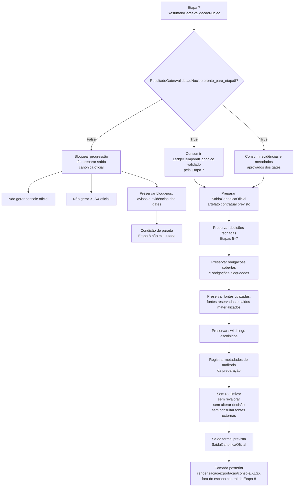

# Contrato Individual — Etapa 8 — Saída Canônica Oficial

## 1. Identificação documental

- **Etapa:** 8
- **Nome:** Saída Canônica Oficial
- **Entrada formal obrigatória e exclusiva:** `ResultadoGatesValidacaoNucleo` aprovado e `LedgerTemporalCanonico` validado pela Etapa 7
- **Saída formal prevista:** `SaidaCanonicaOficial`
- **Módulo funcional:** previsto para microfrente funcional posterior
- **Função pública prevista:** prevista para microfrente funcional posterior, não implementada neste contrato documental

## 2. Status normativo

Este contrato formaliza documentalmente a Etapa 8 como a primeira camada autorizada a preparar a saída canônica oficial após aprovação dos gates da Etapa 7.

Este documento não implementa código, não altera runtime, não move funções pré-existentes, não cria console, não gera XLSX e não altera contratos das Etapas 1–7. A nomenclatura `SaidaCanonicaOficial` é o nome contratual provisório explícito da saída desta etapa e poderá ser confirmada em microfrente funcional posterior.

## 3. Posição na cadeia macro

```text
Etapa 7 -> ResultadoGatesValidacaoNucleo aprovado + LedgerTemporalCanonico validado -> Etapa 8 -> SaidaCanonicaOficial -> camada posterior de renderização/exportação
```

A Etapa 8 nasce depois da validação do núcleo. Ela não substitui a Etapa 7, não reabre o ledger, não consulta etapas anteriores e não executa renderização final de console ou XLSX.

## 4. Função da etapa

A Etapa 8 prepara a saída canônica oficial do projeto a partir do `LedgerTemporalCanonico` já validado e do `ResultadoGatesValidacaoNucleo` aprovado.

Sua função é transformar evidências, decisões, bloqueios, avisos, obrigações, fontes, saldos, switchings e metadados já materializados no ledger validado em um artefato canônico oficial, apto a ser consumido por camadas posteriores de apresentação, renderização, exportação, console ou XLSX.

A Etapa 8 não decide novamente. Ela organiza, fecha e disponibiliza a forma canônica oficial da decisão já validada.

## 5. Entrada formal obrigatória e exclusiva

A entrada formal obrigatória da Etapa 8 é composta exclusivamente por:

```text
ResultadoGatesValidacaoNucleo aprovado
LedgerTemporalCanonico validado pela Etapa 7
```

A Etapa 8 só pode avançar quando:

```text
ResultadoGatesValidacaoNucleo.pronto_para_etapa8=True
```

Se `pronto_para_etapa8=False`, a Etapa 8 deve bloquear progressão e não deve preparar saída canônica oficial.

## 6. Componentes consumíveis da entrada

A Etapa 8 pode consumir somente componentes já aprovados ou preservados pela Etapa 7, incluindo:

- `LedgerTemporalCanonico` validado;
- `ResultadoGatesValidacaoNucleo` aprovado;
- metadados de validação dos gates;
- bloqueios preservados;
- avisos preservados;
- evidências materializadas no ledger;
- eventos do ledger;
- obrigações cobertas;
- obrigações bloqueadas;
- fontes utilizadas;
- fontes reservadas;
- saldos referenciais materializados;
- switchings escolhidos e materializados;
- resumo consolidado dos gates;
- componentes necessários para montar a saída canônica oficial, desde que derivados do ledger validado.

Referências históricas embutidas no ledger são permitidas apenas como rastreabilidade já materializada. Elas não autorizam busca direta em artefatos anteriores.

## 7. Saída formal obrigatória

A saída formal obrigatória prevista da Etapa 8 é:

```text
SaidaCanonicaOficial
```

`SaidaCanonicaOficial` é, nesta microfrente, um artefato contratual previsto. Ainda não há implementação formal nova da Etapa 8 neste documento.

A saída não deve ser confundida automaticamente com funções ou artefatos legados do runtime. Funções pré-existentes do runtime podem ser tratadas como referência transitória somente se uma microfrente funcional futura fizer essa decisão explicitamente.

## 8. Componentes mínimos da saída

`SaidaCanonicaOficial` deve conter, no mínimo, quando implementada:

- origem formal da saída;
- referência ao `LedgerTemporalCanonico` validado;
- referência ao `ResultadoGatesValidacaoNucleo` aprovado;
- indicador de prontidão da Etapa 8;
- decisões preservadas das Etapas 5–7;
- obrigações cobertas preservadas;
- obrigações bloqueadas preservadas;
- fontes utilizadas preservadas;
- fontes reservadas preservadas;
- switchings escolhidos preservados;
- saldos e residuais materializados preservados;
- bloqueios e avisos aprovados ou preservados;
- evidências dos gates relevantes para rastreabilidade;
- resumo canônico de saída;
- metadados de auditoria da própria preparação.

A estrutura exata do schema será definida em microfrente funcional posterior.

## 9. Processo interno da etapa

A Etapa 8 deve executar, quando implementada, um processo determinístico de preparação da saída oficial:

1. receber `ResultadoGatesValidacaoNucleo` e `LedgerTemporalCanonico`;
2. verificar que `ResultadoGatesValidacaoNucleo.pronto_para_etapa8=True`;
3. bloquear progressão se a prontidão for falsa;
4. confirmar que o ledger consumido é o mesmo ledger validado pelos gates;
5. consumir somente evidências, decisões e metadados já materializados no ledger validado ou nos gates;
6. organizar obrigações cobertas e bloqueadas sem reclassificar decisão;
7. organizar fontes utilizadas e reservadas sem recalcular alocação;
8. organizar switchings escolhidos sem reavaliar elegibilidade;
9. preservar bloqueios, avisos e evidências;
10. montar `SaidaCanonicaOficial`;
11. disponibilizar a saída para camada posterior de renderização/exportação.

Esse processo não deve consultar dados brutos, planilhas, logs, scripts diagnósticos, console, XLSX, caches externos ou artefatos anteriores ao ledger.

## 10. O que a etapa pode fazer

A Etapa 8 pode:

- preparar a saída canônica oficial após gates aprovados;
- consumir `LedgerTemporalCanonico` validado;
- consumir `ResultadoGatesValidacaoNucleo` aprovado;
- organizar evidências já materializadas;
- preservar decisões fechadas nas Etapas 5–7;
- preservar obrigações cobertas e bloqueadas;
- preservar fontes utilizadas e reservadas;
- preservar saldos e residuais materializados;
- preservar switchings escolhidos;
- preservar bloqueios e avisos;
- montar metadados de auditoria da própria preparação;
- entregar artefato canônico para consumo posterior.

## 11. O que a etapa não pode fazer

A Etapa 8 não pode:

- avançar quando `ResultadoGatesValidacaoNucleo.pronto_para_etapa8=False`;
- reotimizar;
- revalorar;
- escolher nova fonte;
- trocar pacote vencedor;
- alterar obrigação coberta;
- alterar obrigação bloqueada;
- alterar switching escolhido;
- alterar saldo;
- corrigir dados;
- consultar fontes externas;
- consultar diretamente `EstadoTemporalInicial`;
- consultar diretamente `ResultadoMotorTemporalConjunto`;
- consultar dados brutos;
- consultar planilha;
- consultar logs como fonte decisória;
- consultar scripts diagnósticos;
- consultar console;
- consultar XLSX prévio;
- consultar saída observável anterior;
- consultar cache BCB como fonte decisória;
- gerar console oficial;
- gerar XLSX oficial;
- alterar runtime nesta microfrente documental;
- alterar contratos das Etapas 1–7;
- alterar contrato operacional mestre.

## 12. Relação com a etapa anterior

A Etapa 8 depende diretamente da Etapa 7.

A Etapa 7 entrega `ResultadoGatesValidacaoNucleo`. A Etapa 8 só pode consumir esse resultado se ele indicar `pronto_para_etapa8=True`. Além disso, a Etapa 8 deve usar apenas o `LedgerTemporalCanonico` validado pela Etapa 7.

Quando `pronto_para_etapa8=False`, a relação entre Etapa 7 e Etapa 8 é de bloqueio: a Etapa 8 não deve preparar saída canônica oficial e deve preservar bloqueios, avisos e evidências dos gates.

## 13. Relação com a etapa posterior

A Etapa 8 entrega `SaidaCanonicaOficial` para camada posterior de renderização, exportação, console ou XLSX.

Console e XLSX oficiais não são responsabilidade central da Etapa 8. Eles devem ser tratados como camada posterior ou como consumidores posteriores da saída canônica oficial, em microfrente separada e contratualmente autorizada.

A Etapa 8 não deve ser usada para introduzir regras de apresentação que alterem decisão econômica, ledger, gates ou saída canônica.

## 14. Schema/funções públicas previstas ou implementadas

Módulo funcional previsto para microfrente posterior:

```text
nucleo/<modulo_formal_etapa8_a_definir>.py
```

Artefato formal previsto:

```python
SaidaCanonicaOficial
```

Função pública prevista, ainda não implementada nesta microfrente:

```python
construir_saida_canonica_oficial(
    ledger: LedgerTemporalCanonico,
    gates: ResultadoGatesValidacaoNucleo,
) -> SaidaCanonicaOficial
```

A assinatura acima é contratual provisória. Ela deve ser confirmada, ajustada ou substituída em microfrente funcional posterior.

Funções atualmente existentes no runtime, como:

```python
construir_saida_canonica_com_switching_v17_c7(...)
construir_matriz_elegibilidade_fontes_s7b(...)
aplicar_matriz_elegibilidade_ao_fluxo_pagamentos_s7c(...)
```

são funções pré-existentes do runtime/legado operacional. Este contrato não as promove automaticamente à condição de implementação formal final da Etapa 8.

## 15. Auditoria esperada

A auditoria da Etapa 8 deve verificar, no mínimo:

- se `ResultadoGatesValidacaoNucleo.pronto_para_etapa8=True` antes da preparação;
- se o ledger consumido é o ledger validado pela Etapa 7;
- se a saída foi derivada exclusivamente do ledger validado e dos gates aprovados;
- se nenhuma etapa anterior ao ledger foi consultada diretamente;
- se nenhuma fonte externa foi consultada;
- se obrigações cobertas e bloqueadas foram preservadas;
- se fontes utilizadas e reservadas foram preservadas;
- se saldos e residuais materializados foram preservados;
- se switchings escolhidos foram preservados;
- se bloqueios, avisos e evidências foram preservados;
- se nenhuma reotimização, revaloração ou nova escolha foi executada;
- se console e XLSX não foram gerados pela Etapa 8.

## 16. Critérios de aceite

A Etapa 8 será aceita funcionalmente, em microfrente futura, quando:

1. consumir somente `ResultadoGatesValidacaoNucleo` aprovado e `LedgerTemporalCanonico` validado;
2. bloquear progressão quando `pronto_para_etapa8=False`;
3. produzir `SaidaCanonicaOficial`;
4. preservar decisões das Etapas 5–7;
5. preservar obrigações cobertas e bloqueadas;
6. preservar fontes utilizadas e reservadas;
7. preservar saldos e residuais materializados;
8. preservar switchings escolhidos;
9. preservar bloqueios, avisos e evidências;
10. não consultar `EstadoTemporalInicial`;
11. não consultar `ResultadoMotorTemporalConjunto`;
12. não consultar dados brutos, planilhas, logs, scripts diagnósticos, console, XLSX ou saída observável anterior;
13. não gerar console ou XLSX oficiais;
14. não alterar runtime fora da microfrente funcional autorizada;
15. não alterar contratos das Etapas 1–7.

Nesta microfrente documental, o aceite se limita à criação deste contrato, atualização do README dos contratos individuais e registro do log documental, sem alteração funcional.

## 17. Fluxograma operacional-explicativo completo



## 18. Condição de parada

A Etapa 8 deve parar sem preparar saída canônica oficial quando:

- `ResultadoGatesValidacaoNucleo.pronto_para_etapa8=False`;
- o ledger informado não for o ledger validado pela Etapa 7;
- houver tentativa de consultar etapa anterior ao ledger;
- houver tentativa de consultar dados brutos, planilha, logs, diagnósticos, console, XLSX ou saída observável anterior;
- houver necessidade de reotimizar, revalorar ou alterar decisão;
- houver ambiguidade entre preparação canônica oficial e renderização/exportação;
- houver necessidade de alterar contrato mestre ou contratos das Etapas 1–7 para executar a microfrente corrente.

## 19. Histórico documental / adendos funcionais consolidados

- `MICRO-ETAPA8-CONTRATO-01`: criação documental do contrato individual da Etapa 8, com `SaidaCanonicaOficial` como artefato contratual previsto.
- Esta microfrente não altera código, runtime, contratos das Etapas 1–7, contrato operacional mestre, dados, saídas, scripts diagnósticos, console ou XLSX.
- A implementação formal da Etapa 8 deve ocorrer somente em microfrente funcional posterior, após auditoria e aprovação deste contrato documental.
