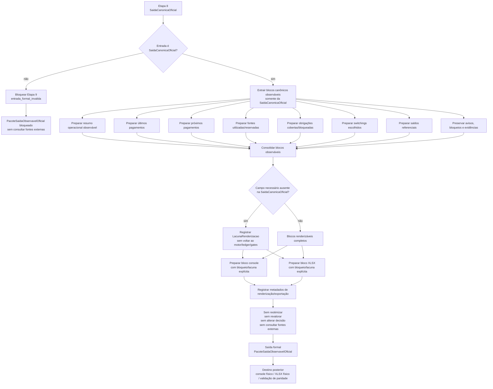

# Contrato Individual — Etapa 9 — Saída Observável Oficial

## 1. Identificação documental

- **Etapa:** 9
- **Nome:** Saída Observável Oficial / Renderização / Exportação
- **Entrada formal obrigatória e exclusiva:** `SaidaCanonicaOficial`
- **Saída formal prevista:** `PacoteSaidaObservavelOficial`
- **Natureza:** camada pós-Etapa 8 de renderização oficial unificada para console, XLSX e relatório operacional observável
- **Módulo funcional previsto:** `nucleo/saida_observavel_oficial.py`
- **Função pública prevista:** `construir_pacote_saida_observavel_oficial(saida: SaidaCanonicaOficial) -> PacoteSaidaObservavelOficial`

## 2. Status normativo

Este contrato formaliza a Etapa 9 como a camada posterior à Etapa 8, responsável por transformar `SaidaCanonicaOficial` em saída observável oficial.

A Etapa 9 é etapa real da cadeia operacional do projeto `payment-investment-allocation`. Ela não é adaptador residual, comparador paralelo, equivalência observável paralela, script diagnóstico nem correção direta de console/XLSX.

Este contrato não implementa código funcional. Ele define a fronteira normativa para a frente funcional posterior.

## 3. Posição na cadeia macro

```text
Etapa 8 -> SaidaCanonicaOficial -> Etapa 9 -> PacoteSaidaObservavelOficial -> camada posterior de exportação física/visualização/paridade
```

Na arquitetura macro, a Etapa 9 corresponde à renderização oficial unificada posterior à saída canônica validada. Console e XLSX passam a ser consumidores da saída observável oficial, não fontes decisórias autônomas.

## 4. Função da etapa

A função da Etapa 9 é preparar a saída observável oficial a partir de `SaidaCanonicaOficial`, preservando decisões, obrigações, fontes, switchings, saldos, bloqueios, avisos e evidências já materializados na cadeia Etapas 5–8.

A Etapa 9 pode organizar, formatar, ordenar, nomear colunas, preparar blocos de console, preparar blocos de XLSX, compor resumo operacional observável e registrar metadados de renderização/exportação.

A Etapa 9 não decide novamente. Ela apenas transforma a saída canônica oficial em representação observável coerente, rastreável e consumível por interfaces humanas ou arquivos.

## 5. Entrada formal obrigatória e exclusiva

A entrada formal obrigatória e exclusiva da Etapa 9 é:

```text
SaidaCanonicaOficial
```

A Etapa 9 não pode consumir diretamente:

- `EstadoTemporalInicial`;
- `ResultadoMotorTemporalConjunto`;
- `LedgerTemporalCanonico`;
- `ResultadoGatesValidacaoNucleo`;
- dados brutos;
- planilha operacional;
- cache BCB/CDI como fonte decisória;
- scripts diagnósticos;
- logs como fonte de estado;
- XLSX anterior;
- console anterior;
- saída legada como fonte decisória.

Funções legadas podem ser inspecionadas somente para compatibilidade de formato, nomes de colunas, layout e transição controlada de renderização. Elas não definem o contrato da Etapa 9 e não podem fornecer decisão econômica.

## 6. Componentes consumíveis da entrada

A Etapa 9 pode consumir somente componentes materializados em `SaidaCanonicaOficial`, incluindo:

- origem formal da saída;
- referência ao ledger e aos gates já preservada pela Etapa 8;
- indicador de prontidão da Etapa 8;
- status de preparação da saída canônica;
- data de referência;
- resumo canônico da saída;
- decisões e eventos preservados;
- obrigações cobertas preservadas;
- obrigações bloqueadas preservadas;
- fontes utilizadas preservadas;
- fontes reservadas preservadas;
- switchings escolhidos preservados;
- saldos referenciais por data preservados;
- bloqueios e avisos preservados;
- evidências e metadados da preparação canônica;
- campos de auditoria necessários para demonstrar origem em `SaidaCanonicaOficial`.

Quando uma informação necessária para console ou XLSX não estiver presente em `SaidaCanonicaOficial`, a Etapa 9 deve registrar lacuna objetiva e bloquear ou degradar a renderização correspondente sem consultar etapas anteriores diretamente.

## 7. Saída formal obrigatória

A saída formal obrigatória prevista da Etapa 9 é:

```text
PacoteSaidaObservavelOficial
```

Esse artefato deve ser a fonte oficial para renderização de console, XLSX e relatório operacional observável.

O nome `PacoteSaidaObservavelOficial` é adotado como nomenclatura contratual da Etapa 9. Eventual ajuste futuro de nomenclatura deve preservar unicidade semântica, origem exclusiva em `SaidaCanonicaOficial` e ausência de ambiguidade com `SaidaCanonicaOficial` da Etapa 8.

## 8. Componentes mínimos da saída

`PacoteSaidaObservavelOficial` deve conter, no mínimo:

- origem formal em `SaidaCanonicaOficial`;
- status de renderização;
- data de referência;
- blocos para console;
- blocos para XLSX;
- resumo operacional observável;
- últimos pagamentos;
- próximos pagamentos;
- fontes utilizadas;
- obrigações cobertas;
- obrigações bloqueadas;
- switchings escolhidos;
- saldos referenciais;
- avisos preservados;
- bloqueios preservados;
- lacunas de renderização, quando existirem;
- metadados de layout, ordenação, formatação e exportação;
- evidências de que os blocos foram derivados exclusivamente de `SaidaCanonicaOficial`.

Os blocos observáveis devem distinguir campos operacionais, campos diagnósticos preservados, bloqueios formais e lacunas de origem.

## 9. Processo interno da etapa

A Etapa 9 deve executar um processo determinístico de renderização oficial:

1. receber `SaidaCanonicaOficial`;
2. validar tipo formal da entrada;
3. verificar prontidão/status canônico informado pela Etapa 8;
4. extrair somente blocos materializados em `SaidaCanonicaOficial`;
5. preparar bloco de resumo operacional observável;
6. preparar bloco de últimos pagamentos;
7. preparar bloco de próximos pagamentos;
8. preparar blocos de fontes utilizadas e reservadas;
9. preparar bloco de obrigações cobertas;
10. preparar bloco de obrigações bloqueadas;
11. preparar bloco de switchings escolhidos;
12. preparar bloco de saldos referenciais;
13. preservar bloqueios, avisos e evidências;
14. registrar lacunas quando campo exigido pela renderização não existir na entrada formal;
15. montar blocos para console;
16. montar blocos para XLSX;
17. montar metadados de renderização/exportação;
18. emitir `PacoteSaidaObservavelOficial`.

Esse processo não pode reotimizar, revalorar, consultar fontes externas, reconstruir ledger, inferir decisão econômica ou usar saída legada como fonte de verdade.

## 10. O que a etapa pode fazer

A Etapa 9 pode:

- consumir `SaidaCanonicaOficial`;
- validar tipo formal da entrada;
- preparar saída observável oficial;
- preparar blocos para console;
- preparar blocos para XLSX;
- preparar resumo operacional observável;
- formatar valores, datas e textos;
- ordenar linhas e colunas;
- nomear colunas observáveis;
- preservar decisões, obrigações, fontes, switchings, saldos, bloqueios e avisos;
- registrar lacunas de renderização quando a informação não existir na entrada formal;
- preservar compatibilidade de layout com funções legadas quando isso não alterar decisão;
- oferecer artefato único para consumidores de visualização/exportação.

## 11. O que a etapa não pode fazer

A Etapa 9 não pode:

- reotimizar;
- revalorar;
- escolher nova fonte;
- trocar pacote vencedor;
- alterar obrigação coberta;
- alterar obrigação bloqueada;
- alterar switching escolhido;
- alterar saldo;
- corrigir dados financeiros;
- consultar dados brutos;
- consultar planilha;
- consultar `EstadoTemporalInicial`;
- consultar `ResultadoMotorTemporalConjunto`;
- consultar `LedgerTemporalCanonico` diretamente;
- consultar `ResultadoGatesValidacaoNucleo` diretamente;
- consultar cache BCB/CDI como fonte decisória;
- consultar logs como fonte de estado;
- consultar scripts diagnósticos como fonte de estado;
- consultar console anterior como fonte decisória;
- consultar XLSX anterior como fonte decisória;
- usar funções legadas como fonte de decisão;
- executar pagamento real;
- executar switching real;
- criar camada paralela fora da cadeia;
- mascarar lacuna upstream com rótulo observável enganoso.

Rótulos como `fonte_a_decidir`, `não decidido_etapa5` e `obrigacao_temporal_futura_sem_decisao_etapa5` só podem aparecer na saída observável oficial quando preservados explicitamente como bloqueio, aviso ou lacuna formal originada em `SaidaCanonicaOficial`. Se houver informação canônica suficiente para substituí-los por fonte, obrigação, status ou bloqueio correto, a renderização oficial deve fazê-lo sem alterar a decisão.

## 12. Relação com a etapa anterior

A Etapa 9 depende exclusivamente da Etapa 8.

A Etapa 8 entrega `SaidaCanonicaOficial`, que já preserva decisões, obrigações, fontes, switchings, saldos, bloqueios, avisos e metadados originados do ledger validado e dos gates aprovados.

A Etapa 9 não reabre Etapa 8. Ela consome sua saída formal e transforma essa saída em representação observável oficial.

Se `SaidaCanonicaOficial` não contiver informação suficiente para compor determinado bloco observável, a Etapa 9 deve registrar lacuna objetiva e apontar que a correção pertence à etapa anterior adequada, sem buscar diretamente essa etapa.

## 13. Relação com a etapa posterior

A Etapa 9 entrega `PacoteSaidaObservavelOficial` para camadas posteriores de:

- renderização física de console;
- geração física de XLSX;
- exportação de arquivos;
- visualização humana;
- validação de paridade da renderização;
- limpeza e depreciação controlada de rotas legadas.

A camada posterior deve consumir o pacote observável oficial e não deve retornar ao motor, ledger, gates, planilha, logs ou funções legadas como fonte decisória.

## 14. Schema/funções públicas previstas ou implementadas

Módulo funcional previsto:

```text
nucleo/saida_observavel_oficial.py
```

Artefato formal previsto:

```python
PacoteSaidaObservavelOficial
```

Classes auxiliares previstas, a confirmar na frente funcional:

```python
BlocoConsoleSaidaObservavel
BlocoXLSXSaidaObservavel
ResumoSaidaObservavelOficial
LacunaRenderizacaoSaidaObservavel
MetadadosRenderizacaoSaidaObservavel
```

Função pública prevista:

```python
construir_pacote_saida_observavel_oficial(
    saida: SaidaCanonicaOficial,
) -> PacoteSaidaObservavelOficial
```

A frente funcional posterior deve verificar os nomes reais mais simples e compatíveis com o código vivo, preservando a responsabilidade contratual e a entrada exclusiva.

## 15. Auditoria esperada

A auditoria da Etapa 9 deve verificar, no mínimo:

- se a entrada é `SaidaCanonicaOficial`;
- se nenhuma fonte externa à entrada formal foi consultada;
- se decisões foram preservadas sem reotimização;
- se valores e saldos foram preservados sem revaloração;
- se obrigações cobertas e bloqueadas foram preservadas;
- se fontes utilizadas e reservadas foram preservadas;
- se switchings escolhidos foram preservados;
- se bloqueios, avisos e evidências foram preservados;
- se blocos de console e XLSX derivam exclusivamente da saída canônica;
- se rótulos como `não decidido_etapa5` foram classificados corretamente como informação renderizável, lacuna formal ou problema upstream;
- se funções legadas foram usadas apenas para compatibilidade de layout, quando usadas;
- se o pacote produzido está apto para consumo por console/XLSX sem buscar fontes decisórias alternativas.

## 16. Critérios de aceite

A Etapa 9 será aceita funcionalmente quando:

1. consumir exclusivamente `SaidaCanonicaOficial`;
2. produzir `PacoteSaidaObservavelOficial`;
3. preparar blocos de console;
4. preparar blocos de XLSX;
5. preservar decisões, obrigações, fontes, switchings, saldos, bloqueios e avisos;
6. não consultar motor, ledger, gates, planilha, logs, scripts diagnósticos, console anterior ou XLSX anterior como fonte decisória;
7. não reotimizar, revalorar ou alterar decisão;
8. tratar rótulos residuais de saída legada como problema de renderização, lacuna formal ou evidência upstream objetiva;
9. disponibilizar caminho claro para migração de console/XLSX;
10. produzir mudança observável ou bloqueio estrutural justificado na saída final.

Nesta frente documental, o aceite se limita à criação do contrato, atualização mínima do README e criação do log, sem alteração funcional.

## 17. Fluxograma operacional-explicativo completo



## 18. Condição de parada

A Etapa 9 deve parar ou emitir pacote bloqueado quando:

- a entrada não for `SaidaCanonicaOficial`;
- houver tentativa de consultar etapa anterior diretamente;
- houver tentativa de consultar dados brutos, planilha, cache BCB/CDI, logs, scripts diagnósticos, console anterior ou XLSX anterior como fonte decisória;
- houver necessidade de reotimizar, revalorar ou alterar decisão;
- a renderização exigir campo inexistente em `SaidaCanonicaOficial`;
- rótulos legados não puderem ser substituídos por informação canônica sem alterar decisão;
- consumidores posteriores tentarem usar a Etapa 9 como motor decisório;
- houver necessidade de alterar contratos das Etapas 1–8 para executar a frente corrente.

A parada deve preservar evidência objetiva da lacuna ou violação, indicando a camada correta de correção futura.

## 19. Histórico documental / adendos funcionais consolidados

- `FECHAMENTO-CONTRATOS-ETAPAS-1-8-01`: congela a cadeia Etapas 1–8 e determina que console/XLSX pertencem a camada posterior à Etapa 8.
- `ETAPA9-CONTRATO-01`: cria este contrato individual da Etapa 9, define `PacoteSaidaObservavelOficial` como saída formal prevista e estabelece entrada exclusiva em `SaidaCanonicaOficial`.

Esta frente não altera código, runtime, contratos das Etapas 1–8, contrato operacional mestre, modelo matemático-estatístico-financeiro, dados, saídas, scripts diagnósticos, console ou XLSX.
